# AI 外呼平台安装教程

> 更新：2026-09-08；应用代码基准：`26f205b`。面向首次部署人员。本文与[平台配置手册](docs/platform-configuration-guide.md)、[产品操作手册](docs/operator-manual.md)配套使用。
>
> 图中页面来自本次最新代码构建的独立 Docker 演示环境，电话、短信和业务数据为 Mock/合成数据。截图端口为 `18080`，常规安装默认 `8000`。第三方账号开通、真实线路、云语音和生产发布尚未验收，不能按截图推断已接通。

## 1. 先选择安装目标

| 目标 | 使用文件 | 完成后能验证什么 |
|---|---|---|
| 首次安装、页面和业务演练 | `docker-compose.yml` | 登录、配置保存、客户/话术/任务、Mock 通话 |
| 增加监控告警 | 基础文件 + `docker-compose.observability.yml` | Prometheus、Grafana、Alertmanager |
| FreeSWITCH 合成媒体验证 | 另见[本机媒体说明](docs/voismart-local-media.md) | 合成双向媒体；不代表运营商电话 |
| 单服务器 500 总在途候选 | 独立 `docker-compose.single-host-500.yml` | 配置/预算预检；仍需真实容量验收 |

先完成基础安装，再接电话和语音。500 指呼出、振铃、AI/人工接通的总和。当前持续回调吞吐与队列时延仍未达标，32 核/64 GiB 是首轮目标机候选，并非实测最低采购要求。详见[容量模板](deploy/single-host-500/README.md)。

## 2. 检查安装工具

准备 Git、Docker Engine 或 Docker Desktop、Compose v2；API 验收脚本需要 `curl` 和 `jq`。Docker 安装不需要宿主机安装 Python/Node。二次开发使用版本见[兼容矩阵](compatibility-matrix.toml)。

```bash
git --version
docker version
docker compose version
curl --version
jq --version
```

预期：Docker 同时返回 Client 和 Server；只有 Client 或连接 socket 失败时，先启动 Docker 并检查本机权限。镜像/依赖下载失败需排查网络，不跳过构建或依赖校验。

## 3. 获取与确认代码

首次安装：

```bash
git clone https://github.com/duyu0218-flash/ai-outbound-platform.git
cd ai-outbound-platform
git status --short --branch
git log -1 --oneline
```

如从本次更新的 PR 安装，先在 GitHub 确认 PR 的分支和提交，再检出该分支；默认克隆的 `main` 只有在 PR 合入后才包含分支更新。

已有仓库：

```bash
git rev-parse --show-toplevel
git status --short --branch
git fetch origin --prune
git log --oneline HEAD..origin/main
```

只有工作树干净、当前就是要升级的分支，并确认可快进时才执行 `git pull --ff-only`。本地有独立提交时先比较并合并，禁止用 `reset --hard` 覆盖本地工作。`.env`、数据库、录音和私有线路配置不是代码更新的一部分。

## 4. 建立环境文件

在仓库根目录执行。已存在 `.env` 时保留并逐项合并新参数：

```bash
if [ ! -e .env ]; then
  cp .env.example .env
fi
chmod 600 .env
```

编辑 `.env`，首次本机演练至少确认：

```dotenv
APP_ENV_FILE=.env
ENV=dev
DEMO_USERS_ENABLED=true
TELEPHONY_PROVIDER=mock
VOICE_GATEWAY_DRIVER=mock
VOICE_AI_PIPELINE=legacy
SMS_PROVIDER=mock
LLM_PROVIDER=rule
AI_AGENT_URL=http://ai-agent:8001
CALLBACK_INBOX_ENABLED=false
```

基础演练使用同步回调；要启用 Inbox 必须一并完成 PostgreSQL 迁移和独立消费者部署，见第 10 节。不能只改开关。

`--env-file .env` 用于 Compose 参数替换，`APP_ENV_FILE=.env` 用于服务的 `env_file`；两者须指向同一配置。DB/Redis 密码、连接串与服务双方 Token 必须一致；不同用途密钥必须独立。可用 `openssl rand -hex 32` 生成随机值，在私有文件内保存，不截图、不提交。

| 配置组 | 需确认的参数 | 从哪里取得 |
|---|---|---|
| 数据库/缓存 | `POSTGRES_PASSWORD`、`REDIS_PASSWORD` | 本环境生成，Compose 会生成内部连接地址 |
| 应用鉴权 | `SECRET_KEY`、`JWT_SECRET`、`API_KEY` | 各自生成；生产按租户分配 API Key |
| 服务鉴权 | `AI_AGENT_SERVICE_TOKEN`、`TELEPHONY_SERVICE_TOKEN` | 本环境生成，调用方/接收方一致 |
| 回调鉴权 | `TELEPHONY_WEBHOOK_TOKEN`、`TELEPHONY_WEBHOOK_SECRET` | 本环境生成，与网关匹配 |
| 录音 | `RECORDING_STORAGE_SERVICE_TOKEN`、S3 访问凭据 | 本环境生成；生产使用私有存储凭据 |

开发示例密码不能用于公网或生产。页面只配置非敏感业务项，不能把 SIP 密码、API Key 填在页面“凭据引用”里。

## 5. 构建并启动基础平台

```bash
docker compose --env-file .env config --quiet
docker compose --env-file .env up -d --build
docker compose --env-file .env ps
```

首次拉取和构建需要等待网络下载。等待依赖服务健康后再登录。此清单启动 PostgreSQL、Redis、SeaweedFS、录音适配器、控制 API、任务 Worker、AI Agent、Voice Gateway。

验证服务：

```bash
curl -fsS http://127.0.0.1:8000/health
curl -fsS http://127.0.0.1:8000/readyz
docker compose --env-file .env exec -T ai-agent \
  python -c "import urllib.request; print(urllib.request.urlopen('http://localhost:8001/health').read().decode())"
```

`ai-agent:8001` 仅在容器私网开放，不能直接请求宿主机 `localhost:8001`。`readyz` 是依赖就绪检查，不是电话接通证据。

基础端口只绑定本机回环。远程访问先建立 SSH 隧道，例如 `ssh -L 8000:127.0.0.1:8000 用户@服务器`，再在本机打开页面；正式多人访问需另行配置 HTTPS 入口和受控访问策略。

安装验证的实际输出见[本次验证记录](docs/reviews/20260908-manual-refresh.md)。

## 6. 首次登录

打开 `http://127.0.0.1:8000/admin/login`。非生产且启用演示账号时使用 `admin / 12345678`，点击登录进入仪表盘。

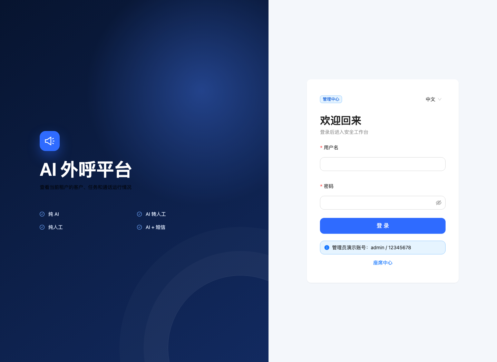

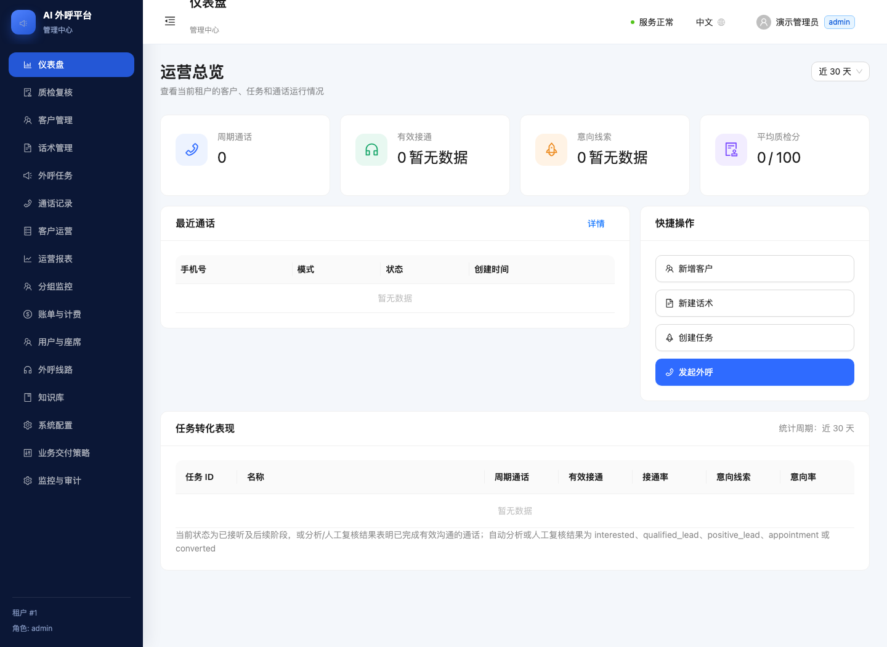

座席入口 `http://127.0.0.1:8000/agent/login`，演示账号 `1001@test / 12345678`。登录失败、退出后返回、座席越权都要检查，不能只验证页面能打开。

## 7. 按顺序完成平台配置

每一步都要“填写 → 保存 → 刷新 → 核对回显”。具体字段和前后截图见[配置图解](docs/platform-configuration-guide.md#14-逐步配置截图2026-09-08)。

1. **用户与座席**：新增正式管理员/座席，验证新账号，再停用演示账号。

   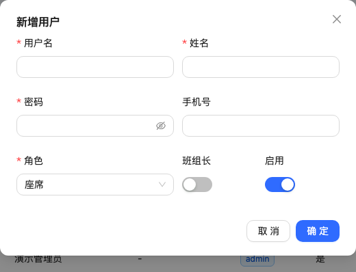

2. **外呼线路**：本机选 Mock；真实环境配置已获准的网关、主叫、凭据引用、并发。

   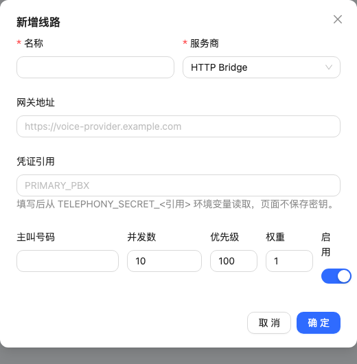

3. **系统配置 → 并发容量**：首次从小并发验证；以实际生效容量为准。

   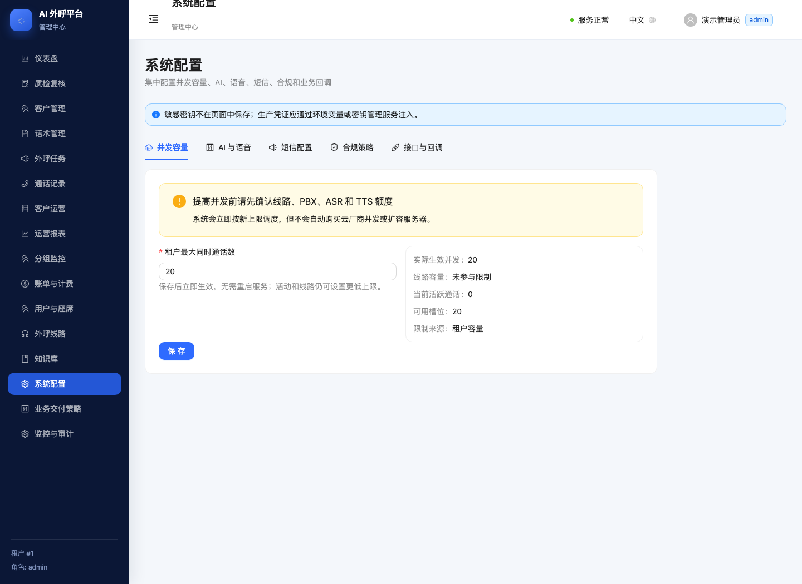

4. **AI 与语音**：保存租户策略，服务器另行配置语音/模型连接与密钥。

   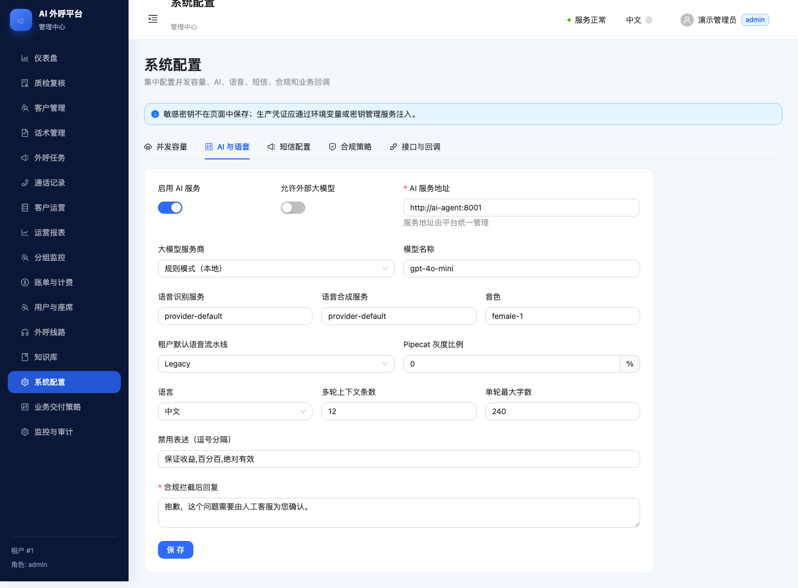

5. **短信配置**：核对服务商、签名、模板和启用状态。

   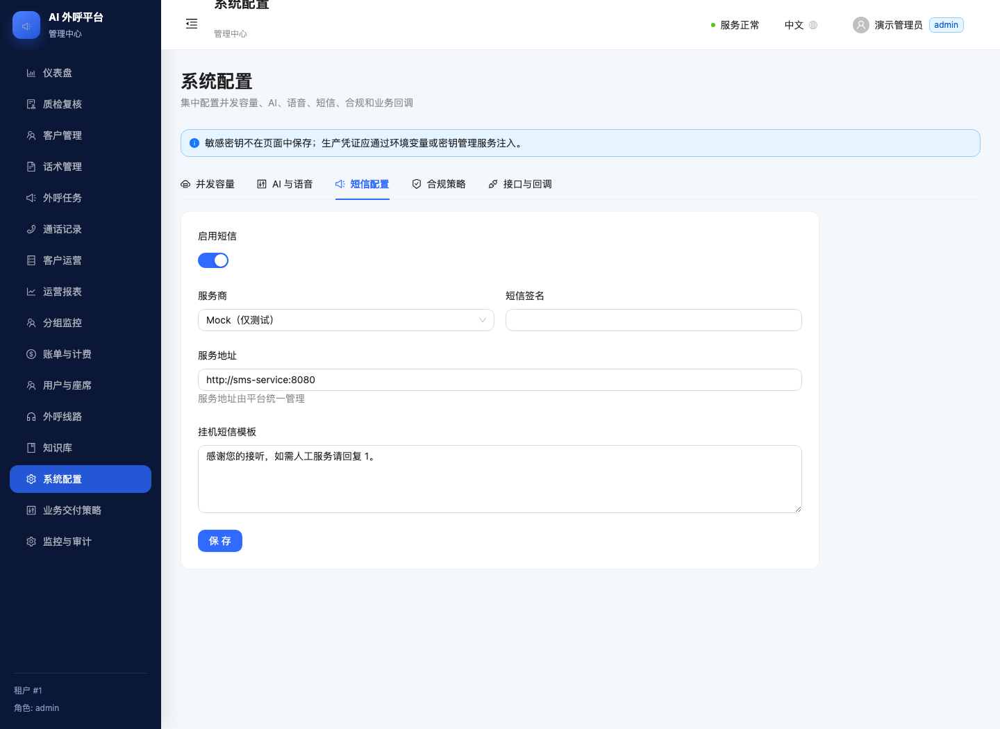

6. **合规策略**：核对同意、DNC、时段、频次、录音告知和保留期。

   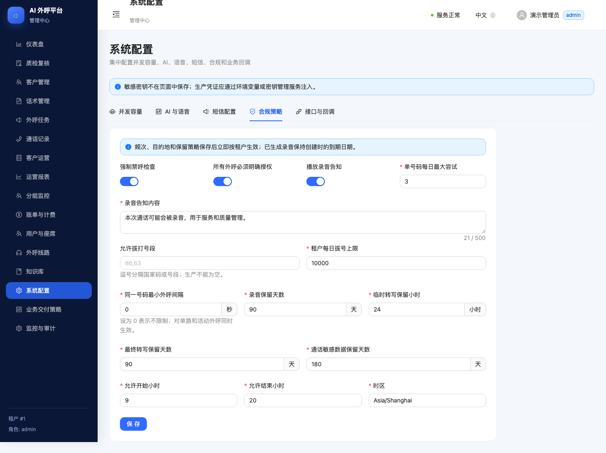

7. **接口与回调**：填写接收地址、凭据引用及重试参数，再由双方验证签名和对账。

   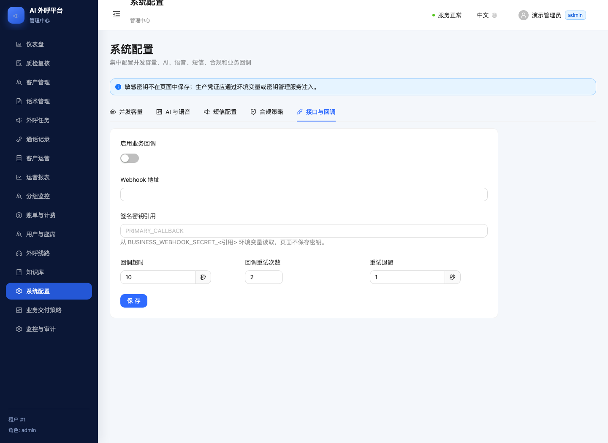

8. **监控与审计**：确认依赖、实际并发、积压和操作记录。

   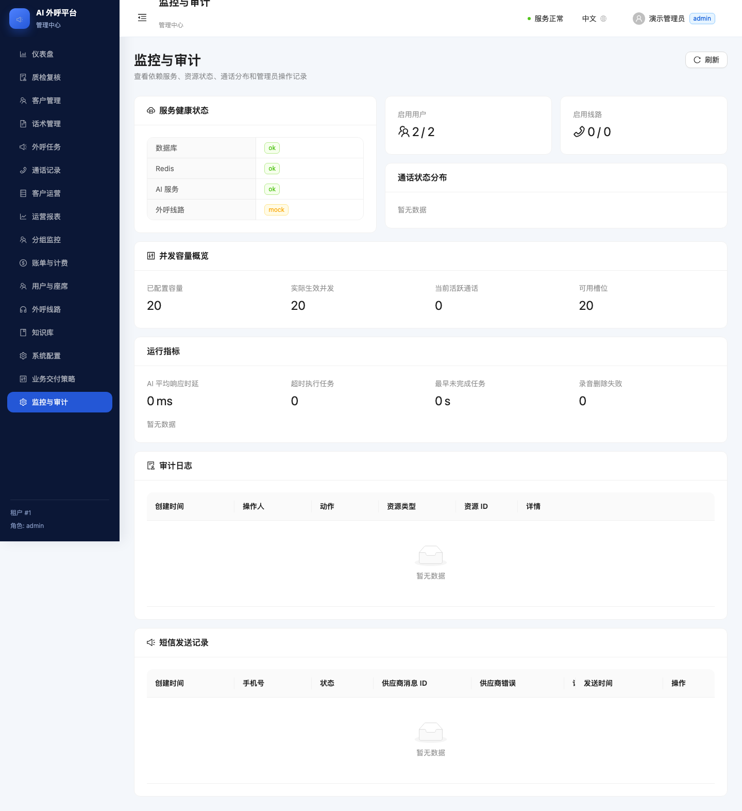

## 8. 跑通首次业务操作

按[产品操作手册](docs/operator-manual.md)完成：

客户创建/导入 → 知识与话术 → 业务交付策略与试跑 → 任务草稿 → Mock 启动/暂停/恢复/停止 → 通话记录 → 座席接管 → 质检/人工跟进 → 报表。

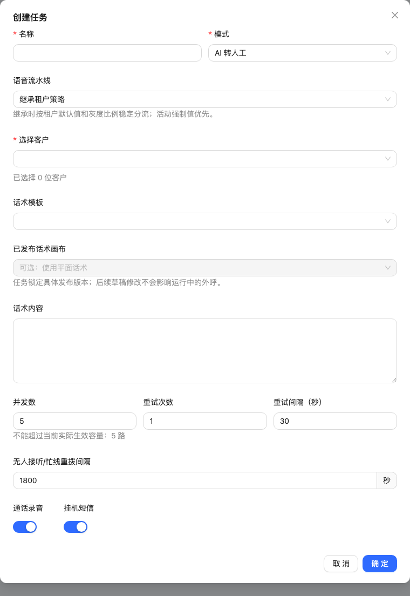

先用独立演示库和合成号码。业务试跑只执行规则，不拨电话，不调用大模型，不发短信。真实拨号前必须完成下一节全部接入验收。

## 9. 接入真实电话、语音与坐席

| 顺序 | 操作 | 验收依据 |
|---|---|---|
| 1 | 取得 SIP Trunk、批准主叫、并发/CPS/预算及白名单资料 | 供应商资料与合同额度 |
| 2 | 配置 FreeSWITCH 网关、拨号计划、SIP/RTP、防火墙 | 受控实拨、双向声音 |
| 3 | 配置 `freeswitch_esl`、独立命令签名、路由白名单、持久预算账本 | 无路由/超预算拒拨，硬超时挂断 |
| 4 | 配置 VoiSmart/Pipecat、ASR、TTS、录音告知音 | 客户说话识别、回复播放、打断、录音 |
| 5 | 按需配置外部 LLM、短信和业务回调 | 超时兜底、回执、签名、幂等和对账 |
| 6 | 需要人工接听时配置 WSS/TURN/坐席 SIP | 真机耳麦、双向声音、接听/拒绝/超时回退 |

参数和操作位置见[平台配置手册第6—10节](docs/platform-configuration-guide.md#6-电话线路与-freeswitch)。本次没有访问或配置用户的运营商、云语音控制台，外部控制台截图和真实接入操作仍为**未验证/待补**。不得将本平台截图冒充供应商控制台截图。

## 10. 最新回调 Inbox 和单机 500 候选

普通基础 Compose 默认使用同步回调。Inbox 启用顺序：停止新拨号和流量切换 → 备份 → 执行版本化迁移（含 `20260908_callback_inbox.sql`）→ 同一后端配置启用开关 → 启动消费者 → 检查心跳/死信/最老积压 → 放行。

- 单机候选使用独立的[500部署清单](deploy/single-host-500/README.md)，不能把它随意叠加基础 Compose。
- `result=received` 只证明回调已持久接收；业务结果必须查询话单/事件，不能据此判定接通、转人工或短信成功。
- 死信修复后使用 `python -m app.callback_inbox_worker --retry <receipt_id>` 重排；具体容器/环境必须指向对应消费者。
- 回退先暂停入口并排空，包括死信，之后再统一停用；禁止同步/Inbox 两种模式混用。
- 持续 600 回调/秒与小于 1 秒队列时延门槛尚未通过；不把配置中的 500 写成商用容量。

完整操作和当前失败证据见[Inbox说明](docs/reviews/20260908-callback-inbox.md)。

## 11. 监控、升级、备份与回退

可选监控（先生成私有监控密码）：

```bash
./scripts/bootstrap-deployment-secrets.sh
docker compose --env-file .env -f docker-compose.yml \
  -f docker-compose.observability.yml up -d --build
```

本机入口：Prometheus `9090`、Alertmanager `9093`、Grafana `3000`。Grafana 密码在 `.secrets/grafana_admin_password`，不要放进手册或截图。

升级旧环境须先确认 Compose 项目名、工作目录、运行镜像和目标提交，暂停新拨号并排空在途任务，备份数据库、录音、私有配置和语音/模型账本。数据库备份使用 `scripts/backup-postgres.sh`（需要 `BACKUP_DATABASE_URL`、`BACKUP_DIR` 与 `pg_dump`）；用 `scripts/verify-postgres-backup.sh` 和 `scripts/restore-postgres-drill.sh` 验证恢复。

生产保持 `AUTO_MIGRATE=false`。构建目标镜像后，在受控发布窗口按项目迁移器显式升级，示例：

```bash
docker compose --env-file .env build
docker compose --env-file .env run --rm --no-deps control-api \
  python -m app.migration_runner
```

此命令要求 DB 已启动、连接配置正确、备份已验证。迁移失败时不启动调度。保留旧代码/镜像与数据备份；回退不能只改 Git 或删除数据卷，需核对迁移兼容性及未完成的外呼/回调账本。不要使用 `down -v` 作为升级步骤。

## 12. 排错与验收边界

| 现象 | 检查与处理 |
|---|---|
| `not a git repository` | 进入包含 `docker-compose.yml`、`.git` 的实际仓库根 |
| 端口被占用 | 用独立 Compose 项目名、容器前缀及宿主机端口；保留旧实例 |
| `/admin` 503 或无内容 | 查看构建是否完成、镜像是否包含 `app/static/index.html` |
| `/readyz` 非200 | `docker compose logs --tail=100 control-api task-worker ai-agent voice-gateway`，逐依赖处理 |
| 页面设置成功却未接电话 | 核对实际 provider、FreeSWITCH、线路和云语音；保存并不等于接通 |
| 任务启动后不拨号 | 客户同意/DNC/频控、合规外呼时段与已发布业务策略服务时段（两者都须允许）、启用线路/容量、Worker 和积压 |
| Inbox 回调200但话单没更新 | 查消费者心跳、死信、最老待处理时间及业务事件 |
| 软电话不可点击 | 查看 WebRTC 是否启用、HTTPS/WSS/TURN 是否完成 |

本次已验证、未验证、已知问题、环境限制及上线前置条件集中记录在[验收记录](docs/reviews/20260908-manual-refresh.md)。代码提交、静态检查、开发环境、测试发布、真机和生产分别记录。
