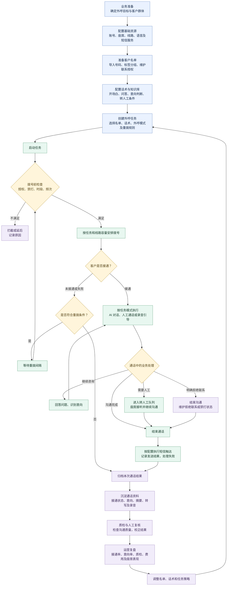

# AI 外呼系统业务流程图

按“准备 → 执行 → 处理 → 复盘”展示系统业务流程。

```mermaid
flowchart TD
    A["业务准备<br/>确定外呼目标与客户群体"] --> B["配置基础资源<br/>账号、座席、线路、语音及短信服务"]
    B --> C["准备客户名单<br/>导入号码、标签分组、维护联系授权"]
    C --> D["配置话术与知识库<br/>开场白、问答、意向判断、转人工条件"]
    D --> E["创建外呼任务<br/>选择名单、话术、外呼模式及重拨规则"]
    E --> F["启动任务"]

    F --> G{"拨号前检查<br/>授权、禁打、时段、频次"}
    G -->|"不满足"| H["拦截或延后<br/>记录原因"]
    G -->|"满足"| I["按任务和线路容量安排拨号"]
    I --> J{"客户是否接通？"}

    J -->|"未接通或失败"| K{"是否符合重拨条件？"}
    K -->|"是"| L["等待重拨间隔"]
    L --> G
    K -->|"否"| R["归档本次通话结果"]

    J -->|"接通"| M["按任务模式执行<br/>AI 对话、人工通话或录音引导"]
    M --> N{"通话中的业务处理"}
    N -->|"继续咨询"| O["回答问题、识别意向"]
    O --> M
    N -->|"需要人工"| P["进入转人工队列<br/>座席接听并继续沟通"]
    N -->|"明确拒绝联系"| Q["结束沟通<br/>维护拒绝联系或禁打状态"]
    N -->|"沟通完成"| S["结束通话"]
    P --> S
    Q --> S

    S --> T["按配置执行短信触达<br/>记录发送结果，处理失败"]
    T --> R
    R --> U["沉淀通话资料<br/>接通状态、意向、摘要、转写及录音"]
    U --> V["质检与人工复核<br/>检查沟通质量，校正结果"]
    V --> W["运营复盘<br/>接通率、意向率、质检、费用及座席表现"]
    W --> X["调整名单、话术和任务策略"]
    X --> E

    classDef prep fill:#EAF2FF,stroke:#6387C5,color:#172B4D
    classDef action fill:#E8F7F0,stroke:#5A9F7A,color:#163D2B
    classDef decision fill:#FFF5DB,stroke:#C5A34D,color:#594414
    classDef result fill:#F1ECFA,stroke:#9B83BD,color:#3F2C5B
    class A,B,C,D,E prep
    class F,I,L,M,O,P,S,T action
    class G,J,K,N decision
    class H,Q,R,U,V,W,X result
```

支持的任务模式：**纯 AI、AI 转人工、纯人工、录音转人工、AI＋短信**。运行中的任务可暂停、恢复或停止。

本图依据当前源码与[操作手册](operator-manual.md)整理，描述业务流程，不代表真实线路和生产验收已通过。本次仅新增流程文档，未进行实际拨号、真机或生产验证。
