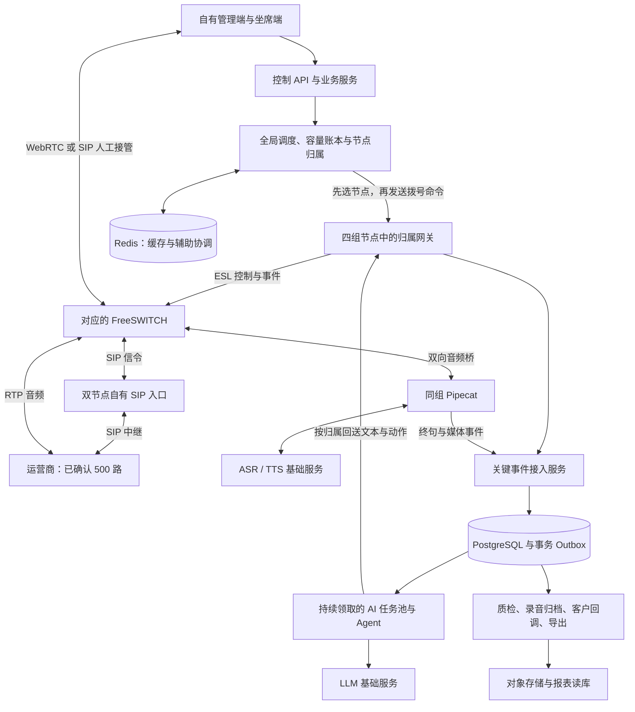

# 自有外呼平台替代方案：单节点 200 路、集群 500 路

> 部署拓扑已被后续确认的“四台应用服务器 + 托管 PostgreSQL/Redis”方案替代。当前配置以 [compact 部署说明](../deploy/compact/README.md) 为准，代码及验证结果见 [本轮实施记录](compact-node200-implementation.md)。本文保留早期独立拆分部署的规划依据，其中服务器数量、组件分离及“未修改代码”的阶段描述不再代表当前交付状态；真实 200/500 路验收门槛仍有效。

日期：2026-09-07。版本：单节点 200 路修订版。替代此前单节点 150 路、五媒体节点的容量规划。

**200 路是用户指定的单节点设计及验收目标，不是已测得容量。本轮交付方案与实施清单，未修改运行配置或执行扩容部署。**

## 结论与已确认前提

**目标是用自有平台完整替代现有三方外呼系统，由我方完成全部业务交付。运营商线路 500 并发沿用用户已确认的容量前提；线路直接接入自有通信底座。三方平台 API、音频流、话单回调和 AI 托管均不再作为架构依赖。**

替代范围包括名单与任务、外呼调度、SIP 通话控制、实时 AI、录音、人工接管、结果交付、质检、统计与运维。自有业务平台可调用云端 ASR/TTS/LLM 基础服务；本文不把“替代三方外呼平台”扩大解释为必须自行训练或本地部署全部模型。

我方系统按最重场景“500 路同时接通并进行 AI 对话”设计和验收。拨号中、振铃、接通和人工接管的占用按 SIP 中继实际呼叫腿计数，调度器不得在已有 500 个通道全部占用时继续超额拨号。通话结束、取得可靠释放证据后再补充新呼叫。

推荐沿用当前 FastAPI、PostgreSQL、Redis、TaskOutbox 和 Pipecat，完成可横向扩展的调度、AI 任务、事件回传及会话归属。近期不以更换 ASGI 服务器、引入另一套 RTC 框架或简单提高配置值作为实现 500 并发的主要措施。

**只有在目标服务器、自有 SIP/PBX/媒体全链路和实际 ASR/TTS/LLM 服务下通过下文门槛，才能把“支持 500 并发”写入上线验收结论。** 本文中的配置、服务器规格和吞吐是待验证的设计预算，不是已经测得的生产能力。

## 一、容量口径与验收负载

| 指标 | 设计及验收要求 | 说明 |
|---|---|---|
| 通话并发 | 500 路同时接通、双向音频、持续 AI 对话 | 不能用 500 条空闲 WebSocket 或 500 条 dialing 记录代替 |
| 业务通道占用 | 全局不超过已确认的 500 路运营商通道 | 多租户、多任务、多节点共享同一总预算 |
| 对话负载 | 常态按每通 8 秒一个客户终句估算，共 62.5 轮/秒；持续设计预算 125 轮/秒 | 8 秒为规划假设，真实脚本更密集时重算；必须测试打断、重试和长上下文 |
| 同步终句突发 | 500 通在 1 秒内产生客户终句 | 不用缓存开场白掩盖真实 LLM 突发能力；供应商与我方须共同通过 |
| 关键事件入库 | 目标 1,000 个有效事件/秒持续，2,000 个/秒突发 60 秒 | 为转写终句、媒体、状态及人工事件留余量；不是说 500 通话等于 1,000 RPS |
| 管理页面 | 与满负载通话同时进行 100 RPS 常用读操作及至少 1 个大导出 | 页面和导出不得饿死挂断、状态回调和 AI 任务 |
| 媒体故障余量 | 4 个独立媒体节点，每节点须实测通过 200 路 | 合计 800 路节点能力，业务上仍只开放 500；少一个节点后剩余能力 600 路 |

### 单节点 200 路的计算与约束

- 一台媒体节点指独立宿主机上的 FreeSWITCH＋网关＋Pipecat 组合；业务 API、AI 任务池、数据库独立部署，ASR/TTS/LLM 使用云服务。200 路不表示一台机器同时承载整个业务平台与本地模型推理。
- 最少运行节点数为 `ceil(500/200)=3`，但损失一台只剩 400 路，不能满足单节点故障后的容量目标。因此部署 `ceil(500/200)+1=4` 台媒体节点。
- 四节点正常分配为 125/125/125/125；计划排空一台后为 167/167/166。125 是正常均衡结果，200 才是通过验收后登记的节点上限。
- 节点预留、拨号中和活跃客户通话合计不超过 200；PBX 呼叫腿、外线和 AI 流另有独立预算。满载时取得可靠释放证据后才补入，避免振铃电话接通后超限。
- 按每通 8 秒一轮客户终句估算，200 路对应 25 轮/秒；单节点按两倍预算验证 50 轮/秒及 200 个同步终句。全平台持续 125 轮/秒及 500 个同步终句的目标不降低。
- 按全平台 1,000 关键事件/秒的预算分摊，200 路节点验证 400 事件/秒持续、800 事件/秒短突发。实际事件量用完整追踪修正，原始音频帧不作为业务事件逐帧入库。
- 单节点满载按每通一路识别占用 200 个 ASR 会话；全平台共享 ASR 规划额度仍为 625，不是每台预占 625。模型与 TTS 吞吐预算不因服务器减少而缩减。
- 200 个客户通话全部转接内部坐席时约产生 400 个 PBX channel，另加瞬时转接腿；此场景与 200 路持续 AI 场景分别验收。

关键事件预算的计算示例：125 个终句话轮/秒，每轮约 4 个关键控制事件，约 500 事件/秒，再为通话生命周期、人工操作、重试和波峰留余量。实际事件数须从完整对话追踪统计，按观测值调整；原始音频帧不得逐帧写入业务数据库。

对话时延建议作为验收指标：客户说话结束至首段可听回复 P95 ≤ 1.5 秒、P99 ≤ 3 秒；插话至停止旧播报 P95 ≤ 300ms。均包含 ASR 断句、排队、模型首输出、TTS 首包和实际播放，不能只测模型请求耗时。

## 二、自有通信与业务平台架构

固定采用“运营商 SIP 中继 → 自有 SIP 入口 → 自有 FreeSWITCH/Pipecat 节点”的架构。业务系统先选定通话所属节点，再由该节点网关通过 ESL 控制对应 FreeSWITCH 发起呼叫。SIP 入口负责信令路由与健康隔离；全局通话名额、AI 配额、节点归属由我方调度统一决定。

- **通信入口：** 两个自有 SIP 边缘节点，推荐 OpenSIPS，统一中继入口、路由、访问控制与节点探测。它不是 AI 调度器，不能代替全局业务容量账本。运营商信令经边缘节点；RTP 在本方案中由 FreeSWITCH 锚定。按网络拓扑配置公网地址、端口与 NAT；需额外媒体中继时再把该层纳入容量测试。
- **通话与媒体：** 四个独立宿主节点，各部署配对的 FreeSWITCH、voice gateway 和 Pipecat；统一分配、固定归属、独立录音与事件缓冲。集群资格测试须把编解码、重采样、AI 音频桥、双声道录音和人工桥接一起打开。
- **实时 AI：** Pipecat 负责输入音频、ASR、TTS 输出和打断；后端 AI 任务与 Agent 负责话术决策、工具调用和业务动作。各通话的文本与动作返回原媒体节点。
- **人工坐席：** 自有坐席页面及 WebRTC/SIP 分机接入 FreeSWITCH，按节点归属完成转接、接管和录音续接。WebRTC 的证书、鉴权、ICE/TURN、浏览器权限与实际网络连通性独立验收。
- **业务交付：** 自有数据库保存任务、话单、转写、客户意向和跟进结果；录音进入对象存储；我方生成质检、报表与对客户业务系统的可靠回调。

FreeSWITCH ESL 提供通话控制与事件接口；音频仍须经媒体模块与 RTP/音频桥单独传输。[FreeSWITCH 官方文档](https://developer.signalwire.com/freeswitch/integration/event-socket/) 当前源码已存在 `freeswitch_esl`、`uuid_raw_audio_stream` 和 Pipecat 适配入口；存在代码不等于生产镜像已经装好并通过 500 路验证。需固定镜像、音频模块版本、命令协议、采样率与双向播放方式，逐项验收。

当前 Pipecat 管道实际是音频输入→STT→转写回调→TTS→音频输出；LLM 决策仍经过后端 `ai_turn` 任务与 Agent。仅扩 Pipecat 不会自动扩容 AI 决策队列。

自有 PBX 容量要区别“通话数”和“呼叫腿数”：500 个客户通话加 500 个内部坐席桥接腿可能形成约 1,000 个 PBX channel，还须计入转接临时腿、录音和转码开销。内部坐席腿不等于新增运营商外线通道；若转接到外部手机号，需要按额外外线腿预留通道或限制外转数量。容量检查必须在转接前完成，不能因此挤掉已有客户通话。以上是自有调度计数规则，不重新质疑运营商已确认的 500 路容量。

## 三、必须完成的六组改造

### 1. 全局容量与通话归属：先确保横向扩容不会超拨或串线

新增或扩展：

- `GatewayNode`：节点地址、能力、健康状态、实际容量、负载、draining 状态。
- `CallOwnership`：`call_id + attempt → gateway_id + pbx_node_id + fs_uuid + owner_epoch`。
- `CapacityReservation`：唯一键为 `call_id + attempt`，记录全局、租户、任务、运营商通道、PBX 呼叫腿、媒体和 AI 配额占用。

在短事务内按固定顺序原子校验并预留所有必要名额；任何一项不足就回滚整个预留。Redis 可做缓存与通知，不能成为唯一真实账本，也不能在 Redis 切换丢失计数后继续超额接纳。

号码同意、禁打、时段和频次的最终校验仍保留；减少锁内重复查询，不能通过放宽业务规则换吞吐。

媒体、speak、stop、hangup、transfer 都路由到该轮次的归属节点，并校验轮次及所有权代次。不能先调线路，再随机选择一个网关处理后续命令。

明确状态机：reserved→dialing→active→ending→released；超时但 PBX 通话结果未知时进入 unknown/reconciling，继续占用名额，待归属 PBX 通道查询、可靠终态事件或通信层对账确认后再释放。不得通过租约 TTL 到期直接把真实占线当成空闲。

拨号用令牌桶平滑 CPS，速率参数按 SIP 接入约定和自有节点实测建呼能力配置。此处管理的是调用节奏，不重新质疑已确认的 500 路线路容量。

主要代码入口：`backend/app/services/call_service.py`、`backend/app/services/telephony.py`、`backend/app/models.py`、`voice_gateway/app/security.py`。

### 2. 网关回调：取消跨通话的串行发送瓶颈

目前 `CallbackSender.flush()` 每批取 50 条后逐条 await，每次发送还创建 HTTP 客户端，批次结束再等待 0.5 秒。500 路持续产生事件时，队列可能先于控制 API 积压。

改为进程长期复用 HTTP 客户端；按 `call_id + attempt` 分区，同一通话有序、不同通话有界并发。每节点先以 16～32 个 HTTP 发送槽压测，再依据吞吐及控制 API 准入预算调整。

终态、接通、转人工、最终转写和打断控制优先；partial 转写合并、限频或仅推送在线界面，不无限制造业务 outbox。打断走低时延路径，事后仍可靠记录审计信息。

队列先持久化再发送，200 确认后才完成；失败保留原 event_id，指数退避并加入抖动，尊重 Retry-After。同一通话的依赖顺序不能被重试打乱，但也不能阻塞其他通话。

已有 SQLite 账本不能由多个进程共享运行。保留一份账本一个写入者，阻塞写入移出媒体事件循环；跨节点总配额与归属使用集中账本，节点本地队列作为可靠缓冲。

验收同时测运营商 SIP→自有 PBX→网关→控制面路径，不允许发压器绕过这个瓶颈后把结果称为“系统支持 500”。

### 3. AI 任务池：持续补位、逐通话排序、及时作废旧回答

当前批量 `gather()` 会等待最慢任务完成后才开始下一批。改成空闲槽位立即领取新任务的常驻执行池；领取时完成条件更新及租约赋值，执行时不持有数据库连接。

PostgreSQL `FOR UPDATE SKIP LOCKED` 适合多个消费者领取队列任务；领取和状态更新必须放在同一短事务内，不能先扫描同一批再让所有消费者重复竞争。[PostgreSQL 官方说明](https://www.postgresql.org/docs/16/sql-select.html)

同一通话使用 `attempt + turn_sequence + generation_id` 保证结果顺序。客户插话、转人工或挂断使旧输出失效；旧转写保留作上下文和审计，过期回答不能再触发 TTS、短信或转人工。

AI、终态质检、业务回调、录音、导出分独立执行池和资源预算。外部 HTTP 使用异步客户端和有界连接池；同步 DB 操作封装为短工作单元，不给数百个任务各占一个长期数据库连接。

正常负载至少能消费 125 个有效话轮/秒，并验证 500 个同步终句突发。执行槽数按 `到达率 × 平均任务占用时间` 计算；例如平均 1.5 秒时，125 轮/秒约需要 188 个在途请求，正常工作预算可从 200 起测。突发若仍要满足相同时延，就需要更多可用在途额度或更低任务耗时，不能依靠长队列掩盖资源不足。

主要入口：`backend/app/services/task_queue.py`、`backend/app/services/dispatcher.py`、`backend/app/services/call_service.py`、`agent/`。

### 4. 控制面与数据库：先缩短事务，再增加实例

终态回调只同步执行事件幂等、合法状态转换、必要交接收尾、时长账本和 durable outbox。自动质检及重报表移到专用任务；必须保留事件去重、业务状态和 outbox 的原子提交，不能回到“事件已确认但任务丢失”的旧问题。

关键回调/通话控制与管理页面分独立部署和连接预算；大导出异步生成对象存储文件，报表走 SQL 聚合、日汇总或读副本。副本延迟不能用于决定是否还可拨号、是否挂断或是否转人工。

先以集群约 100 个真实 PostgreSQL 连接为预算起点，分配给关键写入、AI 任务、后台和运维保留池，并以测量结果调整。所有 API、worker 和 PgBouncer 副本的预算必须相加核算，不能每个节点都设置 100。

可引入双实例 PgBouncer 管理连接；迁移和默认数据初始化走独立直连地址。当前修复已把两种 bootstrap 操作移到专用连接，但仍须对实际驱动、预处理语句、事务与切换逐项验证。transaction pooling 不支持 session advisory lock。[PgBouncer 官方兼容表](https://www.pgbouncer.org/features.html)

既要压“简易终态回调”，也要压有多轮转写、有录音、有人工接管、有重复乱序的混合场景，并使用生产量级历史数据验证索引与查询计划。

### 5. 媒体和 AI 服务：四节点固定归属，预热而不是临时起进程

每个媒体节点启动常驻进程和连接池，先通过 200 路资格测试再登记可用容量；正常 500 路分散为每节点约 125 路。升级时先 draining，不再接新呼叫，等待本节点通话结束后再停止进程。一个节点崩溃后，完成通话对账并逐步补入新通话，剩余三节点可按 167/167/166 分配；故障会话不会自动迁移。

音频收发、编码/重采样、STT/TTS、播放与打断按通话隔离。固定开场白、常用告知语可预生成，减少同时开始时的 TTS 波峰；客户个性化回答仍按真实云服务能力验收。

保持有限上下文、检索片段上限、TTS 句段和响应长度预算，避免通话越久单次模型输入越大。对云服务设置按租户与供应商的限流、错误分类和熔断；依赖服务不健康时暂停新拨号，保护正在通话。

不能用降级到静默、固定话术或无 AI 的通话来通过“500 路 AI 服务正常”的验收。若业务允许降级，要独立计数并明确触发条件。

### 6. 可观测与容量保护：让“500 路”成为可验收指标

至少暴露以下按节点/租户/供应商拆分的指标：实际通话、预留/unknown 名额、实际 ASR 连接、TTS/LLM 在途数、音频输入输出缺口、打断耗时、终句至首音延迟、有效请求吞吐、200/429/503/超时、任务最老年龄、成功消费速率、数据库连接等待和锁等待。

把 trace_id、call_id、attempt、turn_sequence、owner_epoch 贯穿 SIP/PBX、网关、音频、AI、事件、数据库和录音。告警发生时能区分音频未到、ASR未出字、模型排队、TTS首包慢或网关事件积压。

## 四、初始部署与基础语音服务预算

### 我方资源候选

以下规格用于启动基准测试。**必须先证明每种节点达到目标吞吐，再据此定型采购，不能把规格本身当成容量证明。** ASR/TTS/LLM 使用云 API，以下不含本地模型 GPU。

| 服务 | 初始部署候选 | 冗余与验证要求 |
|---|---|---|
| SIP 边缘入口 | 2 个独立节点，各 4 vCPU / 8GB 起测 | OpenSIPS 信令路由与访问控制；中继可达性、对话内路由和单节点故障切换须验证 |
| 控制/关键回调 API | 3 个节点，各 8 vCPU / 16GB | 分离关键入口与后台读请求；单 API 节点须通过约 500 有效事件/秒后，3 节点才具备掉 1 节点仍达 1,000 的预算 |
| FreeSWITCH＋网关＋Pipecat | 4 个独立节点，各 16 vCPU / 32GB 起测 | 单节点须通过 200 路真实媒体长稳；正常约 125 路/节点；四节点分散到独立故障宿主机 |
| AI/其他后台任务 | 3 个节点，各 8 vCPU / 16GB 起测 | 逐类独立工作池，实际进程数/异步槽位由平均耗时、CPU和供应商额度决定 |
| PostgreSQL | 主库＋热备，各 16 vCPU / 64GB，SSD/NVMe或等价云盘 | 明确切换方式、连接重建、持久化/RPO策略，长时压测验证写入及锁等待 |
| 报表读库 | 1 个节点，8 vCPU / 32GB 起测 | 承担统计/导出，不能参与强一致的通话调度判断 |
| Redis | 自建为 3 台，各 4 vCPU / 8GB 起测；或托管高可用 | 主节点、两个副本，各配置仲裁进程；真实占用以持久账本为准 |
| 存储与入口 | 可靠对象存储、双入口/负载均衡；可部署 2 个 PgBouncer 实例 | 数据库连接预算跨全部实例求和；录音与日志不争用媒体系统盘 |

上述每个媒体节点的 200 路资格包含自有 FreeSWITCH、音频桥和 Pipecat 的整体表现；如三者拆机部署，每一层都要满足同样的并发和故障余量，不能沿用合并部署的机器总数。不同可用区/机房整体故障不在“少 1 个节点”承诺范围内，需另行增加冗余预算。

### 服务器数量与计数边界

| 自建用途 | 台数 |
|---|---:|
| SIP 边缘入口 | 2 |
| 控制/关键回调 API | 3 |
| FreeSWITCH＋网关＋Pipecat | 4 |
| AI 与后台任务 | 3 |
| PostgreSQL 主库、备库、报表读库 | 3 |
| Redis 主节点、两个副本及仲裁进程 | 3 |
| **合计** | **18** |

数据库和 Redis 使用托管服务时，自管应用节点为 `2+3+4+3=12` 台，另购买相应托管服务。18 台方案使用云负载均衡和对象存储；PgBouncer 可部署在两个有资源预留的控制节点，独立专机则另加 2 台。压测机、预生产环境不计入生产数量；独立自建对象存储、负载均衡或 TURN 专机另列资源。

媒体节点保留 16 vCPU / 32GB 作为首次资格测试候选，不能因目标从 150 改成 200 就推定原规格足够。若出现单核、编码、队列或内存瓶颈，先定位修复；需要升级规格时，在新规格上重跑相同验收后定型。增加核心数不能替代修复单事件循环中的阻塞。

音频带宽示例：16kHz、16bit 单声道原始 PCM 为 32KB/s，500 路单向约 16MB/s，双向约 256Mbps，尚未计协议、ASR/TTS多跳、录音、复制和转人工。以实测流量确定每节点和出口带宽，不能只按 SIP 信令流量计算。双声道录音按实际编码与保留天数单独测算。

### ASR/TTS/LLM 额度

| 服务 | 规划预算 | 需核实的口径 |
|---|---|---|
| 运营商线路 | **既有线路 500 并发，按用户确认已满足** | 本方案不增加采购，不作为不足项 |
| ASR | 按 500 路最重场景申请至少 625 个持续识别连接额度 | 持续连接占用并发；若每通多识别流或主备并行，需要按实际流数增加 |
| TTS | 验证 125 次动态回复/秒持续和 500 通同步播报突发 | 按请求并发、流式连接保持时间、QPS/字符吞吐分别核实；若按每通持续 TTS 连接计额，预算至少 625 |
| LLM | 125 轮/秒持续；500 个同步终句的短突发额度 | 正常在途约 200 仅基于平均 1.5 秒示例；突发时延若同样要求达标，按实测确认至少约 500 个在途请求能力及对应瞬时请求率 |

阿里云官方说明：实时识别从 start 建立 WebSocket 到 stop/close 一直占用一个并发，不能用“每秒请求少”替代“持续连接额度足够”。这与运营商线路的 500 个通道是两个独立资源。[官方并发说明](https://help.aliyun.com/zh/isi/product-overview/faq-about-concurrency-and-monitoring)

模型 token 预算示例：每轮平均输入 1,500、输出 100 tokens，125 轮/秒对应约 11.25M 输入 TPM＋0.75M 输出 TPM，合计约 12M TPM、7,500 RPM。这里只是容量计算示例，真实额度必须使用实际话术、历史和知识库 token 数据计算，不能只申请 500 个连接而遗漏 token 限流。

依赖服务切换必须预留真实额度。两个供应商各买一半额度不代表一个故障时另一个能接住全部 500 路。

## 五、证明可以上线的测试门槛

| 阶段 | 测试方式 | 必须通过的结果 |
|---|---|---|
| 单节点资格 | 一个媒体节点，真实音频＋ASR/TTS/LLM＋录音，20→50→100→150→200 路，每档至少 30 分钟 | 200 路连续 8 小时并持续换入新呼叫，另做 24 小时混合负载；对话和打断时延达标，资源与队列无持续增长 |
| 单节点突发与限流 | 200 个客户终句在 1 秒内到达；200 路满载时尝试第 201 路；另做人工桥接场景 | 动态回复时延达标；超额请求在拨号前拒绝或改派有空位节点，不损害已有通话；PBX 呼叫腿不超预算 |
| 四节点故障容量 | 正常 125×4；分别测试计划排空和媒体宿主机崩溃 | 计划排空后剩余节点可承担 167/167/166；崩溃时记录受影响通话并可靠对账，之后补入新通话；节点不超过 200、全局通道不超过 500 |
| 控制面 | 真实复杂话单＋生产量级历史数据，消费者开启，1,000 有效事件/秒 2 小时；2,000 事件/秒突发 60 秒 | 额定档无容量不足导致的持续 503；事件处理成功率≥99.9%，其余可重试且最终不丢；入库 P95≤100ms、P99≤300ms |
| 集群阶梯 | 100→250→400→500 路，所有通话都有音频、动态对话、录音 | 每档至少 30 分钟，按实际同时接通数统计；500 路不靠持续排队或退化到无 AI 实现 |
| 长稳 | 500 路保持 8 小时并持续换入新呼叫，另做 24 小时混合负载 | 系统自身导致的异常断话率≤0.1%；不把自然挂断、业务拒绝或对方未接混入；无持续增长的内存、任务年龄、连接数 |
| 功能混合 | 500 路同时含打断、重拨、转人工、无人接听回队、录音归档、质检、页面与导出 | 无串租户、串通话、旧轮次覆盖、重复动作或费用重复累计；人工结论不被覆盖 |
| 同步突发 | 500 个客户终句同刻到达，开场白同时播放，供应商 429/慢响应 | 测出完整延迟分布；若不满足既定时延，增加额度/槽位或调整模型，不宣称通过 |
| 故障 | 控制 API/AI worker 崩溃、媒体节点离线、DB/Redis切换、ESL 命令超时与 SIP 响应不确定、网络抖动、重复乱序回调 | 已持久化接收事件不丢；未知通话不错误释放；无重复拨号；停止向失效节点派发并完成对账 |
| 过载恢复 | 超过允许额度、回调洪峰、任务消费者短暂停止后恢复 | 保护正在通话；受控拒绝可重试；任务年龄回落，无半提交、重复短信或重复外呼 |

关键状态回调待发送/任务队列最老年龄，正常目标≤1秒；持续 5 秒以上即报警并限制新任务；AI排队 P95目标≤200ms，不能用增加超时掩盖积压。录音、导出、质检有独立业务完成时限，不与实时任务混算。

所有指标必须附原始数据：计划与实际发出数、HTTP状态、成功率、并发曲线、P50/P95/P99、队列最老年龄、资源曲线、供应商限流及正确性对账。协议级媒体仿真用于负载构造，另抽样自有平台直连运营商/真机核验音质和人工接管；空连接、固定模拟响应和成功健康检查均不能代替验收。

**故障保证的边界：** 4×200 的预算保证的是少一个媒体节点后还有足够的承载资源，不保证故障节点上的现有音频会话零中断。现有状态和音频架构不支持任意媒体会话透明热迁移。若要求“任意媒体节点宕机仍500通全部不断话”，必须追加可热接管的媒体底座、状态同步与专门故障验收，不能用 N+1 资源数字作零掉话承诺。

## 六、完整替代平台的业务验收

容量达标与业务替代需同时通过。下列为自有系统的交付清单，不表示当前所有项目均已实现或验证。

| 入口/阶段 | 必测状态与结果 |
|---|---|
| 登录、租户与权限 | 登录/退出、会话过期、坐席和管理员权限、租户切换无旧缓存或录音泄漏 |
| 名单与外呼任务 | 导入校验/去重、DNC与频控、话术与线路配置、保存回显、暂停/恢复/取消、500 名额在任务间公平分配 |
| 拨号与异常处理 | 接通、忙线、未接、拒接、超时结果不明、重复事件、重拨次数与时间窗口；取消后的任务不得继续拨号 |
| 实时 AI | 开场白、多轮上下文、噪声/静默、打断、ASR断连、慢模型、TTS失败、工具调用；旧回答不得在转人工/挂断后播放 |
| 坐席工作台 | 可接管、可转接、无空闲坐席、坐席掉线、客户先挂断；音频双向、状态同步、返回路径和录音连续性 |
| 录音、转写与质检 | 录音完整可播放、左右声道归属、转写顺序、自动结论/人工改判、保存回显和审计记录 |
| 交付、报表与计量 | 线索导出、客户业务回调重试去重、通话时长和费用不重复计量、报表与明细对账 |
| 运维与版本切换 | 备份恢复、告警处置、节点排空、兼容迁移、密钥配置、回退后无双调度或任务遗失 |

逐入口执行点击、完整页面、表单填写、保存回显、返回与异常状态检查。关键业务链为：登录→名单→任务/话术→启动外呼→AI对话→人工接管或自动结束→录音/质检→线索交付→统计对账。

替换切换期间，准备并核对需要迁移的名单、禁呼记录、任务、话术、未完成跟进与历史话单/录音索引。冻结旧平台对应任务后才启用自有调度，保证同一批名单始终只有一个拨号主体；不迁移进行中的电话会话，等待原通话结束后切换。历史数据迁移是交接动作，生产运行不依赖旧平台。

## 七、单节点 200 路的代码与配置实施清单

以下为待实施要求，现有 P1/P2 修改保持原状态。本轮未将配置直接投入运行。

| 位置 | 改造要求 | 验收证据 |
|---|---|---|
| `voice_gateway/app/config.py`、`security.py` | 对齐节点客户通话预算 200；持久预留、幂等释放；并发、CPS、日限额和费用限额独立配置 | 第 201 路无拨号副作用；过期租约不释放真实通话 |
| `voice_gateway/app/pipecat_pipeline.py` | 对齐 200 个媒体会话容量；创建/释放竞争、媒体收发和取消按通话隔离；阻塞工作移出事件循环 | 200 路音频与打断长稳，断连无会话泄漏和旧音频回放 |
| `voice_gateway/app/security.py` 中 CallbackSender | 长期复用 HTTP 客户端、跨通话有界并发、同通话有序重试；从 16～32 个发送槽起测 | 单节点 400 个有效事件/秒持续、800 个/秒短突发；队列与数据库最终对账一致 |
| `backend/app/services/task_queue.py` | 持续领取、原子任务租约、AI 与后台独立池、过期回答取消；不把所有工作池并发直接改成 200 | 单节点贡献 50 轮/秒及 200 终句突发；全平台 125 轮/秒及 500 终句突发 |
| `backend/app/services/call_service.py`、`telephony.py`、`models.py` | 全局 500、每节点 200；固定 PBX/网关归属；按剩余容量和健康负载分配；排空与 unknown 对账 | 四节点均衡，计划缩至三节点仍达到 500；异常期间不超拨、不重复呼叫 |
| `backend/app/api/routers/webhooks.py`、数据库与后台任务 | 关键事件短事务，质检/录音/导出异步及资源隔离；事件、业务状态、outbox 原子提交 | 全平台关键入口与管理操作并发时 SLO、幂等和账本正确性通过 |
| `docker-compose*.yml`、`deploy/`、监控与压测脚本 | 四组独立 PBX/网关身份、路由、媒体地址、端口和持久目录；验收通过后登记容量 | 可复现版本及 200 路单节点、500 路集群原始报告 |

已核对源码默认值：`VOICE_MAX_CONCURRENT=20`、`PIPECAT_MAX_ACTIVE_SESSIONS=100`、`OUTBOUND_PLATFORM_MAX_CONCURRENT=20`，AI/业务回调/录音任务并发为 4/4/2。它们不代表实际运行配置或已验证容量。未来生产档的前两项目标均为 200、平台目标为 500；须在集中准入和资格测试通过后启用。租户、任务及线路路由更小的限额仍有效，应核对目标业务配置，不无差别放宽全部租户。

不能用增加 Uvicorn worker 的方式直接共享 Pipecat 会话和 SQLite 安全账本。如果单进程成为瓶颈，可设计独立地址、会话归属和账本的媒体分片，由节点级准入把分片预算总和限制在 200；不能每个分片都开放 200。

## 八、实施顺序与每步交付

1. **容量与协议契约。** 固定自有 SIP 中继配置、FreeSWITCH/音频模块版本、事件 ID/轮次、通道查询、挂断确认与呼叫腿计数；固定 ASR/TTS/LLM 和脚本负载。交付可复现的压力发生器、500路验收指标及供应商额度清单。
2. **控制面先扩。** 实现网关回调并发、有序发送、连续领取任务、终态质检异步与关键入口隔离。交付 1,000 有效事件/秒及 125 有效话轮/秒的完整队列/数据库对账；保留全部竞态与幂等回归。
3. **节点归属与配额。** 实现集中 reservation、所有权路由、排空、失败对账；不能先无状态复制带内存会话的网关。交付多节点下始终不超过500通道的证明及重启无重复外呼测试。
4. **媒体节点资格与集群联调。** 单节点200路通过后扩到四节点，联通真实ASR/TTS/LLM并完成500路阶梯、长稳和故障测试。
5. **替代交付与上线发布。** 完成第六节业务闭环、历史数据交接与对账，备份后部署兼容版本；按小规模→250→500灰度切换，确保旧平台对应任务停止、同一名单只有自有系统调度。任何额定指标不达标则回退可用容量，不把500写成已完成。

本文是技术方案交付；本轮没有执行上述扩容改造、采购或生产部署。运营商线路500并发沿用用户已确认事实，不重复验证其是否足额。

- 已验证项：此前100路模拟拨号和100 RPS短时全成功回调；本轮方案容量计算与相关源码配置入口核对。
- 未验证项：单节点200路真实AI长稳、四节点500路端到端、故障恢复和真实坐席/真机全链路。
- 已知问题：串行回调、整批任务等待和本地会话归属仍须按清单改造。
- 环境限制：本轮未搭建目标规格生产等价集群及真实媒体负载。
- 正式上线前置条件：代码改造、单节点资格、集群业务验收和切换对账全部通过。
- 发布状态：本轮仅修改方案文件，未执行功能代码静态检查或新增功能测试；测试环境、真机和生产环境均未因本轮修订而发布或验证。
