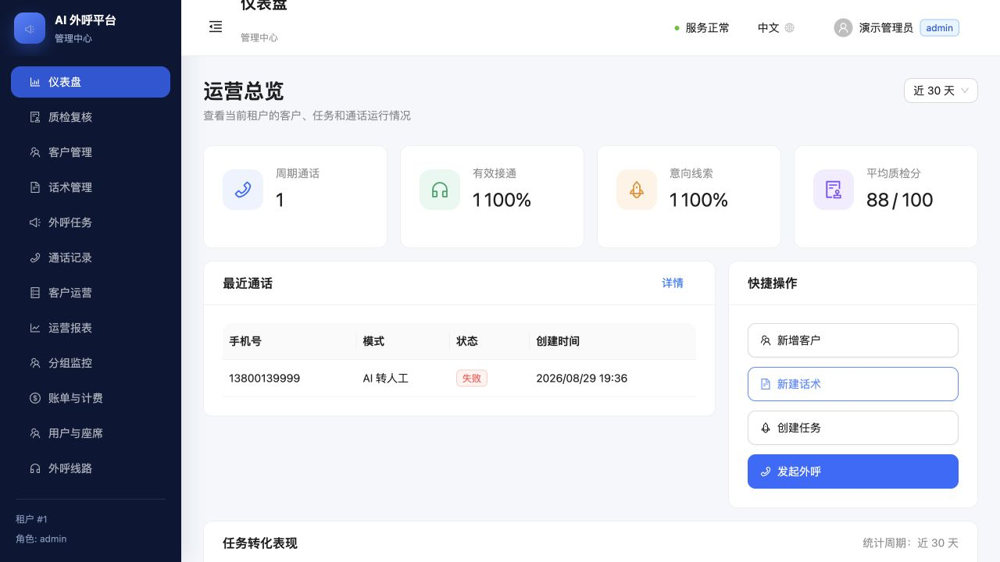
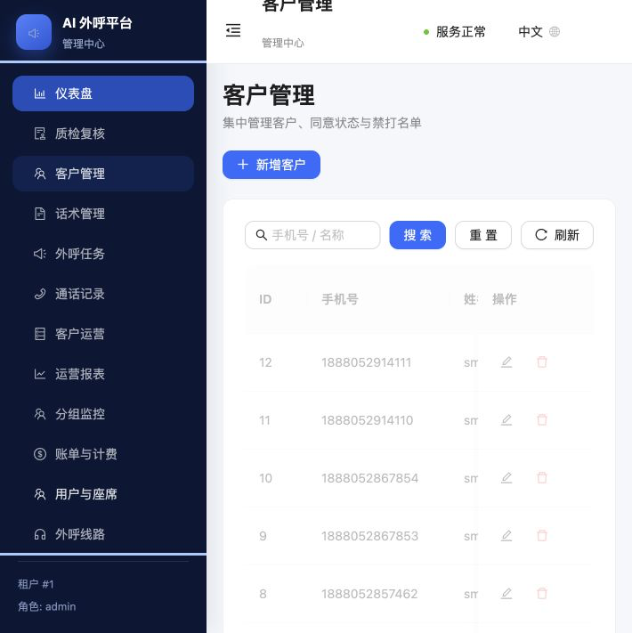
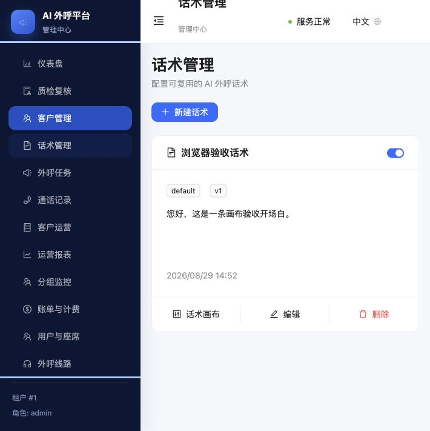
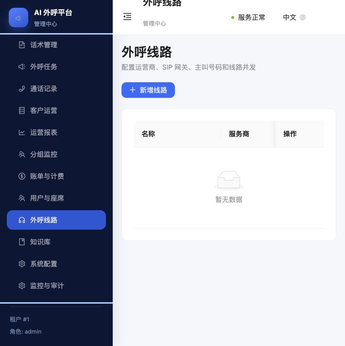
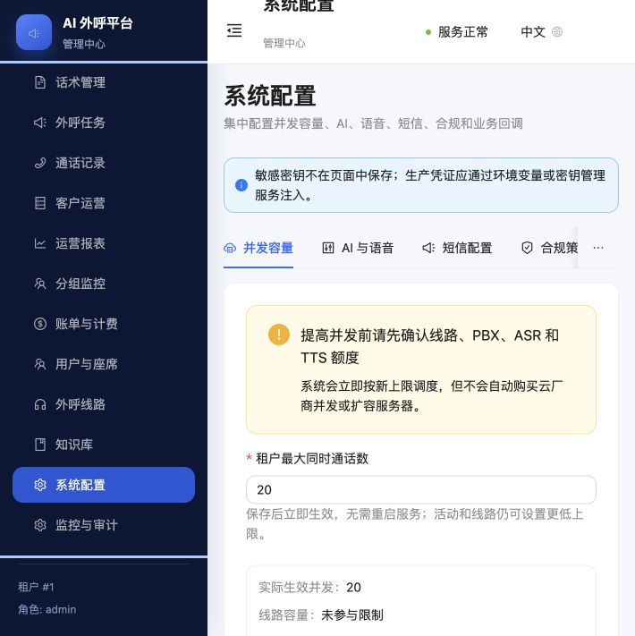
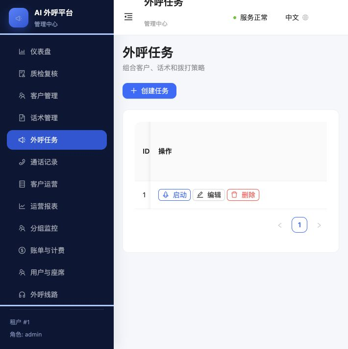
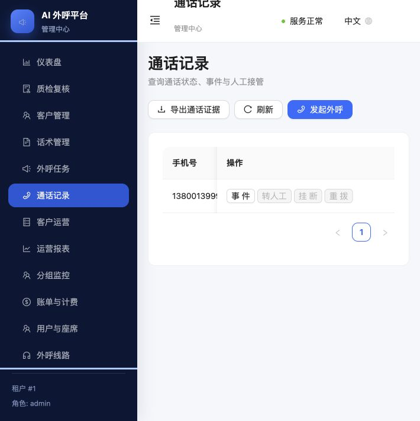
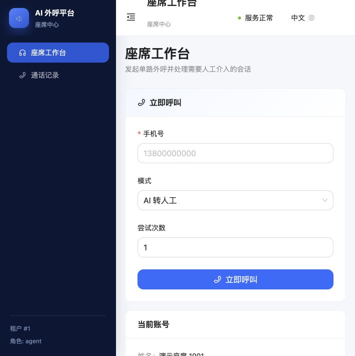
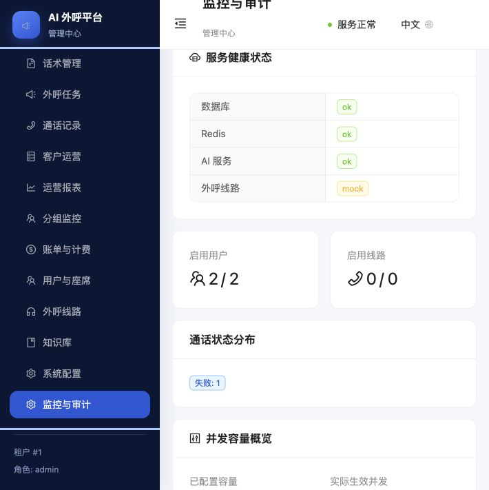

# AI 外呼平台操作手册

> 适用版本：`b14724f` 及后续兼容版本  
> 手册更新时间：2026-08-30  
> 适用对象：系统管理员、运营人员、质检人员、班组长和人工座席

## 1. 使用范围与重要说明

本手册说明 AI 外呼平台管理中心和座席中心的日常操作。截图来自本地演示环境，页面中的号码、账号、任务和统计均为演示数据。

- 管理中心负责客户、话术、任务、线路、容量、质检、报表、账号和系统配置。
- 座席中心负责单路呼叫、座席状态、人工接管和本人可见的通话记录。
- `Mock` 线路只用于开发验收，不能视为真实电话接通。
- 生产环境必须关闭演示账号，使用正式账号和密钥管理服务。
- 发起外呼、启动任务、重拨、转人工、挂断、批量禁打、删除和修改系统配置都会改变业务数据，操作前应确认对象和环境。

## 2. 访问地址与角色

| 入口 | 默认地址 | 可用角色 |
|---|---|---|
| 管理中心 | `http://<服务器地址>:8000/admin` | `admin` |
| 座席中心 | `http://<服务器地址>:8000/agent` | `agent` |
| API 文档 | `http://<服务器地址>:8000/docs.html` | 已登录用户可从右上角账号菜单进入 |
| 健康检查 | `http://<服务器地址>:8000/readyz` | 运维检查 |

本地演示账号仅在非生产环境且 `DEMO_USERS_ENABLED=true` 时创建：

- 管理员：`admin / 12345678`
- 座席：`1001@test / 12345678`

生产环境不得继续使用上述密码。管理员和座席登录入口相互独立，座席直接访问管理页面会被重定向回座席中心。

## 3. 登录、语言和退出

1. 打开对应角色的登录地址。
2. 输入用户名和密码，点击“登录”。
3. 登录成功后，左侧显示该角色可访问的菜单，右上角显示服务状态、语言和当前账号。
4. 点击“中文 / English”可即时切换语言，语言偏好保存在当前浏览器中。
5. 退出时点击右上角“当前账号”→“退出登录”；退出后应返回对应登录页。

如果登录失败：

- 确认进入的是正确角色入口。
- 检查账号是否启用、密码是否正确。
- 连续失败并提示请求过多时，等待登录限流窗口结束后再试。
- 生产环境不要让用户共享管理员账号。

## 4. 管理中心概览

管理员登录后首先进入仪表盘。仪表盘展示周期通话、有效接通、意向线索、平均质检分、最近通话、快捷操作和任务转化表现。

左侧菜单包括：仪表盘、质检复核、客户管理、话术管理、外呼任务、通话记录、客户运营、运营报表、分组监控、账单与计费、用户与座席、外呼线路、知识库、系统配置、监控与审计。

推荐的首次配置顺序：

1. 用户与座席
2. 外呼线路
3. 系统配置
4. 客户管理或客户运营导入
5. 话术管理和知识库
6. 外呼任务
7. 通话记录和质检复核
8. 运营报表、账单与监控

## 5. 用户与座席

入口：管理中心 → 用户与座席。

### 新增账号

1. 点击“新增用户”。
2. 填写用户名、姓名、密码和可选手机号。
3. 选择角色：管理员或座席。
4. 如该座席需要质检复核权限，开启“班组长”。
5. 保持“启用”并保存。

密码至少 8 位。生产环境应使用随机强密码，并通过安全渠道交付。

### 编辑、停用和改密

- 点击“编辑”可修改姓名、手机号、角色和班组长状态。
- 编辑时填写新密码会同时重置密码；留空则不改密码。
- 列表中的“启用”开关可停用账号，但不能停用当前登录账号。
- 账号和权限修改会进入审计日志。

## 6. 客户管理与客户运营

### 单个客户

入口：管理中心 → 客户管理。

点击“新增客户”，填写：

- 手机号：新建后不可直接修改；同一租户内不可重复。
- 姓名和标签：用于检索、分组与运营分析。
- 同意状态：已同意、未同意、已撤回或未知。
- 时区：默认 `Asia/Shanghai`，用于外呼时段判断。
- 禁打：开启后系统不得向该客户发起外呼。

已有任务或通话历史的客户不应直接物理删除；需要停止触达时，将其设置为禁打并记录原因。

### CSV 导入、导出和批量禁打

入口：管理中心 → 客户运营。

1. 点击“导入”，选择 CSV 文件。
2. 开启“更新已有数据”时，相同号码会更新；关闭时会跳过已有数据。
3. 导入后核对总数、新增、更新、跳过、失败和错误明细。
4. 需要批量禁打时勾选客户，点击“批量禁打”，填写原因后提交。
5. 点击“导出”可下载当前租户客户数据。

正式导入前建议先用 10—20 行样本验证字段、编码、号码格式和去重逻辑，再导入全量数据。

## 7. 话术与流程画布

入口：管理中心 → 话术管理。

### 新建基础话术

1. 点击“新建话术”。
2. 填写名称、分类和话术正文。
3. 可补充描述、标签并设置是否启用。
4. 保存后，启用的话术可被外呼任务选择。

### 配置话术画布

在话术卡片中点击“话术画布”：

1. 创建画布，或复制已有版本为新草稿。
2. 添加播报、等待、转人工和挂机节点。
3. 选择节点后填写节点名称和播报内容。
4. 设置起点、终点和连线条件：默认、关键词或静默。
5. 点击“保存”保存草稿。
6. 完整模拟并人工复核后再发布；发布版本不可直接修改，需要复制为新草稿。

任务只能绑定已发布的流程版本。发布前应至少覆盖正常回答、拒绝、静默、异常和转人工分支。

## 8. 知识库

入口：管理中心 → 知识库。

1. 点击“创建”。
2. 填写标题、分类、标签和知识正文。
3. 开启“启用”并保存。
4. AI 会根据通话内容检索当前租户启用的知识条目。
5. 删除操作会停用知识条目，历史版本仍可追溯。

知识内容应短而明确，避免同一问题存在互相冲突的答案。政策、价格和合规口径变更后应同步更新版本。

## 9. 外呼线路

入口：管理中心 → 外呼线路。

点击“新增线路”，配置：

| 字段 | 说明 |
|---|---|
| 名称 | 便于运营识别的线路名称 |
| 服务商 | `HTTP Bridge` 为真实网关接口；`Mock` 仅用于测试 |
| 网关地址 | 语音网关或运营商接口地址 |
| 凭据引用 | 环境变量或密钥管理服务中的引用名，不填写明文密钥 |
| 主叫号码 | 经运营商报备并允许外呼的号码 |
| 并发数 | 该线路最多同时占用的通话数 |
| 优先级 | 数字越小越优先参与选线 |
| 权重 | 同优先级线路间的分配权重 |
| 启用 | 只有启用线路参与真实调度 |

平台实际并发不会超过“租户容量、任务并发、启用线路并发总和”中的最小值。线路保存成功不代表真实 SIP/RTP 已接通，上线前必须实拨验证。

## 10. 系统配置

入口：管理中心 → 系统配置。

### 并发容量

- “租户最大同时通话数”允许填写 `1—10000`，保存后立即生效。
- 页面同时显示实际生效并发、线路容量、当前活跃通话、可用槽位和限制来源。
- `10000` 是配置校验上限，不代表系统已经通过万路压测。
- 增加容量前必须同步确认 PBX、运营商、ASR、TTS、数据库、Redis、服务器和网络带宽。

### AI 与语音

配置 AI 服务商、模型、ASR/TTS 服务商、语言和语音相关参数。密钥不得填写在页面中，应通过环境变量或密钥管理服务注入。

### 短信配置

设置短信服务商、签名、模板和挂断短信策略。正式启用前验证模板报备、发送回执、失败重试和计费口径。

### 合规策略

重点检查：

- 允许外呼的开始和结束小时
- 租户时区
- 是否强制 DNC
- 是否要求明确同意
- 单号码每日最大尝试次数
- 同号码两次尝试的最小间隔秒数
- 是否播放录音告知
- 录音保留天数
- 临时转写保留小时数

修改合规策略后，使用测试号码验证允许时段、禁止时段、DNC、未同意、次数和间隔拦截，不要只检查保存成功。

### 接口与回调

设置业务 Webhook 地址、凭据引用、超时、重试次数和退避时间。凭据字段保存引用名，不保存明文密钥。生产启用前需要验证签名、幂等、超时重试、失败队列和接收方对账。

## 11. 创建和运行外呼任务

入口：管理中心 → 外呼任务。

### 创建任务

1. 点击“创建任务”。
2. 填写任务名称。
3. 选择启用的话术模板和已发布的流程版本，或填写基础话术。
4. 选择模式：录音转人工、纯人工、纯 AI、AI 转人工或 AI + 短信。
5. 选择已同意且非禁打的客户。
6. 设置任务并发、重试次数、重试间隔和同号码尝试间隔。
7. 按业务和法规决定是否录音、是否发送挂断短信。
8. 保存后任务进入草稿状态。

### 启动前检查

- 客户同意状态和 DNC 正确。
- 当前时间在允许外呼时段内。
- 话术/流程版本已经发布并完成模拟。
- 真实线路已启用，主叫号码和凭据正确。
- 租户、任务和线路并发已按压测结果设置。
- 录音告知、短信模板和业务回调已验证。
- 座席状态为“空闲”，转人工链路可用。

### 启动、暂停、恢复和停止

- 点击“启动”会创建并投递通话任务，属于真实业务动作。
- 运行中可暂停；暂停后不会继续投递新的通话。
- 点击恢复可继续处理未完成任务。
- 点击停止结束任务，不再继续调度。
- 运行中的任务不能直接编辑或删除。

## 12. 单路呼叫和通话记录

管理员入口：管理中心 → 通话记录。  
座席入口：座席中心 → 座席工作台或通话记录。

### 发起单路呼叫

1. 点击“发起外呼”或在座席工作台填写手机号。
2. 选择通话模式、可选任务和客户。
3. 设置最大尝试次数。
4. 确认号码、客户授权、时段和线路后提交。

### 通话状态和操作

- 通话记录显示号码、模式、状态、尝试次数、任务和创建时间。
- 点击“事件”查看状态时间线、AI 分析、质检结果和内部事件。
- 仅在状态允许时才能转人工或挂断，禁用按钮表示当前状态不允许该动作。
- 失败、无应答等状态可按策略重拨；系统仍会重新执行合规与频控检查。
- 管理员可点击“导出通话证据”，下载近 30 天 CSV。导出行为会记录到审计日志。

不要把 `queued`、`dialing` 或 `answered` 当作业务完成；以运营商终态、录音、转写和业务回传共同确认结果。

## 13. 座席工作台与人工接管

### 座席状态

- 空闲：可以接受人工接管。
- 忙碌：正在处理会话，不应接收新接管。
- 离线：退出接管队列。

平台会周期性同步座席状态；同步失败时页面会回滚到上一个状态并提示重试。

### 接管流程

1. 座席登录后将状态设为“空闲”。
2. 在“待接管队列”查看客户、号码、任务、意图、最后一句话和摘要。
3. 确认能够接听后点击“接受”；接受后座席状态转为忙碌。
4. 无法处理时点击“拒绝”，请求会按系统规则继续流转。
5. 在“当前会话”持续查看会话状态；处理结束后恢复为空闲。

当前仓库已实现浏览器 WebRTC 软电话、耳麦选择、接管请求和媒体状态控制；真实 WSS、coturn、FreeSWITCH 音频、耳麦、网络抖动和媒体桥接仍需在目标设备上验收。

## 14. 质检复核

入口：管理中心 → 质检复核；具备班组长权限的座席也可进入质检复核。

1. 按待复核、已复核或全部筛选。
2. 可设置最高分阈值，优先查看低分通话。
3. 点击“证据”查看结果、意图、情绪、分数、风险标记、摘要、转写和录音资产。
4. 点击“复核”修正通话结果、意图、情绪、质检分、风险标记和摘要。
5. 保存后复核结果会进入仪表盘和运营统计。

人工复核必须基于录音和转写证据。没有可用录音或转写时，应记录证据缺失，不要仅凭自动摘要定责。

## 15. 运营报表、分组监控和账单

### 运营报表

可按任务、座席或线路查看 7、30、90 天数据，并切换按天或按小时粒度。核心指标包括通话、有效接通、转人工、完成、失败、无应答和损失。

### 分组监控

按客户标签/分组查看客户数、禁打客户、通话、接通、转人工、完成、失败和无应答。发现异常时先检查分组定义、时间范围和样本量。

### 账单与计费

按任务、座席或线路输入线路分钟单价、AI 分钟单价和短信单价，查看估算成本。该页面属于运营估算，不替代供应商正式账单；上线后应定期与运营商、ASR/TTS、模型和短信账单对账。

## 16. 监控与审计

入口：管理中心 → 监控与审计。

重点关注：

- 数据库、Redis、AI 服务和外呼线路健康状态
- 启用用户与启用线路数量
- 通话状态分布
- 已配置容量、实际生效并发、活跃通话和可用槽位
- AI 平均响应时延、超时任务、最早未完成任务和录音删除失败
- 管理员操作审计日志
- 短信发送状态、供应商消息 ID、错误和失败重试

当页面显示 `mock` 或 `unconfigured` 时，表示对应真实服务没有完成生产配置。遇到故障先暂停新任务，再保存日志、请求 ID、通话 ID和供应商 ID，避免反复点击造成重复操作。

## 17. 常见问题处理

| 现象 | 建议检查 |
|---|---|
| 无法登录 | 入口角色、账号启用状态、密码、登录限流、服务健康 |
| 任务无法启动 | 客户、话术、任务状态、外呼时段、DNC、同意状态、容量和线路 |
| 实际并发低于配置 | 任务并发、租户容量、启用线路并发总和和正在占用的通话 |
| 设置 10000 仍未达到万路 | 10000 只是配置上限；核查 PBX、运营商、ASR/TTS、服务器、网络和压测结果 |
| 转人工按钮不可用 | 通话状态、座席是否空闲、接管请求状态和角色权限 |
| 没有录音或转写 | 录音开关、告知与授权、供应商回调、对象存储和保留策略 |
| 短信失败 | 服务商配置、模板报备、余额、号码格式、回执和重试日志 |
| 统计与业务不一致 | 时间范围、指标口径、运营商终态、自动分析和人工复核结果 |

## 18. 正式上线前置条件

- 使用正式域名、HTTPS、可信主机和最小权限账号。
- 设置 `ENV=production`、关闭演示账号，并替换所有默认密码和密钥。
- 接入真实 PBX/SIP/RTP、运营商号码、ASR、TTS、模型、短信和对象存储。
- 完成号码资质、录音告知、客户授权、DNC、呼叫时段和目标地区法规审查。
- 完成纯人工、录音转人工、纯 AI、AI 转人工和 AI + 短信关键链路实测。
- 按候选容量的 10%、25%、50%、100% 逐级压测，并完成高峰长稳测试。
- 验证故障降级、超时回收、重试幂等、重复回调、备份恢复和审计留痕。
- 在目标浏览器、耳麦、网络和真机上验证 WebRTC 与人工接管。
- 建立运营商、云服务和业务系统的监控、告警、值班与回滚机制。

## 19. 当前验收状态

| 证据层级 | 状态 |
|---|---|
| 源代码和手册 | 已完成 |
| 页面入口与演示环境浏览器检查 | 已完成 |
| 本地开发服务 | PostgreSQL、Redis、Control API、AI Agent、Voice Gateway 健康 |
| GitHub CI | 以对应提交的 Actions 结果为准 |
| 测试环境发布 | 未验证 |
| 真实运营商与媒体链 | 未验证 |
| 真机与耳麦 | 未验证 |
| 生产环境发布 | 未验证 |

本手册中的“可操作”表示当前代码和演示环境存在对应入口，不等同于真实线路、真机或生产环境已完成验收。
