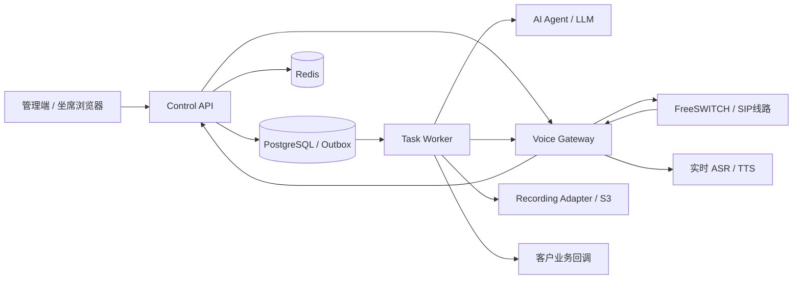

# 商业化、安全与并发架构复审

日期：2026-09-06。源码基线：`b46d811`，分支：`fix/voice-phase1-evaluation`。

## 决策结论

当前项目具备进入受控测试环境的工程基础，但尚不满足面向客户承诺稳定商用、明确并发容量或高可用SLA的条件。本轮确认8类安全与并发问题；另有任务调度、语音扩容、存储及可观测性方面的架构限制。建议先修复这些问题，再进行候选生产配置的容量测试。

这里的“不满足”有具体依据：租户可配置的AI地址收到平台共享服务凭据；号码日频次存在并发竞争；异步任务缺少完整的拨号轮次和执行租约保护；当前业务容器使用mock语音网关，且源码指纹不同于本次分支。不能根据单元测试数量、Compose healthy或配置里的并发上限推导商用可用。

本次只审查并新增报告、合成复现证据，没有修改业务源码、更新现有部署、提交或推送Git，没有真实拨号、发送短信或外传业务数据。高负载测试没有施加在现有业务实例上。

## 系统全貌与保留价值

现有结构是模块化控制服务加独立AI服务、语音网关和录音适配器。控制服务使用FastAPI、SQLModel/PostgreSQL；Redis承担限流、锁及坐席媒体状态；PostgreSQL Outbox承担异步任务；语音网关承接FreeSWITCH ESL与Pipecat媒体会话；录音进入S3兼容存储。

值得保留的实现：回调HMAC和去重；业务变化与Outbox共事务；登录失败锁定和JWT版本撤销；租户过滤与前端会话缓存隔离；拨号前持久化安全意图；线路、号段、CPS、并发和费用预留；未知PBX状态保留容量；排空接口；受控Pipecat分发及依赖审计CI；备份恢复脚本。它们降低了风险，但下列旁路和故障分支尚未闭合。

建议保留模块化后端，优先拆分执行队列与资源边界；当前没有证据表明必须重写成大量微服务或引入Kafka。

## 已确认问题：上线前优先处理

以下P1表示必须优先整改的实际缺陷；不代表本轮已经发生生产事故。8类问题均有合成复现，网络目的地与凭据均为测试值。

### F1 / P1：租户可配置地址带出共享服务凭据和原始通话内容

- 位置：`backend/app/api/routers/admin_management.py:622`、`:655`；`backend/app/services/dispatcher.py:209`；短信同类路径为`backend/app/services/telephony.py:360`。
- 租户管理员可修改`ai.agent_url`，只校验HTTP/HTTPS前缀；独立安全审批只覆盖capacity/compliance，不覆盖AI地址。`request_ai_turn`随后向该地址发送全局`AI_AGENT_SERVICE_TOKEN`、号码、转写及上下文。
- 复现：在设置校验与写入路径切换为production后，不带安全审批仍可保存合成外部地址；HTTP拦截器确认共享测试令牌与原号码被附带。外部网络请求数为0。
- 影响：这是租户配置到平台服务凭据的信任边界穿透；也绕开了AI Agent内部针对外部LLM配置的主机限制和脱敏步骤。不能因为LLM适配器有白名单，就认定整个模型调用链都有保护。
- 整改：租户选择平台登记的provider ID，平台管理真实地址和凭据；内部AI端点不得由租户自由填写。客户回调需独立出站策略，限制协议、端口、域名和解析IP，禁止未授权内网/元数据目的地；批准的内部服务单列白名单。短信端点与全局SMS API key一并整改。若真实环境曾使用不可信端点，再依据审计记录评估凭据轮换。

### F2 / P1：号码日频次在并发下可以突破

- 位置：`backend/app/services/call_service.py:267`。号码频次检查先执行，随后才锁Tenant行；取得锁后未重新检查号码频次。
- 复现：真实隔离PostgreSQL 16中，日上限设为1；两个独立线程在前置检查后同时继续，结果两个拨号名额均领取成功，总attempts为2。没有调用拨号适配器。
- 影响：同一号码可能被多个任务同时呼叫；客户频次承诺与号码治理不可靠。网关总CPS/并发限额不能替代每号码频次约束。
- 整改：把检查与领取放进同一受保护事务；低规模先在已有租户锁后重检。扩展时用`tenant + normalized_phone + local_day`计数/预留记录及原子条件更新，并统一最小间隔、DNC撤销、初拨与重拨口径。

### F3 / P1：上一次拨号的AI任务能在新一轮执行

- 位置：`backend/app/api/routers/webhooks.py:300`、`:367`、`:406`；`backend/app/services/task_queue.py:153`；`backend/app/services/dispatcher.py:263`。
- 回调入口检查attempt，但持久AI任务payload只带call_id/transcript；执行时再读取当前attempt作为“期望轮次”。入队时属于旧轮次的文本会因此变成新轮次的输入。
- 复现：第1轮入队后，把通话推进到第2轮IN_AI；处理旧任务时，真实dispatcher仍调用模型入口并携带旧文本，模型和后续媒体动作均被mock。
- 整改：payload持久化attempt、turn序号和事件ID；领取前、请求模型前、执行媒体动作前及写入结果时都核验同一轮次。前一轮任务标记过期，不对新通话执行。会话历史也应按轮次或新会话边界过滤。

### F4 / P1：崩溃后的AI任务回收可以篡改终态并提前释放容量

- 位置：`backend/app/services/task_queue.py:272`。
- 回收超过5分钟且次数耗尽的AI任务时，直接将关联通话写成FAILED，没有核对通话状态、拨号轮次或PBX终止证据。
- 复现：IN_AI→FAILED，COMPLETED→FAILED，两种状态均被覆盖。现有`test_scheduler_marks_crashed_final_attempt_dead`甚至把FAILED当作预期，因此现有回归全绿不代表该安全约束正确。
- 整改：死信只改变任务及诊断状态；通话终态由带轮次的PBX确认更新。活动通话保留名额并进入协调/挂断流程；已完成通话不得倒退。

### F5 / P1：任务重领后，旧执行者仍能覆盖新执行结果

- 位置：`backend/app/services/task_queue.py:121`、`:207`、`:243`；`backend/app/models.py:301`。
- TaskOutbox有locked_at，没有owner、lease generation或fencing token；完成和异常路径按ID重新读取后直接改状态。
- 复现：模拟租约年龄超过5分钟；第二执行者成功写COMPLETED，随后第一执行者迟到失败，把同一任务改回FAILED。外部回调被mock。
- 风险不只来自崩溃：配置允许客户回调timeout到120秒、重试10次、backoff到60秒，合法配置足以超过5分钟。缺少稳定的对外delivery ID也使客户端较难去重重复投递。
- 整改：领取生成执行代次，完成/失败更新必须包含owner与generation的条件；长任务有续租和总deadline，失去租约者不得继续产生副作用。下游携带稳定delivery ID，提供按至少一次投递设计的去重契约。

### F6 / P1：调度领导锁会在工作未完成时过期

- 位置：`backend/app/services/call_service.py:1210`；`backend/app/config.py:61`。AI话轮锁同样需检查：`backend/app/services/dispatcher.py:112`。
- 调度锁默认15秒，工作期间不续租；心跳只在一轮开始写一次。慢PBX、批量录音、AI任务或客户回调都能让单轮超过15秒。仅增加task-worker副本会产生重叠执行者。
- 复现：真实隔离Redis，调度TTL缩短为2秒、合成扫描耗时2.8秒，两个调度器同时进入执行区。验证的是“工作超过TTL”的机制，未把该合成耗时当成生产延迟数据。
- AI锁默认45秒也无续租，模型、TTS重试、播放等待、短信及回调可能让受保护工作超过TTL；此部分本轮为静态风险，未单独复现双AI执行者。
- 整改：按租约所有者安全续租，失去租约立即停止继续派发；即使有锁，业务写入仍需执行代次保护。避免用无限加大TTL替代故障恢复。Redis官方也将互斥有效性限定于租约有效期，并描述了续租机制：[Distributed Locks](https://redis.io/docs/latest/develop/clients/patterns/distributed-locks/)。

### F7 / P1：通用IP限流误伤语音回调，Redis故障后还会永久退回本地计数

- 位置：`backend/app/middleware.py:139`、`:203`、`:236`；默认值`backend/app/config.py:112`。
- 所有webhook共享同一来源IP下的`/api`桶，默认600次/60秒。一个网关产生的状态、speech、media及录音事件互相占额度。请求在验签前就受此桶限制。
- 复现：在使用真实中间件的隔离ASGI入口，同IP连续发送601次合成回调，600次200、1次429。使用的是内存计数路径；Redis路径采用相同key与配额，真实生产流量下的最终阈值仍须测量。
- 容量推演：假设20通同时活跃，每通每秒0.5个事件，就已用完10事件/秒的平均预算；尚未计入其他回调。这是规划例子，不是实测事件频率。网关串行回调投递遇限流后会积压，旧回调超时还可能触发保护性停拨。
- Redis调用异常后代码把`self._redis=None`，没有恢复探测，多个API worker会各自计数；内存桶也没有全局过期清理。
- 整改：登录、人机交互和已认证供应商回调独立预算；回调按可信供应商/租户设置突发和持续速率，快速验签并可靠入队。对重要挂断与状态事件预留处理能力，不能直接关闭全部限流。Redis故障采用明确的拒绝/保守降级策略并自动恢复。

### F8 / P1：到期删除漏掉敏感副本，默认清理吞吐也过低

- 位置：`backend/app/services/retention.py:19`；`backend/app/services/call_service.py:1250`；`backend/app/config.py:60`、`:78`。
- 复现：对181天前已完成的合成通话执行清理，号码已脱敏，但已完成TaskOutbox中的原转写、CallSession.recording_url仍在。
- 静态检查还发现：语音安全SQLite保存拨号payload及审计记录，缺少历史归档/清理；短信、Outbox、备份与对象存储也需要明确各自保留口径。应区分按规定保留的计费审计与可清理的内容载荷。
- 按默认单调度器、每小时一轮、每类批量200计算，每类理论最多处理4800条/天，遇慢任务还会更少。相对于平台默认日拨号上限10000及每通多个转写的增长量，长期积压可能持续增加；这只是配置推算，不是已发生的生产积压。
- 整改：建立号码、转写、短信、录音、任务payload、日志与备份的数据副本清单；独立清理worker按时间预算持续分页处理，保留必要去重元数据时清空敏感内容，并监控最老逾期数据年龄及清理速率。

## 额外架构限制与商业交付缺口

| 领域 | 当前证据与影响 | 改造方向 |
| --- | --- | --- |
| 任务阻塞 / P1 | scheduler依次等待过期处理、重拨、待拨、Outbox、清理；Outbox逐条await。录音入库/删除使用同步httpx.Client并在async任务内直接调用；API的async拨号和AI链也直接用同步SQLModel查询。慢存储、连接池等待会阻塞事件循环或拖慢整轮。 | 拨号、实时AI、回调、录音、清理分别设队列和并发预算；同步任务整体在线程/独立进程执行，或者迁移真正异步DB/HTTP。Session不可跨线程共用；网络等待前释放事务。 |
| 执行位置不统一 / P1 | webhook提交后仍用FastAPI BackgroundTasks执行process_task，因而并非所有AI/录音工作都在独立worker。API进程会与worker共同领取任务。 | API只验签、短事务入队并确认；实时worker获得任务通知，Outbox轮询兜底。避免直接删除快速路径却保留1秒轮询，导致话轮延迟上升。 |
| 租户公平性 / P2 | pending扫描按updated_at取全局前200；容量满时不改变排序，某租户的队首可能持续占据候选批次；dispatch批次还取不同租户容量的最小值。 | 租户配额与加权轮询，限额拒绝的任务延后available_at；独立衡量排队时间。此项为代码推演，未做多租户持续饥饿实测。 |
| 连接池 / P2 | 每个后端进程pool_size=10、overflow=20。两个API进程加一个worker理论最大90连接；4个API加一个worker为150，尚未计算迁移及管理。临时PostgreSQL默认max_connections实查100。 | 按进程总量预算连接，预留运维/迁移空间；按实测采用连接代理。不能只增加uvicorn worker。未读取现有业务数据库参数，不能认定现网已耗尽。 |
| 语音网关水平扩容 / P1扩容前置 | SecureDriver对SQLite账本flock独占；Pipecat会话与FreeSWITCH绑定在进程内字典。共享卷不能简单多开；不同卷又各自计算全局预算，控制命令也可能落错实例。 | 明确call_id→gateway/PBX的归属与排空协议；共享配额协调，或为分片分配互不重叠预算且总和受控。当前先按单网关受控容量部署。 |
| 录音临时空间 / P2 | 录音最大值默认512MiB，超过8MiB后落临时文件；Compose的录音适配器/tmp只有64MiB，多个下载共享它。 | 按录音长度、编码、声道及并发测量并配置临时盘、配额和并发上限。超大合法输入会遇空间失败，该故障本轮未写满磁盘复现。 |
| 监控 / P2 | Prometheus以状态总量为主，无HTTP/AI全链路延迟直方图、事件循环延迟、任务等待时间分布、DB池等待及PBX/云供应商容量视图；每15秒从历史业务表聚合，历史增长会增加扫描压力。管理页有平均AI延迟和最老任务年龄，不能代替P95/P99告警。 | 增加低基数计数器/直方图、队列与依赖指标、PBX/主机/PG/Redis采集；单独保存call_id级追踪，避免用号码/call_id做Prometheus标签。 |
| 压测覆盖 / P2 | 已有SIPp OPTIONS与基础UAC；UAC只保持2秒，可选RTP echo，没有平台建任务、中文多轮语音、ASR/TTS/LLM和录音闭环负载。未找到k6/Locust API容量套件或本轮当前版本的稳定并发报告。 | 分层压测并最终联测，不能把OPTIONS响应或两秒通话当作AI外呼容量。 |
| 高可用交付 / P2 | 仓库主Compose是单实例PG/Redis/存储，存在固定container_name；有备份脚本，不等于已演练PITR和故障切换。主Compose未配置CPU/内存上限与日志轮转。 | 若承诺持续商用SLA，另建候选生产部署清单与资源隔离，演练RPO/RTO、备份恢复和发布回滚。当前安装不能认定为高可用生产模板。 |
| 运营闭环 / P2 | 前端录音资产页目前展示storage_uri/provider_url，没有完整的鉴权回听入口。安全账本的费用预留不是运营商CDR对账或租户结算。 | 补短期签名播放/下载、访问审计、录音回听验收；若按量收费，补计费事件、账单对账、冲正、成本与租户账期。内部使用与对外收费SaaS采用不同验收范围。 |

异步函数中直接调用同步工具不会自动得到线程池隔离，见[FastAPI并发说明](https://fastapi.tiangolo.com/async/)。多消费者任务领取可评估PostgreSQL的`FOR UPDATE SKIP LOCKED`，但仍需执行代次、业务幂等和失败恢复：[PostgreSQL SELECT](https://www.postgresql.org/docs/18/sql-select.html)。出站地址治理采用应用校验与网络限制两层，参考[OWASP SSRF防护](https://cheatsheetseries.owasp.org/cheatsheets/Server_Side_Request_Forgery_Prevention_Cheat_Sheet.html)。

## 并发容量必须怎样定义

容量报告至少分开报告：登录坐席/长连接数量、API RPS、新拨号CPS、振铃加通话占线数、已接通AI会话数、ASR并发、TTS/LLM请求率和并发、每秒回调事件、录音上传吞吐。不同指标不可互换。

- 平稳情况下，占线数约等于拨号CPS乘以平均占线秒数。占线时长需包含未接通振铃，不可只用接通后通话时长。
- 仅作容量建模：0.2 CPS、平均占线100秒，对应约20条占线；同样CPS在占线200秒时约40条。突发和长尾还需额外测量。
- AI会话量由接通率及接通后时长决定；LLM请求率约为AI会话数乘以每通每秒话轮数，再乘模型调用比例与重试放大系数。ASR通常是一通一个持续会话，TTS还需区分连接配额、请求QPS和生成字符量。
- 安全容量由实测网关/PBX资源、已购线路、云ASR/TTS/LLM限制、回调与存储能力共同决定；把它们换成同一工作负载下的容量后再取约束最严的一项。
- 上线配额建议低于合格压测点并预留约30%资源余量；此为候选工程目标，需要依据目标硬件、供应商配额和业务SLO调整，不能当作已证实能运行20/100/1000路的结论。

## 可执行压测与故障验收计划

先明确候选生产硬件/容器限制、Git SHA与镜像digest、数据库规模、租户数、坐席数、线路CPS/并发、真实时长分布、接通率、话轮频率、录音格式及云额度。缺少这些输入时可以做基准，但不能承诺商业容量。

| 层级 | 负载和步骤 | 必须采集 / 通过条件 |
| --- | --- | --- |
| 1. 控制面 | 隔离环境与真实PG/Redis，mock所有付费供应商。混合登录、客户搜索、任务配置、合成建呼、签名回调、坐席事件流与报表；按目标RPS的25%/50%/100%/150%逐级，每级15分钟。数据量可先用10万/100万联系人和相应历史话单两档。 | HTTP P50/P95/P99、5xx、业务拒绝与限流分别统计；DB锁等待、连接池、CPU/内存、队列最老年龄；压力发生器与服务资源分开观察。 |
| 2. 并发正确性 | 同号码跨任务竞争、多个worker领取、重复/乱序webhook、旧轮次AI结果、领取后崩溃、租约过期、DNC撤销、重拨与挂机交叉、转人工抢占。 | 越权、重复实际拨号、超频次/超额度、终态回退均为0；所有有效事件最终可对账，不能只看HTTP 200。 |
| 3. PBX/SIP | 受控线路先OPTIONS，再以符合真实分布的振铃和持续通话压测；例如首期若目标20路，用2/5/10/20路，分别变化CPS；不把2秒UAC直接作为最终场景。 | 呼叫建立/结束、响应码、RTP丢包/抖动、单向音、CPU/带宽、挂断兜底和CDR一致性。20路只是示例目标。 |
| 4. AI媒体 | 同一批获授权8k/16k音频，真实ASR/TTS/候选LLM，覆盖中文、噪声、静音、打断、长句、云限流与超时。混合四种通话模式。 | ASR成功率/CER、句末到final、final到决策、TTS首包、客户停说到首个可听回答、打断到停止可听音频；P95/P99与人工回听共同判断。 |
| 5. 存储与回调 | 正常与接近大小上限录音并发入库；低速/5xx/超时回调；延迟下载、上传失败、重试、删除与入库交错。 | 临时盘峰值、录音缺失/重复、校验和、回调delivery ID与签名、重试放大；不得拖死实时任务。 |
| 6. 稳定与故障 | 100%候选负载至少8小时高峰，候选版再做24小时；150%短突发5分钟。分别断Redis/PG连接、杀API/worker、断ESL/媒体、供应商429/5xx、排空发布；资源耗尽只在隔离环境。 | 内存/文件描述符/队列无持续增长；超载可控拒绝，存量通话受保护；恢复后任务可归因、可对账，旧执行者不得继续覆盖。实际商用恢复指标由业务签字。 |

建议初版SLO候选：普通控制接口P95≤300ms、P99≤1s；有效签名回调持久化确认P95≤200ms；稳态非预期5xx<0.1%；稳态计划负载下的合法回调不被通用限流误伤；容量超载时允许明确的429/503，但单独统计。语音可先以客户停说到首个可听回答P95≤1.5s、插话到停止播音P95≤300ms作为评审起点，按语言、供应商、网络与话术实测调整。所有这些是建议验收门槛，当前均未验证达到。

压测要使用固定到达率模型并同时记录生成器丢弃的迭代，避免系统变慢后发压量同步下降造成假通过。参考[k6 dropped iterations](https://grafana.com/docs/k6/latest/using-k6/scenarios/concepts/dropped-iterations/)。保存版本、配置摘要、负载脚本、原始指标、脱敏call_id清单、供应商配额与账单证据，而不是只保存一张“并发成功”的截图。

## 建议整改顺序

1. **上线阻断项**：F1出站凭据边界；F2号码频次原子性；F3/F4通话轮次与终态；F5/F6租约及执行代次；F7回调限流；F8敏感数据副本清理。先补会失败的回归，再修复，不沿用错误状态预期。
2. **并发基础**：独立实时/离线队列、限制API后台执行、消除同步阻塞与长事务、租户公平调度、连接池预算、录音临时空间、语音归属及总配额。
3. **可验收运营**：延迟分位数与容量监控、可回听录音、告警接收、备份恢复、候选生产环境版本锁定；按业务范围补成本/账单闭环。
4. **容量放行**：完整控制面压测→真实PBX/媒体联测→24小时候选版长稳→故障恢复与真机→受控生产灰度。每一档容量单独留下放行证据。

## 本轮实际验证、未验证及交付状态

| 项目 | 本轮结果 |
| --- | --- |
| 源码定位 | 已验证真实Git根目录、当前分支和HEAD；审查开始时工作区干净 |
| 源代码修改 | 未修改业务源码；只新增本报告与忽略版本控制的合成证据 |
| 静态检查 | 65个Python源文件AST通过；前端TypeScript通过；Git差异检查通过 |
| 后端SQLite | 113 passed，2 skipped（PostgreSQL专属测试） |
| 后端PostgreSQL 16 / Redis 7 | 115 passed，使用本轮新建隔离容器；验证后容器已删除 |
| Voice Gateway | 受控Pipecat 1.8.1+outbound.1指纹校验通过；190 passed |
| AI Agent / Recording Adapter | 分别7 passed / 9 passed |
| 前端单元测试 | 8 passed |
| 新的架构边界复现 | 8类问题已复现；其中Redis锁真实过期、号码频次使用真实PG并发；外部依赖均mock |
| 开发环境功能测试 | 上述自动化范围通过；本轮未重跑浏览器逐页、表单保存和完整业务链路 |
| 本机已运行实例 | 只读观察：控制服务dev/http电话/rule模型/mock短信；语音网关dev/mock/legacy；FreeSWITCH媒体容器unhealthy，最近检查退出码均2；未排查根因 |
| 部署对应性 | 已运行control容器task_queue.py SHA-256与当前源码不同，不能代表本次HEAD已部署 |
| 测试环境发布 / 远端CI | 本轮未执行，也未用历史CI替代本轮结果 |
| 真机 / 真实线路 / 实际容量 | 均未验证；本轮并发缺陷复现不等同于生产压力或长稳测试 |
| 生产环境发布 / Git提交或推送 | 未执行 |

语音首跑误用历史`.venv-voice-gateway`，得到49 failed、141 passed，原始日志保留；失败涉及旧Pipecat依赖与沙箱回环端口限制。随后验证`.venv-no-nltk`分发，在不读取仓库根`.env`的临时目录使用必要回环端口权限重跑，190项全部通过。此环境问题与上面的源码缺陷分开报告。Python测试运行时为本机3.12，Compose候选基础为3.11；本轮未重建容器，3.11目标镜像测试未验证。

本项目实际业务入口清单为：登录/退出→客户导入和搜索→话术与任务→拨号与重试→AI/转人工→通话结果/录音/质检→报表与配置。本轮是架构审查，上述页面的点击、填写、保存回显、返回与异常UI状态未重新逐入口验证。仓库不存在门店/房型、购物车、下单、支付链路，不将无关电商链路算作已验收。

**正式上线前置条件**：完成上述阻断项整改及回归；冻结候选环境和镜像；确认线路与云配额、受控号码及录音授权；四种通话模式完成真实双向声音、打断、转人工、终止回调、录音回听与客户回调验收；完成目标容量、长稳、故障恢复、监控告警及备份恢复；明确运营责任人与灰度/回滚条件。对外收费还需按合同口径完成账单和成本对账。

证据保存在`artifacts/architecture-review-20260906/`：`manifest.json`记录基线、文件哈希和容器观察；`probe-results.json`记录7类复现；`phone-race-result.json`记录第8类；其余文件为复现脚本和本轮原始测试日志。脚本是此次隔离实验快照，包含固定临时地址与初始化数据；再次运行应使用新的隔离目录/数据库并相应调整，不能直接指向业务服务。
