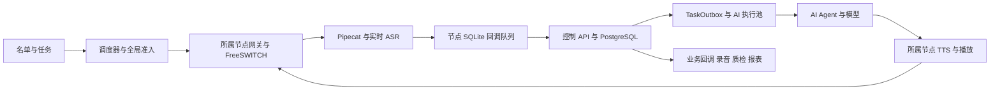

# 500 路并发架构瓶颈与解决方案

> 后续复核更正：P1-3 中“每个回调重新创建 Ledger”的探针运行的是未包装的 `FreeswitchEslDriver`。基线 `SecureDriver.__init__` 已将同一个 sender 注入实际生产驱动与 Pipecat；不能把该探针的 100 次初始化直接当成生产路径开销。ESL/管理端同步读写阻塞事件循环的问题仍成立。修复范围、剩余验收项及最终证据见 [本次修复交付记录](20260907-capacity-p1-p2-fixes.md)。以下保留原始审查基线。

审查日期：2026-09-07。源码基线：`419cc0b`，分支 `fix/review-p1-p2-20260907`。部署基线为 `docker-compose.compact.yml`：四台应用服务器，托管 PostgreSQL、Redis、负载均衡与对象存储。

结论：上一轮改造建立了节点归属、全局准入和并行任务基础，但还不足以承诺 500 路同时接通并持续进行 AI 对话。本轮确认了数据库连接在外部等待期间重新占用、中间转写写入放大、媒体事件循环被同步账本阻塞等实际代码问题。应先处理这些问题，再根据目标机器的压测调整进程和资源；当前证据不支持直接断言“四台服务器不够”。

本轮没有取得一次真实 500 路失败的完整链路剖析，因而不把推算当成实测瓶颈上限。运营商线路 500 路沿用已确认前提；本文分析自有系统，不提出原三方外呼平台的实现方案。

## 1. 当前业务与音频路径

每台目前运行两个 API 进程、一个后台 worker、一个 Agent、一个网关进程和 FreeSWITCH。网关进程还承担该节点全部 Pipecat 会话、ESL 事件和账本操作。ASR 的中间识别与终句均经过 SQLite、HTTP、PostgreSQL；终句再排队调用 Agent，完整模型答复返回后才下发 TTS。

需区分两个数字：`OUTBOUND_PLATFORM_MAX_CONCURRENT=500` 限制的是拨号中、接通、AI、等待/转接人工、人工通话的总占用；“500 路接通”是其中已接通并有双向音频的子集。100 路仍在振铃时，500 个总占用不能记为 500 路接通。准入保护要保留，同时分别展示真实接通数、振铃数和未知状态数。

## 2. 已确认的问题与修复顺序

### P1-1：结束语等待和挂断会重新占住数据库连接

证据位置：`backend/app/services/dispatcher.py:362`、`:475`、`:492`；`backend/app/services/call_service.py:1217`；`docker-compose.compact.yml:58`。

`session.commit()` 后继续访问 `call.id`，默认 ORM 过期刷新会重新发起查询并借出连接。因此“提交后再 await”不一定释放了整个外部等待期间的连接。隔离调用真实 `_apply_ai_action`，仅把提供方替换为假实现，观察到：

| 外部等待入口 | 引擎已借出连接数 |
|---|---:|
| 下发普通 speak | 0 |
| 等结束语播放完成 | 1 |
| 下发 hangup | 1 |

当前每个 worker 只有 6 个数据库连接。集中结束时，多条通话可能占满这些连接；播放完成轮询又要用另一份 Session 申请连接，进一步造成等待。轮询每 100ms 查询一次数据库，100 条等待结束语的通话还会产生约 1,000 次查询/秒。连接池数量不是通话数量上限，但持有连接跨越秒级播放会使两者错误耦合。

解决方案：

- 进入外部 I/O 前，把 call_id、attempt、provider_call_id、playback_id 等复制为普通不可变值，退出 Session；返回后用新短事务校验并写回。
- 建立 `after_playback` 后续任务：播放完成事件持久化后触发挂断；超时扫描兜底。避免 AI 执行槽和数据库轮询跟着整段音频等待。
- 不通过全局关闭 ORM 过期刷新来掩盖问题；迟到结果仍须按轮次和通话状态校验。
- 新增“所有网络/播放等待期间没有该任务持有的数据库连接”的回归，以及小连接池下的集中结束测试。

SQLAlchemy 官方说明了提交后对象过期、后续读取重新开始事务的行为，与本轮复现一致。[Session 生命周期](https://docs.sqlalchemy.org/en/20/orm/session_basics.html#committing)

### P1-2：中间识别结果进入多张表，并重复触发停播

证据位置：`voice_gateway/app/aliyun_nls_stt.py:248`、`voice_gateway/app/pipecat_pipeline.py:124`、`backend/app/services/realtime_voice.py:41`、`backend/app/api/routers/webhooks.py:424`、`:436`。

中间转写与最终句使用同一个持久化入口。每个中间结果写入 SpeechTurn、CallEvent、CallMetric、TaskOutbox，更新 RealtimeSession；即使租户未启用业务回调，也先建立回调任务，再由消费者判断无需发送。`barge_in=true` 的每次中间结果还会安排一次后台停播。

隔离临时 SQLite、已存在的通话及实时会话、真实业务函数测试结果：

| 项目 | 结果 |
|---|---:|
| 单个 partial 的驱动层语句数 | 20，含 BEGIN/SAVEPOINT/RELEASE；其中 4 INSERT、1 UPDATE |
| 单个 final 的驱动层语句数 | 28，含事务控制 |
| 10 partial + 1 final 后 SpeechTurn / CallEvent / CallMetric | 各 11 条 |
| 同一输入产生 TaskOutbox | 12 条，其中 11 个业务回调、1 个 AI 任务 |
| 所有输入标记插话后安排 interrupt_playback | 11 次 |

这些是 SQLite 路径的语句计数，不是 PostgreSQL 实测延迟。假设 500 路中一半客户正在说话、每个说话会话每秒 4 次中间识别，仅 partial 就有 `500×50%×4=1,000 事件/秒`，并产生约 4,000 行新增/秒，尚未计终句、媒体、状态及消费者处理。

解决方案：partial 在网关本地或短 TTL 状态中合并，用于字幕及 VAD；只保留最新版本并限制界面刷新频率。final、计费依据及关键生命周期事件必须可靠持久化。按租户实际订阅创建业务回调；默认业务结果交付不要包含每个中间字。按 `call_id + attempt + playback_generation` 去重打断，媒体本地先停，持久记录后补；最后一句和终态不能被合并丢弃。

### P1-3：媒体事件循环仍可被 SQLite 锁阻塞，生产端还重复初始化账本

证据位置：`voice_gateway/app/freeswitch.py:385`、`:414`、`:499`、`:837`；`voice_gateway/app/security.py:128`、`:299`、`:585`；`voice_gateway/app/pipecat_pipeline.py:534`；`voice_gateway/app/main.py:121`。

ESL 监听器逐个 `await _handle_event`；事件处理直接同步调用 known_uuid、mark_seen、finish。它们使用 `BEGIN IMMEDIATE`，连只读查询也取得写事务。对账和部分 metrics 读取同样直接进入同步账本。虽然发送队列已用线程处理 I/O，尚未覆盖这些入口。

另一个开销是 FreeSWITCH/Pipecat 每发一个事件都会新建 CallbackSender 和 Ledger，导致初始化状态无法复用，唤醒的也是临时 sender，而非持续消费的实例。

本轮真实事件生产方法的隔离复现：

- 100 个事件新建 100 个 Ledger、100 个 SQLite 连接，执行 900 条 `CREATE ... IF NOT EXISTS`。这不是创建了 900 张新表，而是重复执行结构检查语句。
- 人工注入一个 200ms 账本锁占用，调用真实 ESL 事件处理；计划 10ms 后触发的同事件循环心跳实际约 211ms 才触发。说明锁等待会阻塞同进程其他协程；不代表真实磁盘已经测得 200ms 延迟。

解决方案：

- 每个网关只创建一个 Ledger/CallbackSender，注入 FreeSWITCH 和 Pipecat；生命周期内复用连接和发送器。
- 所有账本 I/O 离开音频事件循环；读取不使用写事务，必要状态用有界缓存。单独写入线程可做小批事务，仍需完成可靠持久化后才确认接收。
- ESL 快速读取后按 call_id 分片到有界事件队列，保持同通话顺序，避免一个会话的关闭/录音/慢写堵住所有会话。
- 清理同步阻塞后，再对比同宿主机 2×100 或 4×50 的媒体执行进程。控制网关保留单账本所有者，增加媒体 worker 归属与定向 WebSocket/指令路由；不能直接把当前网关改成四个 Uvicorn worker 共用账本。

SQLite WAL 仍然只有一个写入者，增加连接或线程本身不会变成多写并行。[SQLite WAL 并发说明](https://www.sqlite.org/wal.html#concurrency)

### P1-4：API 准入预算和写放大后的事件负载不匹配

证据位置：`deploy/compact/backend.env.example:20`、`backend/app/middleware.py:119`。

四台各两个 API 进程，每进程最多 4 个 webhook 在途，理想均衡时合计 32，失去一台后 24；没有等待槽，超出立即 503。这是合理的过载保护，但不能算成成功吞吐。该槽还覆盖 ASGI 后台任务退出，耗时不只数据库事务。

在没有其他瓶颈、均衡充分的理想条件下，吞吐上界约为 `在途预算/平均占用时间`：

| 平均 webhook 槽占用时间，假设 | 四台理论上界 | 三台理论上界 |
|---|---:|---:|
| 50ms | 640 请求/秒 | 480 请求/秒 |
| 100ms | 320 请求/秒 | 240 请求/秒 |

这些不是实测容量。要在 32 个槽下处理 1,000 有效事件/秒，平均槽占用需低于 32ms，而且还要留余量。仅提高每分钟限流参数不改变这一关系。回调积压超过默认 30 秒会使网关停止新呼叫，形成“事件慢 → 回调重试 → 准入停止 → 并发下降”的链条。

解决方案：先执行 P1-1/2/3 降低成本；将 webhook 改为短事务的 Inbox 接收、去重和必要顺序信息持久化，ACK 后由有界消费者处理业务。状态变更与派生 Outbox 在消费者事务中保持原子；在接听状态确认处理前不能执行依赖它的 AI 任务。媒体本地打断不等待这一事务。若继续同步写业务，需减少重复查询/保存点，并单独测持槽时间。最后按实测调整每进程预算、API 进程和数据库总连接数，保留过载保护与优雅排空。

### P1-5：调度仍是全局单执行者，故障对账能挡住正常建呼

证据位置：`backend/app/services/call_service.py:267`、`:1088`、`:1195`、`:1251`；`backend/app/services/gateway_cluster.py:64`、`:96`。

四个 worker 竞争同一个调度 leader，每轮按“过期通话对账 → 重拨 → 待拨”顺序执行。过期通话逐条等待挂断；compact 每批 50，若 50 条都用满 8 秒 HTTP 超时，单这一段就可能约 400 秒，期间该 leader 不处理新拨号。新增拨号仍是整批 gather 完成后才进入下一轮，慢拨号影响补位速度。

此外，每次准入取得同一 PostgreSQL 事务锁后，再查询同意/频次/当日总量/线路/租户/任务/节点容量。网关健康探测落库也使用这把锁。本轮小规模 SQLite 完整准入路径观察到 22 条驱动语句；该数量不能直接当 PostgreSQL 数量或锁内耗时，但说明当前临界区包含多步操作。增加调度副本不会绕过这把锁。

解决方案：

- 将未知通话对账拆为独立任务，按节点隔离超时、并行数和熔断；原节点未提供可信结束证据时继续保留容量，不能改成 TTL 自动释放。
- 待拨队列持续按空闲槽补位，以 CPS 令牌桶平滑建呼；每个节点独立处理拨号 I/O，慢节点不拖住其他节点。
- 先缓存可安全缓存的只读策略、维护日计数和活跃容量计数，缩短原子准入事务；安全检查在最终准入仍要验证。确有锁瓶颈再采用固定顺序的条件计数更新/槽位记录，和通话归属同事务提交。
- 正常健康心跳更新改用节点自己的行锁/条件更新，只有节点地址变更等影响所有权的操作参与更严格协调。

PostgreSQL 的 SKIP LOCKED 适合队列表多消费者领取，不能替代全局容量和业务状态的一致性设计。[PostgreSQL 16 SELECT](https://www.postgresql.org/docs/16/sql-select.html)

### P1-6：AI 容量预算与排队语义尚未满足 500 路对话

证据位置：`docker-compose.compact.yml:59`；`backend/app/services/task_queue.py:387`、`:444`；`agent/app/llm.py:101`；`backend/app/services/dispatcher.py:188`。

每台 64 个 AI 执行槽，四台 256，三台 192。占用时间包括上下文查询、模型、下发播报、结果写回，部分路径还包括结束语播放。

| 算例，任务平均占用 3 秒 | 四台 | 三台 |
|---|---:|---:|
| 无余量理论完成上界 | 85.3 轮/秒 | 64 轮/秒 |
| 500 路每 8 秒一轮，62.5 轮/秒 | 约 73% 槽利用率 | 约 98% 槽利用率 |
| 500 路每 4 秒一轮，125 轮/秒 | 超出预算 | 超出预算 |

3 秒是算例，不是当前模型实测。若以 125 轮/秒、平均占用 3 秒、失一节点仍保留约 30% 余量规划，每台至少需 `ceil(125×3/(3×0.7))=179` 个有效执行槽。它是容量计算，不是把 64 直接改成 179 就能通过。

另外，所有同通话同类型任务严格 FIFO：旧任务在重试等待时，新终句不能领取。隔离构造“旧任务失败、30 秒后可重试；新任务已就绪”，领取结果为 0。后端虽然能丢弃旧结果，新输入仍先受到旧任务排队的影响。

当前 Agent 的模型请求为完整响应，拿到整段文本后才 TTS。AI 请求、Agent→模型、语音命令每次各建 HTTP Client；后台每个任务还新建事件循环/租约客户端。它们增加握手与调度开销，不利于大量短轮次。

解决方案：

- 将 AI 执行器改为常驻事件循环的有界异步消费者；数据库短事务用独立受限线程或异步 Session，不跨任务共享 Session。HTTP/Redis 客户端按进程或事件循环复用。
- AI 队列用“最新有效终句优先”，旧的未执行终句可取消/合并，保留对话记录与审计；状态/计费/交付任务仍按业务需要严格有序。
- 把 `attempt + turn_sequence + playback_generation` 一直传到媒体指令端；新输入到达时取消旧模型和旧音频，避免取消后迟到结果播放。
- 规则/流程话术走确定性短路径；模型回答采用流式可播分句，同时执行输出规则校验，区分首音时延与整轮执行时间。
- 用真实脚本测每轮平均占用、P95、TPM、TTS 首包与 ASR 活跃连接，按 500 路及一节点退出情形分配预算。500 个同步终句是单独突发测试，不能用平均吞吐替代。

HTTPX 官方建议不要在高频循环里反复创建客户端，否则无法充分复用连接池。[HTTPX 异步客户端](https://www.python-httpx.org/async/#opening-and-closing-clients)

### P1-7：自有系统的有效配额没有形成统一的上线配置校验

证据位置：`voice_gateway/app/config.py:35`、`voice_gateway/app/security.py:231`、`.env.example:243`、`deploy/security/voice-routes.example.json`。

compact 显式设置了 200/500，但没有设置网关 CPS、每日次数和费用预算。若正式 env 沿用默认，单网关仍为 2 CPS、1,000 次/日；路线示例甚至只有 1 并发、1 CPS、10 次/日。示例显然不是正式线路配置，不能把它认定为当前生产实际限额；问题在于缺少启动前对所有层级“有效最小值”的检查。

举例：如果实际生效是每节点 2 CPS，四节点合计最多 8 CPS；接通率 30%、平均接通时长 120 秒时，单从供给速率估算最多约 `8×0.3×120=288` 路接通，尚未考虑未接通呼叫也占通道。这里限制来自我方应用配置，未重新质疑运营商的 500 路容量。

当前批量调度并没有在发出 HTTP 拨号前按节点 CPS 平滑排队。瞬时超过网关 CPS 得到的 429 会被当作确定拒绝，通话已领取的 attempt 不会撤销；批量发起可能消耗重试次数而没有实际建呼。对应 `backend/app/services/telephony.py:426` 和 `backend/app/services/call_service.py:801`。需要在取得通话拨号轮次前调度可用 CPS，或者为“明确未建呼的容量拒绝”设计单独的安全再排队状态，不能简单对所有失败重拨。

解决方案：统一生成并校验平台、租户、任务、线路、网关、Pipecat、PBX 呼叫腿数量的有效预算；明确 CPS、每日次数及金额预算，不能通过关闭安全限制解决。PBX 的 max-sessions 按实际呼叫腿验证，不能把 200 个客户通话机械等同于 200 个 PBX session。仓库本地媒体验证配置 `deploy/freeswitch-voismart/freeswitch.xml` 明确仅设 20 sessions、5 sessions/s，且无真实 carrier profile；正式 compact 挂载配置必须单独资格验证，不能复用本地验证配置就宣称 200 路。

### P2：持续运行后的其他负载与功能风险

| 风险 | 证据 | 处理方案 |
|---|---|---|
| 知识库每轮全量加载并 Python 排序 | `backend/app/services/knowledge.py:9` | 版本化租户缓存，数据库检索或全文/向量索引只取 Top-K；保持租户隔离，按知识规模测 CPU 与查询量。 |
| 任务领取反复排序待处理集合 | `backend/app/services/task_queue.py:393` | 观察 EXPLAIN 与候选行数，增加与待执行状态相匹配的部分索引/就绪队列表，保留公平性；不要在大积压下每 50ms 排完整集合。 |
| 历史任务、事件、指标继续膨胀 | `backend/app/services/retention.py:140`、`:177` | 目前这些路径主要清空敏感字段；增加保留期限内的分区/归档与终态任务清理，保留去重所需最小墓碑，不因删除历史记录使迟到重试重复执行。 |
| 录音消费者每台 2 槽、适配器仅 1 槽 | `docker-compose.compact.yml:61`、`:136` | 合理匹配上传并发、带宽及对象存储延迟；记录最老待上传年龄。真实录音源 URL 要指向归属节点可达入口，统一 LB 不能随机请求没有该文件的节点。 |
| 跨 PBX 坐席注册/接管未闭环 | `deploy/compact/README.md` | 在四台内配置统一 SIP 注册路由或跨 PBX 分机路由，真实浏览器和耳机验收；纯 AI 容量达标不代表人工接管功能达标。 |
| 观测不足以解释真实媒体上限 | `voice_gateway/app/main.py:100` | 增加事件循环延迟、ESL 队列年龄、PCM 音频缺口、模型在途/首包/限流、每节点有效接通数；仪表盘同时显示数据库和回调积压。 |

## 3. 保持四台主机的技术落地方案

不预先增加服务器。先在四台内重新分配执行责任，是否升级规格以共载压测为依据。

| 层 | 目标设计 |
|---|---|
| 调度 | 单一明确的配额账本，短事务准入；多个独立拨号执行者；CPS 平滑控制；对账与拨号解耦。 |
| 媒体 | 每台 FreeSWITCH 配合一个控制网关及经测试确定数量的媒体 worker；稳定 call/PBX/media-worker 归属，总客户通话目标 200。 |
| 实时事件 | 本地优先处理打断与中间状态；关键事件持久队列回传；回调发送器和账本复用，单通话因果关系保持。 |
| 控制面 | API 快速完成可靠接收；按优先级消费并入业务库；管理查询/导出不能占满实时事件资源。 |
| AI | 常驻异步执行池、连接池复用、流式响应、旧轮次取消；按实测占用时间配置 500 路及单节点退出时的槽预算。 |
| 数据 | 共享托管 PostgreSQL/Redis；短事务、受控连接数、热点计数和历史归档；无需为了 PgBouncer 或监控另加服务器，先验证是否确实需要。 |
| 交付 | 录音、业务回调、质检独立限并发及重试；线路/SIP/坐席路由单独验收。 |

实施顺序：先修连接持有、partial/打断放大和网关同步 I/O；再拆调度对账、调整 AI 队列与流式路径；然后评估 API Inbox、媒体分进程和数据库索引/归档。每一步做单变量对比，避免同时扩大所有并发开关导致无法定位回归。

## 4. 如何证明达到 500

| 阶段 | 必须记录的证据 |
|---|---|
| 机制回归 | 外部 await 无连接占用；同一播放只打断一次；迟到轮次不播放；关键事件与任务同事务；未知 PBX 状态不释放名额。 |
| 控制面负载 | 真实比例的 partial/final/status/media，消费者开启且带生产量级历史数据；分别记录计划/已发/200/503/超时/最终完成、最老队列年龄、DB/线程/锁等待。以优化后负载重算目标，并复测此前规划 1,000 有效事件/秒与突发。 |
| 单节点 | 所有同宿主机服务共载，20→50→100→150→200 路双向音频及真实 ASR/TTS/模型；第 201 路不得产生拨号副作用，200 路 8 小时稳定。 |
| 四节点 | 500 路已接通、有持续双向音频与多轮对话；24 小时混合负载，叠加录音、报表、人工接管；额外 500 个同步终句突发。 |
| 节点退出与故障 | 排空一台后剩余三台目标分布约 167/167/166，AI/数据库/回调预算仍够；故障节点已有通话会中断，不承诺透明迁移，可靠对账后补位。 |

沿用已提出的验收目标：客户说话结束至首段可听回复 P95≤1.5 秒、P99≤3 秒；插话停止旧音频 P95≤300ms；AI 排队 P95≤200ms。它们包括完整音频链路，尚未实测通过。音质、录音、无重复拨号、无越限、无串租户和最终事件对账也必须通过，不能只看 HTTP 成功率。

## 5. 本轮验证与交付边界

本轮两份可复现探针与原始输出在 `artifacts/capacity-review-419cc0b/`：

- `probe_backend.py` / `backend-probe.json`：临时 SQLite，实际业务函数，检查语句/写入放大、重复打断、连接借出、准入路径和旧任务阻塞。外部调用均为假实现。
- `probe_gateway.py` / `gateway-probe.json`：临时 SQLite，实际回调生产方法及 ESL 处理入口；核验账本重建和注入锁等待对事件循环的影响。没有真实 SIP、HTTP 提供方、音频或云 AI。

上一轮 400 事件/秒队列对比仅使用同一个 sender、模拟 5ms HTTP ACK，未覆盖本轮发现的真实生产端反复建账本和后端写放大；不能据此推出 500 路通话。此前 PostgreSQL 172、网关 194、前端 11、浏览器 14 项通过是功能回归证据，本轮未重复整个回归套件，也不以旧压测数字代表当前版本峰值。

| 状态 | 本轮结论 |
|---|---|
| 业务源代码 | 未修改，基线仍为 419cc0b；新增本报告和本地分析产物。 |
| 已验证 | 上述源代码路径及两类隔离机制复现；不涉及生产数据。 |
| 未验证 | 真实 200/500 路、正式 ASR/TTS/LLM 配额和延迟、目标 Linux 性能、SIP/录音/坐席链路、长稳及故障压测。 |
| 环境限制 | 只有本机隔离函数级复现，没有本轮四服务器部署和生产剖析。临时数据库随探针退出清理，原业务数据库未改动。 |
| 已知问题 | 本文列明的 P1/P2；本轮分析没有把它们修复。 |
| 发布 | 未提交本报告、未推送、未部署测试或生产、未做真机测试。 |
| 正式上线前置条件 | P1 闭环，有效配额检查及通信路由齐备，目标机器完成单节点/集群/故障/业务交付验收。 |
