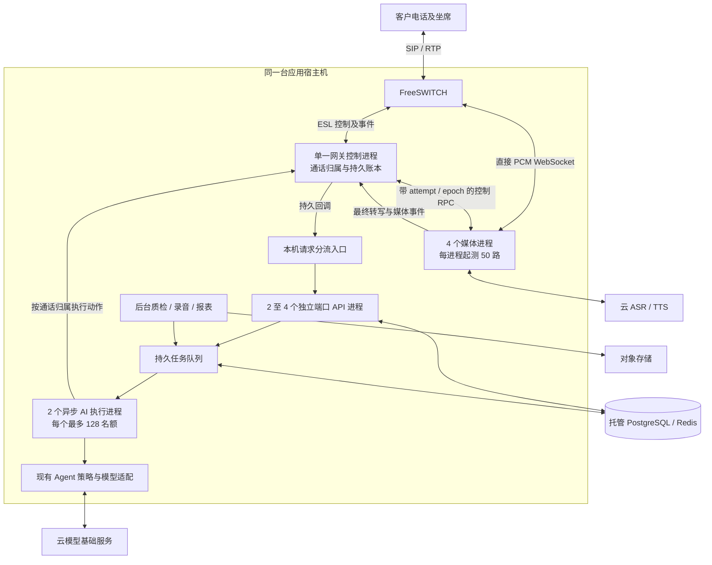

# 单机 200 路：架构检验与改造方案

后续实施与实测见 [改造验收记录](20260907-node200-implementation.md)。本文保留改造前的审查快照。

日期：2026-09-07。审查代码：`f1ec088`。本轮是架构检验、容量计算和实施方案，没有修改运行代码或发布配置。

**结论：现有 compact 架构尚未形成可验收的单机 200 路能力。继续放宽 API 等待队列不足以达到目标。建议沿用自有 FreeSWITCH/Pipecat/业务平台，在同一宿主机内拆分媒体进程、改造 AI 执行池和 API 分流，同时把实际 PBX 配置、录音与资源预算纳入准入和验收。**

单机定义沿用已确认方案：一台应用宿主机承载 PBX、媒体、API、AI 业务逻辑和后台任务；PostgreSQL/Redis、对象存储和 ASR/TTS/LLM 基础能力使用外部服务。自有系统完成业务交付，运营商 500 路能力为既定前提。增加进程不增加物理服务器；若要求数据库和模型推理也全部搬进这台机器，本文预算不适用。

## 已确认的证据与缺口

| 项目 | 当前代码或实测事实 | 对 200 路的影响 |
|---|---|---|
| 媒体单进程 | compact 网关 `--workers 1`，CPU 限额 4；Pipecat 会话/token 存在进程字典；安全账本持有进程排他文件锁 | 200 路媒体共享一个 Python 事件循环；4 核限额不是 4 核并行证明。直接把整个网关改成 4 workers 会争抢账本，且媒体 token/命令无法自动找到归属进程 |
| AI 执行池 | 每机 64 名额；`run_task_lane` 用与名额相等的线程数，每个线程持有自己的事件循环；Agent 模型 HTTP 池上限 128 | 对话密度和任务耗时稍高时就会排队。直接设为 256 会变成大量线程，且 Agent 的 128 连接会形成下游等待 |
| 回调容量 | 双 API 进程、4 回调/进程、8 个等待、50ms：100 RPS 两轮 120 秒分别 0/10 次 503；200 RPS 两轮 30 秒分别 138/37 次 | 尚未通过稳定零拒绝门槛；更不能把 status-only、关闭消费者的压测解释为 200 路 AI 对话 |
| 进程分流 | 实测有 2987/13、2850/150 分布；接近 3002/2998 时 200 RPS 仍有 37 次超时 | 同端口多个 Uvicorn worker 加客户端长连接不能保证均衡；分流与处理尾延迟均需改进 |
| PBX 运行参数 | 仓库 `deploy/freeswitch-voismart/freeswitch.xml` 明确标注 Local media validation only，max-sessions=20、RTP 20000–20100；compact 挂载外部 FreeSWITCH 配置 | 联调模板不能充当 200 路生产配置。没有读取生产配置，不能断言生产实际被限制为 20；必须检查生效会话上限、端口、编解码、模块和呼叫腿 |
| ESL 与持久回调 | 32 个 FIFO、每队列 64；唯一接收循环在 `await queue.put` 等待。回调各事件先写 SQLite FULL 同步，再发送，成功再写账本；失败按通话顺序重试，首次通常等至少 1 秒 | 某分区队列满仍会堵住整个 ESL 接收循环；API 503 的产品影响可能是某通话后续事件和首音延迟一秒以上，不仅是 HTTP 失败率 |
| 资源与录音 | 当前非可选容器 CPU 上限合计 15.5；录音默认双声道、上传并发 2 | 16 核机器需要验证系统及突发余量。CPU 上限之和不是实际用量。音频和录音压力没有包含在上次 API 压测中 |

代码入口：[`docker-compose.compact.yml`](../../docker-compose.compact.yml)、[`PipecatPipelineManager`](../../voice_gateway/app/pipecat_pipeline.py)、[`SecureDriver/CallbackSender`](../../voice_gateway/app/security.py)、[`ESL 接收队列`](../../voice_gateway/app/freeswitch.py)、[`AI 执行通道`](../../backend/app/services/task_queue.py)、[`Agent 连接池`](../../agent/app/llm.py)。最新压测证据见[短队列验收](20260907-admission-step1.md)。本轮重新核对了其记录的源文件 SHA256，均与当前源码一致。

常规带 GIL 的 Python 中，把阻塞 I/O 移到线程有帮助，但不能据此认定 Python 计算已经获得多核并行；释放 GIL 的原生扩展属于不同情况。是否需要拆媒体进程，最终也应以实际媒体剖析校验。[Python 官方说明](https://docs.python.org/3/library/asyncio-task.html#asyncio.to_thread)

## 200 路需要多少处理能力

以下是假设场景和设计预算，不是当前通话实测。

`话轮到达率 = 200 / 每通话终句间隔`

`AI 名额预算 = ceil(话轮到达率 × 平均任务占用秒数 / 0.7)`

任务占用包括领取后的检索、策略、模型请求和结果提交；持久播放续接已经不占原 AI 名额。平均任务耗时不同于模型首 token 延迟。

| 每通终句间隔 | 每秒话轮 | AI 平均占用 | 70% 利用率名额预算 | 当前 64 是否满足该计算 |
|---|---:|---:|---:|---|
| 8 秒 | 25 | 1.5 秒 | 54 | 是，仅平均预算 |
| 8 秒 | 25 | 3 秒 | 108 | 否 |
| 4 秒 | 50 | 1.5 秒 | 108 | 否 |
| 4 秒 | 50 | 3 秒 | 215 | 否 |

因此，建议为 **50 个有效话轮/秒准备可配置的 256 个异步执行名额**，并分别限制模型实际在途请求和数据库短事务；它们不是 256 个数据库连接或 256 个线程。若实测每轮仅 1.5 秒，128 名额可能足够，应按测量收紧。256 也不保证“已有请求未结束又同时到达 200 个终句”的突发时延，必须验证旧请求取消、突发配额和实际响应。

如果每话轮暂按“1 个最终转写 + 2 个播放状态”估算，常态是约 75 个关键回调/秒，密集对话约 150 个/秒，另加建呼、挂断、插话、转人工、录音事件。真实 Voismart 事件数量需从完整通话追踪确认。建议把 **400 个混合有效事件/秒持续、800 个/秒突发 60 秒**作为沿用原 200 路方案的验收余量；这不是“200 路就等于 400 RPS”，也不是已达标数字。

## 推荐同机架构

这是待实现的目标架构。`4 × 50` 是分片起测方式，不是已有 4 个通过 50 路验收的进程。

### A. 拆媒体计算，保留一个 PBX 控制者

1. FreeSWITCH、ESL 连接、拨号/挂断/转接、安全账本仍由一个网关控制进程管理；媒体子进程只运行各自 Pipecat 会话，不各自接管同一个 PBX 或共享写同一份安全账本。
2. 创建媒体会话前持久保存 `call_id + attempt → media_worker_id + worker_epoch + token`，由控制者原子预留宿主机总名额 200 和分片名额 50。每台仍登记为一个 200 路宿主机，不能把四个子进程误算成四个独立故障节点。
3. FreeSWITCH 直接连接被选中的媒体进程 WebSocket，PCM 不经过控制者转发。speak、interrupt、close 和播放完成事件通过受保护的本机 RPC 按原归属路由；RPC 带轮次、代次、幂等标识及期限。
4. 语音代次检查仍由实际媒体归属进程执行，旧 AI 输出、旧关闭、晚到的模块事件不能影响新话轮。媒体进程重启后增加 epoch，旧会话不能误投到新进程。
5. 一个媒体进程故障时暂停给它分配新通话，控制者对账并结束受影响通话；其他进程继续服务。不能声称原来的 50 路自动无损迁移或故障期间仍保持 200 路。整机故障仍依赖其他物理节点。
6. 媒体热路径保留本地打断；CPU 密集音频处理应通过原生实现或独立进程分摊。先测每进程 50，再测四个进程同机 200，不能简单相加独立基准。

主要改造点：`pipecat_pipeline.py`、`freeswitch.py`、网关入口及新媒体子进程/客户端、会话归属存储、Compose 生命周期和健康检查。

### B. 修正 API 分流及回调关键路径

- 将 API 从同一监听口多个 worker 改为同机多个可独立寻址的单进程实例，由本机入口按请求选择上游；起步两个端口，剖析后需要时增至四个。可使用 NGINX `least_conn` 加共享 upstream 状态，并记录每进程请求量/等待/CPU，仍须实测分布。[NGINX 官方说明](https://nginx.org/en/docs/http/ngx_http_upstream_module.html#least_conn)
- 分流只用于无状态业务 API，不能对媒体 WebSocket、PBX 归属命令随机负载均衡。代理保留签名正文，不能盲目重试非幂等 POST；网关重试继续使用原事件标识。
- 保留事件去重、合法状态转换、必要通话账本和任务入队的同一事务。新增持久 Inbox 如果只提前确认收到、却把关键状态任意延后，会改变产品一致性，本阶段不采用这种捷径。
- 减少关键事务内的重复查询、全量历史读取和非必要计算；已异步的质检、外部业务回调等保持异步，不把其既有能力重复列成新收益。
- 回调和普通业务分等待预算，挂断/播放控制保留名额；每通话保持依赖顺序。当前 8/50ms 作为对照，不先延长到数秒。入口优化后压测混合 speech/media/status，而非只发 completed。
- 终句、播放状态经过同一通话流时，前一事件 503 后的退避会阻塞后续事件，验收需测“事件发生到生效”的时延。HTTP 最终重试成功不能证明用户及时听到回答。

### C. 把 AI 等待从线程模型改为异步执行模型

- 改为两个常驻 AI 执行进程，各有最多 128 个受限异步任务；每个进程只保留少量执行 SQL 的线程或真正的异步 DB 短事务。任务等待模型时不占 DB 连接；不能把现有 ThreadPoolExecutor 直接设成 256。
- Agent 的硬编码 128 连接池改成配置项，并与总执行预算匹配；需要时使用两个 Agent 实例分担。模型连接、总任务、租户配额、QPS/TPM 分别限额。
- 客户新话轮、挂断或转人工后，尽快取消旧模型请求并关闭响应流；仍保留最后提交时的代次校验。取消能否立刻停止供应商计费/计算由接口契约决定，不能承诺。
- 若改为分句流式回复，必须先过相应分句输出审查才进入 TTS，保持已有敏感信息及业务动作保护；不能为了首音绕过审核。流式首音变快不自动代表完整任务占用时间同比缩短。
- 先以真实上下文验证 25/50 轮每秒，再测 200 个同步终句、长上下文与模型限流；登记实际供应商配额。每节点 ASR 至少覆盖实际 200 个会话，TTS 按最大在途和播放重叠核算；不需要自建 GPU 服务器。

### D. 解开事件接收与本地持久化的阻塞

- ESL 改为按通话保序、跨通话公平调度的有界工作结构，使一个慢通话不会无限堵住唯一读取循环；达到压力阈值先停止新拨号。关键事件不可直接丢弃，过载或接收断裂必须触发对账，不能只用无界队列掩盖。
- 维持一个本地安全账本所有者；对回调 Outbox 可评估小批持久提交以减少 fsync，只有提交完成才给生产者确认。保留 FULL 持久性，不靠降持久性换指标；拨号审批/防重放等事务不能被随意延后。
- 将录音文件 I/O 和账本低延迟 I/O 的竞争纳入测试。磁盘接近耗尽、关键事件积压或媒体延迟超限时暂停新拨号，保护已接通通话；不要继续接入后降为静默。

## PBX、连接与硬件预算

**PBX：** 200 个客户通话转给内部坐席时，可能占约 400 个 FreeSWITCH 呼叫腿；转接瞬态还需余量。建议以实际最大腿数推导并校验核心 session 上限，500 可作为“200 客户 + 200 内部腿 + 100 余量”的配置起测值，不是运营商线路需求。`sessions-per-second` 与拨号 CPS、内部腿创建分别核算。RTP 端口、编解码、模块及防火墙须跟随实际通道预算，不能沿用仅 20 路联调的配置。[FreeSWITCH 官方参数说明](https://developer.signalwire.com/freeswitch/configuration/core-settings/)

**数据库：** 增加 AI 在途名额不对应等量 DB 连接。候选预算：两 API 各 6 + 两 AI 执行进程各 3 + 后台进程 2 = 每机 20，四台 80；若 API 改四进程，各 4 连接，则每机 24、四台 96。每进程业务准入必须随其池预算调整，另预留迁移/运维连接，并通过托管库负载验证。此为新执行模型的候选，不是当前配置已变更；不必因此新增数据库服务器或 PgBouncer 主机。

**CPU/内存：** 现有 16 vCPU/32GB 仅为起测规格。先在同机运行全部组件测实际资源和音质；当前 15.5 核容器上限之和既不是预留也不是实测用量。为内核、媒体波峰和后台任务保留约 20% 实测余量；若全负载不能满足，调低非实时任务并发或升级同一主机规格，不增加应用服务器台数。24 vCPU/64GB 可作为重负载容量对照规格，不能从规格直接推导支持 200 路。

**音频与录音计算：** 假设 PCM16、8kHz：200 路单声道单方向为 25.6Mbps，本机双向 PCM 合计 51.2Mbps；这部分若走 loopback，不算成两份公网流量。双声道未压缩录音约 6.4MB/s、23.04GB/小时、8 小时约 184.32GB，尚未计副本、上传 spool 与日志；16kHz 翻倍。ASR/TTS 外网流量、SIP/RTP 编码与协议开销单独计算，实际录音格式/采样率必须实测。上传并发 2 是否够取决于文件完成速率和上传耗时，不是看到“2”就认定不够或直接设 200。

## 分阶段验收

下列是建议验收目标，尚未执行或达标。

| 阶段 | 必须实际完成的内容 | 通过标准 |
|---|---|---|
| 1：可部署与归属 | PBX 实际配置核验；控制/媒体拆分；轮次/epoch；进程退出、旧命令与重连测试 | 不串音、不误挂断、不超额；旧进程/旧轮次不能操作新会话；一个分片故障不误停其他分片 |
| 2：控制与 AI | 混合回调 400/s 持续、800/s 突发 60 秒；真实模型 25→50 轮/s；消费者同时运行 | 设计负载内无持续积压或准入拒绝；状态/任务/去重一致。回调确认及事件生效分别计时，不能靠长队列或关闭消费者过关 |
| 3：媒体分档 | 单进程 20→50 路；同机 50→100→150→200 路；每档至少 30 分钟 | 真实接通、双向有效声音、真实 ASR/TTS/模型、多轮对话；记录每个进程的 CPU/内存/音频时序 |
| 4：200 路长稳 | 200 路至少 8 小时，加 24 小时混合业务；200 个同步终句、频繁插话、转人工、录音及管理操作 | 无事件丢失/重复拨号/跨租户串线；队列不持续增长。建议客户停说到首音 p95≤2s、p99≤3s，插话到停播 p95≤200ms；协议和业务需确认，失败则不得声称完整达标 |
| 5：故障与上线 | 媒体子进程、API、Redis、数据库、模型断连；磁盘/上传失败；四节点少一台与排空 | 已接通通话按约定处理，新拨号及时受控；未知占用不因 TTL 直接释放；故障损失和恢复时延单独报告 |

长稳使用完整音频链路；滚动补呼另报告接通数量的最大值、均值和谷值。节点总名额包含预留/拨号中/活跃状态，不能为维持界面永远显示 200 而把额外振铃当成不占资源。200 路是单机资格，四台 500 路及故障后的能力必须独立验收。

## 本轮交付状态

- 已验证：当前源码与部署模板审查、既有压测源文件指纹、AI 名额和音频/录音预算的可复算计算、联调 XML 参数解析。
- 未验证：上述新架构实现、运行性能、生产实际 PBX 配置、单进程 50/同机 200 真实通话、四台集群、真机和生产。
- 已知问题：媒体与控制同进程、AI 64 名额与 128 模型连接不匹配高负载目标、长连接分流及回调尾延迟、ESL 满分区阻塞、录音/模型/硬件预算缺实机证据。
- 环境限制：本轮是代码与架构检验；未连接目标 Linux 服务器或真实模型/线路，未重复用合成 API 请求冒充媒体压测。
- 正式上线条件：完成上述分阶段改造并通过真实音频、业务一致性、故障与资源余量验收。本轮未修改运行源码/配置、未执行迁移、未发布测试或生产，不产生新的页面功能变更。
