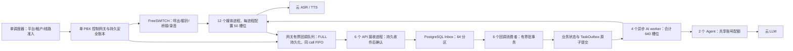

# 单机 500 总在途：代码复审、架构与优化验证

## 结论与范围

以 `cadcd82` 主干为复审基线，在 `perf/single-host-500-review-20260910` 修改。用户已有的 `backend/ai_outbound.db` 保留，不读取、不纳入测试。500 指呼出、振铃、AI 接通和人工接通合计 500 个业务呼叫；PBX 多呼叫腿、媒体会话、模型任务、HTTP 请求各自计量。

本次完成回调持久化、消费失败分类、模型连接恢复、异步 HTTP 依赖、连接池分组及消费者分区优先调度的优化。单机 500 容量验收仍未通过，后续尚需降低回调链路延迟。容量结果见下表和独立原始记录；只有全部门槛通过才认定该轮合成负载通过。真实 500 路商用能力仍未验证。

## 复审发现

| 级别 | 证据与影响 | 处理 |
|---|---|---|
| P1 | `Ledger._transaction` 每批关闭最后一个 SQLite 连接，使 WAL 反复检查点和清理；本次基线提交 P50 11.53ms，累计提交调用耗时 39.08 秒。 | 增加空闲 WAL 保持连接。事务仍用独立连接、RLock 和 FULL 同步；不持有读快照，保留默认 1000 页自动检查点，退出先排空再关闭。 |
| P1 | `consume_partition` 把锁超时、死锁和序列化冲突归罪于最后一个事件；普通竞争可使事件等待 2、4、8 秒，最终误入死信。实际 PostgreSQL 复现了分区计数行锁等待。 | SQLSTATE 55P03/40P01/40001 整批回滚并交给有界轮询重试，不增加事件失败次数。真正的无效事件、语句超时和其他异常仍走原失败机制。 |
| P1 | `run_ai_turn_async` 在 ReadError 后先触发失败挂机，再让任务队列重试；基线出现 8 条业务失败。 | 仅纯模型提案请求允许一次传输重试，两个尝试共享原超时预算，取消和租约失效仍生效。HTTP 错误、超时、无效返回及挂机/转人工动作不在此重试范围。 |
| P1 | 后端虚拟环境及用来运行合成网关的后端镜像缺少 sniffio。cProfile 诊断轮中，HTTPcore 的 `current_async_library` 调用约 20.5 万次、累计约 32.1 秒，大量开销来自反复导入失败和文件查找。 | 四个 HTTP 服务显式固定 `sniffio==1.3.1`；补齐本机测试依赖，并使用离线构建的补齐依赖镜像复测。诊断轮有 profiler 开销，不能当容量成绩。并非所有原有语音镜像都已证明缺少该包。 |
| P1 | cProfile 显示 HTTPcore 大池分配/释放会大量扫描连接，单池 32 连接下出现约 95 万次套接字可读探测。 | 网关改为每池最多 8 连接、按当前占用选择小池，初轮总连接和投递槽位为 32，最终收敛至与 API 总回调名额一致的 24；保留原 claim 层的同 call FIFO。 |
| P1 | 原六消费者每处理一批重新竞争所有活跃分区；网关 32 投递槽位也超过 6 × 4 个 API 回调准入名额。 | 六消费者各优先处理固定分区，每 16 轮全局扫描避免邻居故障后饥饿；网关总投递槽位降为 24，并在 Compose 检查中禁止重复分区编号和超额投递。实际缺失邻居进程接管回归通过。 |
| P2 | 旧负载脚本只记录部分后端源码摘要，缺少网关和实际依赖；1 秒采样可能漏掉最坏排队时间，且未说明发压器使用的事件循环。 | 增加网关/依赖文件摘要、实际运行库版本、asyncio/uvloop 标签、逐事件投递最大值/P99、投递槽位及写队列采样、模型传输重试次数。 |
| P1 未验收 | 单机模板已有 500 配置，但合成脚本直接创建 500 个 IN_AI 数据行，并不建立 500 条真实电话及媒体流。 | 配置、控制面回归、合成回调吞吐、真实音频、生产发布分别验收。 |

SQLite 的最后连接关闭触发检查点行为见 [SQLite WAL 官方文档](https://www.sqlite.org/wal.html)。HTTPcore 的异步运行时检测由当前安装源码核实；sniffio 固定版本与包来源见 [PyPI 官方项目页](https://pypi.org/project/sniffio/1.3.1/)。

## 单机架构

沿用已有分层，不通过简单提高配置上限宣称达标。先确保依赖、连接生命周期与事务路径正确，再决定是否扩大进程数。

| 资源 | 当前单机配置/设计约束 | 验收解释 |
|---|---|---|
| 平台在途名额 | 500；平台、租户、线路和安全账本均取最小批准容量 | 第 501 路拒绝、未知拨号结果不释放、幂等 attempt 已回归；真实线路未验证。 |
| PBX 控制 | 单控制进程、独立持久安全账本 | 不把同一 SQLite 安全账本交给多个独立控制进程。整机故障没有自动接管承诺。 |
| 媒体 | 12 × 50 = 600 资源槽位 | 预留 100 是配置冗余，不代表能在任意媒体故障时维持所有通话；500 个业务名额仍不可超发。 |
| 回调 API | 6 × 5 个 DB 连接，每进程 4 个回调请求、1 个管理请求名额 | 管理端也要测高负载下的延迟和 503；一个保留槽位不等于后台页面必然顺畅。 |
| 回调消费 | 6 × 1 个 DB 连接；单批最多 32 条，事件间检查 50ms 预算 | 同通话保序，业务、去重、Outbox、Inbox 完成原子提交；外部服务等待不放在业务事务中。 |
| AI | 4 × 160 异步槽位；4 × 5 个 DB 连接 | 模型等待用协程，不占住 DB 连接。200 终句/秒 × 3 秒等待需要约 600 个并行等待名额，仅作压力预算。 |
| 后台任务 | 8 个 DB 连接 | 应用池总预算 30 + 6 + 20 + 8 = 64；不能按进程随意放大数据库池。 |
| 云服务 | ASR/TTS 并发、LLM RPM/TPM/RPS 使用同一账号总额度约束 | 必须拿到实际额度和实测延迟；640 个 AI 槽位不代表供应商批准 640 并发。 |

32 专用 vCPU / 64GiB Linux 仍只作为首轮候选，不能据此给出最低采购规格。本次 Docker VM 实际约 12 vCPU / 7.75GiB，且同机已有其他业务容器；负载夹具没有启用完整 PBX/媒体链，也不等同单机生产 Compose 的 CPU 限额。

如果修复依赖后逐事件 HTTP 仍是瓶颈，下一步优先评估有界批量回调传输，保持收件后 ACK、单 call FIFO 和逐事件幂等；跨分区事务须按固定顺序取锁，批内冲突不能拖死无关通话。批接口未实现、未验收，不能用预估收益填补本次容量缺口。只有实测 CPU 或网络池扫描仍构成上限时，再拆独立回调投递进程及各自的持久账本；媒体扩进程不能自动消除控制面瓶颈。

## 压测记录

| 轮次与原始记录 | 回调非 200 次数 | 网关最长采样排队 | Inbox 最大处理延迟 | 业务失败 | 正确性 / 容量 SLO |
|---|---:|---:|---:|---:|---|
| [baseline](evidence/20260910-single-host-500/review0910-baseline-results.json)：主干基线，缺 sniffio | 49 | 36.741s | 2.400s | 8 | 未通过 / 未通过 |
| [wal01](evidence/20260910-single-host-500/review0910-wal01-results.json)：仅 WAL 保持连接 | 2 | 32.699s | 2.275s | 0 | 通过 / 未通过 |
| [wal02](evidence/20260910-single-host-500/review0910-wal02-results.json)：WAL + 竞争重试 | 8 | 33.059s | 1.052s | 4 | 未通过 / 未通过 |
| [uvloop](evidence/20260910-single-host-500/review0910-uvloop-results.json)：事件循环对齐 | 0 | 27.548s | 1.141s | 6 | 未通过 / 未通过 |
| [final](evidence/20260910-single-host-500/review0910-final-results.json)：加入有界模型重试 | 0 | 29.968s | 0.977s | 0 | 通过 / 未通过 |
| [sniffio](evidence/20260910-single-host-500/review0910-sniffio-results.json)：补齐运行依赖 | 0 | 23.482s | 1.373s | 0 | 通过 / 未通过 |
| [pools](evidence/20260910-single-host-500/review0910-pools-results.json)：每池 8 / 共 32 连接 | 12 | 1.638s | 6.573s | 0 | 通过 / 未通过 |
| [affinity](evidence/20260910-single-host-500/review0910-affinity-results.json)：选用：每池 8 / 共 24 + 分区优先 | 0 | 5.233s | 2.099s | 0 | 通过 / 未通过 |
| [pool4](evidence/20260910-single-host-500/review0910-pool4-results.json)：对照：每池 4 / 共 24 | 0 | 7.341s | 3.601s | 0 | 通过 / 未通过 |

选用 `affinity` 的运行源码摘要与交付源码一致：18000/18000 回调成功，零 503、零业务失败、零模型传输重试；逐事件投递最大 5.266 秒、P99 5.188 秒，Inbox 最大 2.099 秒，仍不满足 1 秒门槛。网关采样最老排队从基线 36.741 秒降到 5.233 秒。`pool4` 未带来改善，最终保留每池 8 连接。原始对照与镜像标识见 [comparison.json](evidence/20260910-single-host-500/comparison.json)。

所有普通容量轮次：500 个合成 IN_AI 会话、30 秒计划发送 6000 终句及 12000 媒体事件；6 API、6 Inbox worker、4 AI worker、模型等待 3 秒；Linux 回环网络、独立 PostgreSQL/Redis、网关账本 Docker 本地卷。保留失败轮次，不放宽 1 秒队列门槛，也不以最终清空代替及时处理。

发压模型每通话约 2.5 秒一个终句，模型等待 3 秒，会触发旧轮次失效路径；模型模拟器返回 `tts_text=None`，因此该脚本不能验收终句到首音、真实云模型完成率、双向音频或持续对话质量。生成器 P99 发出滞后单独报告。

## 页面、入口与状态清单

| 入口 | 必查状态与证据 |
|---|---|
| status / transcript / speech / dtmf / media / recording | 签名与模型拒绝、落库再 ACK、幂等/身份冲突、容量限制、业务消费、原子回滚、同 call 顺序和死信。 |
| 网关启动/退出/恢复 | FULL 提交、取消提交者、停止排空、重新启动、进程直接退出后 WAL 恢复、未确认呼叫不释放。 |
| AI 请求 | 三类传输错误至多重试一次；持续失败、HTTP 错误、无效响应、超时和取消；过期轮次不能执行新动作。 |
| 管理端与坐席 | 登录→首页→客户搜索/创建→任务/话术/知识保存→外呼启停→话单分页→人工接管/挂断→线索/预约；表单填写、保存回显、返回、退出、越权与异常。 |

本仓库不存在门店、房型、购物车、下单、支付和商城订单入口。通用电商验收链在此不适用，不将这些未实现页面标记通过；使用上述实际外呼业务链。

## 验证与交付状态

| 层级 | 本次实际状态 |
|---|---|
| 源代码 | 已修改，含 24 槽位对齐、6 个不同消费者分区配置；本地功能分支，未提交、未 push。 |
| 静态检查 | Python 编译、TypeScript/Vite 构建、git diff 检查通过；Compose/容量预算检查 8 项通过；四个运行环境 pip check 通过。 |
| 开发环境功能测试 | PostgreSQL + 独立 Redis 完整后端 **286 项全部通过**；SQLite **272 通过、14 跳过**，跳过的数据库/Redis 专项已在前述 PostgreSQL 回归实际运行。网关 **225**、Agent **13**、录音适配器 **12**、前端单元 **11** 项通过。 |
| 浏览器 | 最终六 API 隔离夹具 Chromium **19 项全部通过**，实际点击、填写、保存回显、返回和登录/退出/权限/任务/坐席链路。 |
| 合成容量 | `affinity` 正确性通过，容量 SLO 未通过；所有失败/对照轮次保留。 |
| 测试环境发布 | 未发布共享测试环境；仅运行本机专用合成夹具。 |
| 真机测试 | 未验证。 |
| 生产环境发布 | 未发布，未替换现有业务实例。 |
| Git / 远端 CI | 建立本地功能分支；未 commit、未 push，未触发远端 CI。 |

[后端 PostgreSQL 日志](evidence/20260910-single-host-500/backend-postgres.txt)、[网关日志](evidence/20260910-single-host-500/gateway.txt)、[浏览器日志](evidence/20260910-single-host-500/browser.txt)、[分区故障接管测试](evidence/20260910-single-host-500/shard-recovery.txt)。

中间诊断中出现过本机根目录 .env、旧 Pipecat 环境和测试夹具初始化顺序导致的失败，均定位后改为显式隔离配置、正确依赖和正确初始化并复验；不把那些失败轮次记成通过。最终浏览器之前的单 API 临时夹具仅保留一个管理槽位，压力分析并行期间出现两个 503 相关失败；恢复原六 API 拓扑后 19 项通过。这不能证明生产峰值下管理界面始终无 503。

## 已知问题、环境限制与正式上线前置条件

1. 真实 500 路 SIP/RTP、ASR/TTS/LLM、双声道录音、打断、人工桥接、真机和目标 Linux 主机均未验证。不得把合成回调成绩称为商用电话容量。
2. 有界模型重试可能额外消耗一次模型请求额度/费用，仍经过 Agent 原账号配额；最多两次尝试共用原超时，不自动重试业务动作。
3. 数据库持续竞争可能反复重放整批；保留队列年龄门禁和可见告警。合法竞争不再误判为毒事件，但这不消除底层竞争。
4. 生产前需重新构建所有修改服务的固定镜像并核验实际依赖；本次本机隔离镜像不替换现有业务实例。保留原配置、原数据和旧压测记录。
5. 目标主机按 20→50→100→200→350→500 分档；每档至少 30 分钟，500 档 8 小时、24 小时混合长稳。分别测试 500 同步终句、同步挂断、600 回调/秒持续及 1200/秒突发，记录计划/实际发出和丢失数。
6. 记录 CPU/内存/磁盘 fsync/网卡、DB 锁和池等待、CPS/总在途/接通/AI 等待各项峰值、逐事件排队、终句到首音与打断 P95/P99；故障恢复、备份恢复及账本对账通过后再发布。
7. 本次改动在本地功能分支；是否达到源代码提交、push、CI、测试发布、真机和生产发布，以交付状态表为准。
