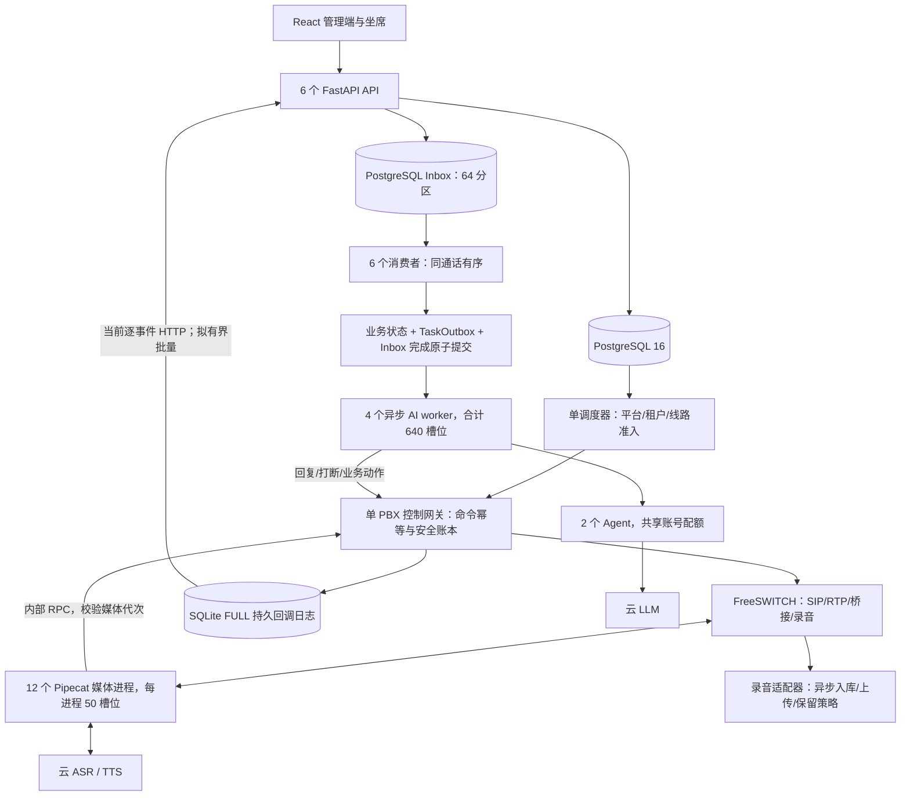

# 单机 500 总在途：架构评估与技术迭代方案

评估日期：2026-09-13。目标：云端 ASR/TTS/LLM，32 核 / 64GB 候选 Linux 服务器。本报告按 64 GiB 模板预算核算；采购时须核实实际可用内存与 CPU 型号、物理核/vCPU、是否独享。

## 1. 判断与评估边界

**现有分层值得继续演进，单机 500 总在途是可开展工程验证的目标；当前证据尚不能证明已经达标，也不足以保证 32 核 / 64GB 必然承载 500 路。** 优先补齐有效对话验收、缩短回调链路、测量完整媒体及模型配额路径。数据库、媒体和云额度共同决定可用容量。

500 的口径是呼出、振铃、AI 通话、等待人工、转人工中和人工通话合计的客户呼叫数。PBX 呼叫腿、媒体 session、模型请求和 HTTP RPS 分别统计。最坏情况按 500 路全部接通 AI 核验，不能依靠低接通率证明容量。

本次是评估与方案编制，没有修改应用源代码、迁移、运行配置或现有实例，没有真实拨号。仓库为 `duyu0218-flash/ai-outbound-platform`，HEAD 为 `cadcd82`，分支为 `perf/single-host-500-review-20260910`；上一轮性能改动仍在工作树中，未提交。已有本地数据库保留，未读取其业务数据。

本次核对了源码、模板、历史原始压测记录、当前容器列表，并运行 22 项配置/网关专项测试。历史完整后端及浏览器回归只作为历史证据，本次没有重新执行全量业务验收。

## 2. 架构与功能实现评估

这是单机多进程方案。保留单 PBX 控制者，媒体按通话归属分散到多个进程，模型等待用协程。Redis 承担租约、唤醒等职责，持久任务与业务状态由数据库负责。现阶段没有证据要求改成微服务集群或更换编程语言。

| 能力 | 当前实现证据 | 评估与验收缺口 |
|---|---|---|
| 管理与坐席 | `frontend/src/App.tsx` 有登录、客户、任务、话术、知识、线路、话单、坐席、质检、报表、账单等入口 | 具备产品操作面；本次未逐页点击、填写和保存，不能称全部功能已验证 |
| 外呼业务 | `call_service.py`、`telephony.py`、`outbound_policy.py`、`gateway_cluster.py` | 有多层容量、状态和线路策略；`NodeSpec.capacity` 已允许 500，旧的 200 上限已不是当前缺口 |
| 业务交付 | `product.py`、`conversation_policy.py`、`product-operations.tsx` | 有策略保存/模拟、预约回拨、跟进事项、交付结果、知识检索和漏斗；真实运营结果、真实短信/回调需独立验收 |
| 准入安全 | 网关持久拨号意图、attempt 幂等、未知结果保留名额 | 本次专项测试验证第 501 路拦截、未知结果不误释放、重试不重复拨号；使用合成驱动 |
| 回调一致性 | `security.py`、`callback_inbox.py`、`db.py` | 已实现落盘再确认、去重、同通话 FIFO、业务与 Outbox 原子提交；存在持续负载延迟缺口 |
| 实时语音 | FreeSWITCH ESL、媒体进程、Pipecat、阿里云 ASR、TTS、代次校验、本地打断 | ASR 中间结果在当前 Pipecat 路径已留在本地，不应再当作尚未实现的优化；500 路真实声音和打断未验证 |
| AI 执行 | `async_ai.py`、`dispatcher.py`、`agent/app/llm.py` | 模型等待不占 DB 连接，过期轮次被拒绝；当前模型回复仍等待完整响应后进入动作阶段，端到端首音需实测 |
| 配额与降级 | `agent/app/quota.py`、节点健康、媒体归属/故障收尾 | 已有共享账号预算及停止新准入；模型连通性、限流恢复、已接通通话可听兜底尚需完整验证 |
| 录音与运维 | 录音适配器、S3 兼容存储、监控、审计、保留策略 | 有实现基础；500 路录音写入、上传积压、恢复演练、整机故障处置未验收 |

源码入口对应实际外呼系统，不包含门店、房型、购物车、商城下单和支付页面。后续功能修改应验收：登录 → 首页 → 客户搜索/导入 → 话术/知识/策略 → 外呼任务 → 呼叫/双向语音 → 人工接管 → 话单/录音 → 预约/跟进 → 退出，同时覆盖越权、异常和返回路径。

## 3. 原始证据与当前瓶颈

### 3.1 已有压测成绩

原始记录：[2026-09-10 affinity 轮](evidence/20260910-single-host-500/review0910-affinity-results.json)。本次逐一复算其中 13 个文件的 SHA-256，均与当前工作树一致；这只覆盖记录的文件，不等于整套镜像与运行环境一致。测试为 500 个合成 `IN_AI` 数据行，30 秒内计划 200 个终句/秒和 400 个媒体事件/秒，非真实媒体。

| 指标 | 原始值 | 解释 |
|---|---:|---|
| 回调 HTTP 200 | 18,000 / 18,000 | 持久接收最终成功，非 200 为 0 |
| 网关投递 P99 / 最大 | 5,188 / 5,266 ms | 包含发送前等待，超过既定 1 秒门槛 |
| HTTP 发送阶段 P99 | 97 ms | 单次 HTTP 快不代表事件整体及时 |
| 网关积压峰值 | 2,656 条 | 30 秒负载期间积压增长，停止发压后才排空 |
| 网关写队列采样峰值 | 16 条 | 与投递积压相比很小；不能由此认定磁盘没有影响 |
| 网关投递占用峰值 | 24 / 24 | 持续占满，需拆解发送、确认落盘、HTTP 与 API 服务时间 |
| Inbox 最大完成延迟 | 2,099 ms | 含外层事务提交，仍超过 1 秒 |
| Inbox 积压峰值 | 319 条 | API 接收与业务消费都有排队 |
| 任务 completed / 成功 AI 指标 | 6,000 / 502 | 两者语义不同，不能把 completed 当作有效回复 |
| 模型模拟器请求 / AI 转写 | 4,238 / 0 | 模拟器等待 3 秒并返回 `tts_text=None`，无可播放回复 |
| 正确性 / 容量 SLO | 通过 / 未通过 | 原脚本的“正确性”仅指它定义的回调、任务和状态断言 |

脚本每通话约 2.5 秒注入一个新终句，模拟模型等待 3 秒，因而持续触发过期轮次路径。502 / 6,000 约为 8.37%，这里只是两个指标的比例，**不是生产对话成功率**。现有脚本适合验证过期任务保护及混合回调，不能证明 200 次有效回复/秒或 500 路正常持续对话。`ai.turn success` 本身也在实际播放前记录，仍须增加首音、播放完成和客户侧接收证据。

### 3.2 需要按证据处理的问题

| 优先级 | 发现及源码位置 | 处理方向 |
|---|---|---|
| P0 验收缺口 | `load-single-host-dialogue.py` 直接写入会话，绕过内部媒体 RPC、真实 Agent 配额、ASR/TTS 和 SIP/RTP | 建立回调压力、有效对话、真实媒体三套负载；完整路径不得用空 TTS 回复替代 |
| P1 已确认 | `CallbackSender._send/_deliver` 仍逐条 HTTP；累计排队 5 秒以上 | 在现有本地 group commit 基础上增加有界批量传输和批量收件，测量平均批大小与逐事件延迟 |
| P1 已确认 | `consume_partition` 每事件仍调用业务处理器，批末更新分区计数；历史出现锁竞争，当前最大完成延迟 2.10 秒 | 采集每批事件数、SQL 数、CallSession/分区锁等待与提交时间；缩减实际热点 SQL，保持原子事务 |
| P1 未覆盖 | 12 个媒体进程经 `/v1/internal/media-events` 汇聚到单控制网关；原负载直接调用发送器，省略了这段 RPC | 新夹具必须经过这段入口并测事件循环滞后、内部 RPC 延迟及失败收尾 |
| P1 未覆盖 | 两个真实 Agent 使用 `AccountQuota`，每次预算事务打开/关闭 SQLite 连接，并做 FULL 提交；原模拟器绕过它 | 单独测 50/100/200 RPS 配额预约与竞争；评估连接生命周期及有界 group commit，不能直接复制每进程额度 |
| P1 配置风险 | 当前模板 6 个 API 各 0.25 核，全部组件 CPU 上限合计 31.5 核 | 同时测主机 CPU 与各 cgroup throttling，按实际瓶颈调额度；旧夹具并未完整复现这些 CPU 限额 |
| P1 生产缺口 | 当前容器列表中 FreeSWITCH 为 unhealthy，且不是 12 媒体/6 API/4 AI 的 500 模板拓扑 | 先定位健康检查及实际 SIP/媒体情况；本次只确认状态异常，未诊断根因，不能据此断言 PBX 已停止服务 |
| P2 延迟与资源风险 | `_wait_for_ai` 按秒检查过期；完整 LLM 响应后才进入 TTS | 测取消传播、过期模型消耗和首音时间；只有首音确受模型整段返回影响时，再实施有边界的流式回复 |

当前网关账本已包含 WAL 保持连接、FULL 同步、64 操作/2ms 的本地批提交和分组 HTTP 连接池。Inbox 已有 64 个逻辑分区、6 个消费者分区优先及故障接管、32 条/50ms 批处理边界。这里的“64 分区”是逻辑分片与锁管理，不是 64 张物理分区表。这些已完成的工作应保留并复验。

24 个投递槽位在 600 事件/秒下，按平均在槽时间测算需要约 40ms/事件以内；这是定位服务能力的预算关系，不是用 97ms P99 反推出准确吞吐上限。也不能把网关和 Inbox 各自最大值直接相加当成同一事件的端到端延迟。

## 4. 32 核 / 64GB 的资源与业务预算

### 4.1 当前模板的可复验配置

本次使用虚构配置渲染 Compose，执行 `check-single-host-500.py` 的静态预算函数，结果为通过：31.5 核 CPU 上限、52.75 GiB 内存上限、64 个应用数据库连接、500 个业务名额、600 个媒体槽位、640 个 AI 槽位。静态函数明确返回 `real_500_call_capacity_verified=false`。

| 组件 | 当前进程/名额 | 当前 CPU 上限合计 | 内存上限合计 |
|---|---|---:|---:|
| FreeSWITCH | 1 | 4 核 | 4 GiB |
| 媒体 | 12 × 50 = 600 | 12 核 | 18 GiB |
| PBX 控制网关 | 1，500 个客户呼叫 | 1 核 | 2 GiB |
| API | 6，合计 24 回调准入槽位 | 1.5 核 | 6 GiB |
| Inbox 消费者 | 6 | 3 核 | 1.5 GiB |
| 异步 AI worker | 4 × 160 = 640 | 3 核 | 6 GiB |
| Agent | 2，共享账号预算 | 1 核 | 2 GiB |
| PostgreSQL | 应用连接 64，数据库 max_connections 120 | 3 核 | 8 GiB |
| Redis | 1 | 0.5 核 | 1 GiB |
| 后台任务 | 单调度角色、有界任务池 | 1.5 核 | 3 GiB |
| 录音适配器 | 1 | 0.5 核 | 1 GiB |
| 其余模板服务 | 代理等，以渲染结果为准 | 0.5 核 | 0.25 GiB |

CPU 上限不是预留资源或实际占用。即使主机有空闲，0.25 核限额也可能让某个 API 被节流；应检查 `cpu.stat`、事件循环滞后和请求延迟后再调整。依据：[Docker 资源限制说明](https://docs.docker.com/engine/containers/resource_constraints/)。建议正常 500 档实际 CPU 使用保留约 25% 余量，主机可用内存保留至少 8 GiB；这是拟定验收目标，尚未实测。新增监控或本地对象存储也必须纳入预算，不能套用现有总数。

保持数据库池预算 `6×5 + 6×1 + 4×5 + 8 = 64`。扩 API 或 AI 进程时同步重分配池；增加 PostgreSQL max_connections 不会自动增加吞吐。12×50 的媒体槽位允许资源余量，但进程故障仍会影响该进程上的通话，不能承诺无损迁移。

### 4.2 将 500 呼叫换算成实际工作量

| 资源 | 核算方式 | 首轮方案 |
|---|---|---|
| 新呼叫 CPS | 稳态约为总在途 / 平均占用秒数 | 占用 60 秒时约 8.3 CPS，30 秒时约 16.7 CPS；先从 10–15 CPS 验证，再按线路许可、短呼叫分布与补位要求提高 |
| ASR | 同时打开的音频流数，而非终句 RPS | 最坏 500 路全部 AI 时至少覆盖 500 个客户侧流，并核实重连余量；双路分别识别则另算 |
| LLM 请求率 | AI 接通数 / 平均对话轮间隔 × 模型调用比例 | 500 路、每 6–10 秒一轮、每轮一次模型时约 50–83 RPS；200 RPS 单列为强化压力场景 |
| LLM 等待槽位 | 请求率 × 平均模型等待时间，再留调度余量 | 80 RPS × 3 秒约 240；200 × 3 秒约 600，当前 640 仅余约 6.7%，不能称充足冗余 |
| LLM RPM / TPM | RPS × 60；再乘每次真实输入输出 token | 200 RPS 需要 12,000 RPM；若每次 1,000 输入 + 200 输出，则约 14.4M TPM，未含重试等余量，仅为测算 |
| TTS | 文本请求率 × 生成占用时间，并测同步回复突发 | 不能用 500 个 AI session 直接推定 TTS 配额；针对所选普通/流式产品核算 |
| 回调 | 终句、媒体、状态、录音等事件之和 | 沿用 600 事件/秒持续、1,200/秒突发，同时按真实调用抓样校正事件模型 |

阿里云官方资料列出实时语音识别与普通语音合成的商用并发为 200 路，超过部分需扩容；不同 TTS 产品的限额不同。500 目标必须拿到实际账号、地域及产品的批准额度，不能照抄模板。依据：[并发说明](https://help.aliyun.com/zh/isi/product-overview/faq-about-concurrency-and-monitoring)、[扩容说明](https://help.aliyun.com/zh/isi/upgrade-speech-services-and-purchase-resource-plans)。

当前配置测试中的 `LLM_APPROVED_RPM=10000` 是虚构测试值；若部署也设为该值，就不足以长期支持每秒 200 次模型调用。`quota.py` 的短时预算按当前秒与前一秒统计，必须与供应商实际时间窗口对齐，不能把字段名 RPS 当成完全相同的算法。额度示例不是批准额度。

### 4.3 带宽、媒体帧和录音磁盘

以下均为显式假设下的理论预算，使用十进制 Mbps/GB，无实测成绩：

- G.711 每方向 64kbps，20ms 打包且按 IPv4 RTP/UDP/IP 40 字节头估算，约 80kbps/方向/路；500 路约 40Mbps 入、40Mbps 出。额外人工呼叫腿、SRTP、二层封装另计。
- 向 ASR 推送 16kHz、16bit、单声道未压缩 PCM 为 256kbps/路，500 路约 128Mbps 出站。若 TTS 同时回传同规格流，峰值还需约 128Mbps 入站；实际协议压缩和发送节奏以产品为准。
- 500 路按 20ms 音频帧连续双向传输约 50,000 帧/秒。媒体 CPU 调度、重采样、VAD 和音频复制的负担不能由 600 条业务回调/秒替代验证。
- 单份 8kHz、16bit、双声道录音，500 路连续写入约 16MB/s、57.6GB/小时、1.3824TB/24小时；16kHz 双声道翻倍。只在全接通且全时录音假设成立，接通占比和录音时长应单独建模。
- 建议验证千兆网卡与实际到云端的双向带宽；只有百兆公网时，上述未压缩 ASR 路径就会超预算。录音异步上传需要额外出站能力或限速错峰，不能只看 SIP 带宽。
- 数据库/WAL/网关日志使用低延迟持久盘；录音使用独立 I/O 预算和受控暂存。按可容忍上传中断时长计算空间，例如 8kHz 双声道满载 8 小时需要约 460.8GB 纯录音空间，再加数据库、日志、临时副本及安全余量。最终磁盘采购以保留期和实测为准。

PBX 模板的 `max-sessions=1500`、`sessions-per-second=100` 是内部保护上限，业务 CPS 仍由线路/平台批准值控制。桥接和转人工会增加呼叫腿，应测试真实拓扑。依据：[FreeSWITCH 官方命令说明](https://github.com/signalwire/freeswitch-docs/blob/main/docs/reference/cli-and-api.mdx)。

## 5. 技术迭代顺序与交付边界

### 阶段 A：冻结基线并修正验收模型

交付：固定源码及镜像清单、三个独立测试场景、每事件/每轮 trace、目标服务器基线监控。

1. 整理现有未提交改动与回归，排除本地业务数据库；记录每个服务实际镜像 digest、依赖版本、CPU 限额和配置摘要。
2. 保留当前 600 事件/秒脚本作为回调与过期轮次场景。增加 500 会话闭环对话夹具：正常轮次必须收到有效回复/播放证据后再推进，单列打断、挂机、无回复等预期终止场景。
3. 有效对话经过真实 Agent 服务及账号预算逻辑，使用本地模拟供应商做可复现压测，再切换真实供应商做受控验证。不能直接用模型夹具替代 Agent。
4. 增加媒体内部 RPC、真实音频收发和网关原生事件路径；发压器最好在另一台机器，500 目标机只承载被测服务。
5. 对账计划发出、实际发出、持久接收、业务应用、模型请求、有效回复、首音、完成播放、预期取消、过期丢弃、异常失败和漏发。按正常对话与打断分别计算分母。

本阶段门槛：基线可重复；500 合成数据行、任务完成和可用对话三者有明确独立指标；任何采样缺口直接标记无有效容量结论。

### 阶段 B：缩短回调接收和消费链路

交付：版本化批接口、批发送器、收件批量 SQL、兼容开关、完整性回归与 A/B 压测。

1. 首轮尝试最多 16 条/批、64KiB/批、最多等待 5ms，低流量及时发出。参数为实验起点。600/16=37.5 请求/秒只是满批理论值，实际收益必须报告平均批大小，不承诺 16 倍提升。
2. 第一版批内每通话至多取当前队首事件，跨通话聚合；同通话后继只有在前驱已确认并完成本地账本更新后才能发送。签名覆盖整个原始批体，每事件仍保留稳定 event_id、attempt、body digest。
3. 正常批在短 PostgreSQL 事务中完成校验、持久收件和容量计数，按分区 ID 固定顺序取锁，使用批量语句；收件路径不执行外部业务动作。HTTP 200 只在成功持久化后返回，重复事件也须核对 digest。
4. 超时或响应丢失，原身份重试；格式错误、身份冲突或某分区满导致整批不能接受时，分类拆小批/单条并隔离重试，避免无关通话长期被坏事件拖住。不能悄悄删除坏事件或允许其同通话后继越过。
5. 同步统计每批 SQL、fsync、锁等待、消费耗时、重放量、最老年龄和管理端请求延迟。仅优化测出的热路径，保留业务状态、Outbox 和 Inbox 完成同事务。
6. 不把 50ms 批预算当成硬超时：当前开始计时前已查询并锁定呼叫，最后一次处理/提交也可能超预算。增加完整事务 wall time，试验批大小 8/16/32 与按耗时提前结束。

PostgreSQL 的 `SKIP LOCKED` 可用于多消费者队列，但不会自动保证业务顺序；现有分区锁和同通话前驱约束不能直接删去。依据：[PostgreSQL 16 SELECT](https://www.postgresql.org/docs/16/sql-select.html)。SQLite WAL 生命周期优化应继续保持 FULL 持久确认；依据：[SQLite WAL](https://www.sqlite.org/wal.html)。

本阶段门槛：相同负载至少连续三轮满足原有 1 秒网关/Inbox 门槛，零丢失、重复副作用和顺序错误；600 事件/秒持续压测后再做 1,200/秒突发，不以最终排空代替延迟达标。

### 阶段 C：完整 AI/媒体路径和配额效率

交付：真实 Agent 配额压测、有效轮次结果、媒体帧指标、故障与取消回归。

1. 测实际 Agent 50/100/200 RPS 下的共享 SQLite 预约延迟及最后连接关闭行为；如证实为热点，再采用受控连接生命周期或账号级有界提交。持久预算确认先于模型请求，未知失败不得随意返还预算。
2. 在现有 attempt/turn/speech generation 校验基础上，减少已过期任务占用槽位的时间。推进取消传播与待执行旧轮次合并，原始转写仍保留；挂机、转人工、短信等动作不能按“只保留最新”规则合并。
3. 按真实模型延迟分布选择槽位。200 RPS 强化场景若需要 25% 等待余量，3 秒均值对应约 750 个槽位；是否扩到该量级须先批准云配额并验证 DB/动作池，不能先把 640 改大宣称达标。
4. 保留 12 个媒体进程 × 50 槽位作为初测拓扑，测每进程 20ms 帧处理、VAD/重采样、WS 发送积压与内存。局部音频打断先清队列，业务回调异步持久化；故障时保留归属并收尾，不自动把旧 session 换到新进程。
5. 测“用户停止说话→ASR 终句→模型→TTS→客户收到首音”。若主要瓶颈来自整段 LLM 回复，第二轮增加流式文本分句与 TTS；每个播报段必须通过内容/轮次守卫，业务动作仍以最终确认结果执行。
6. 预生成固定开场和兜底音、限制动态回复长度可作为延迟优化实验；缓存键应包括租户、话术版本、声音及编码，避免跨租户或版本误复用。

本阶段门槛：正常对话有效回复率、播放成功率、真实首音与打断延迟达标；过期/取消按预期终止独立统计；账号额度和模型限制没有被实例数放大。

### 阶段 D：目标机资源调整与生产前验收

交付：32 核 / 64GB 实测资源分配、容量曲线、最长安全运行档位、故障恢复与发布回退方案。

1. 在目标 Linux 使用固定镜像运行完整模板。先修复/核实 PBX 健康状态，再验 SIP、双向声音、真实云服务、录音和人工桥接。
2. 按进程 CPU 节流与 DB 锁等证据调整配额；管理 API 若在低主机利用率下被限额卡住，再试验提高其 CPU 额度，其他组件共同重算预算。限制导入、报表、录音上传等背景作业，保护实时通话。
3. 只有单网关事件循环经优化仍成为实测上限时，才设计独立回调 relay：维持单拨号控制者，通过持久交接和代次令牌保证每事件明确归属。不能简单复制控制网关或让多个控制进程共享安全账本。
4. 20 → 50 → 100 → 200 → 350 → 500 分档；每档至少 30 分钟，500 档 8 小时，随后 24 小时混合长稳。每档失败先分析，不通过放宽 SLO 继续升级。
5. 演练媒体进程退出、API/Inbox 消费者退出、Redis 中断、数据库短断、云限流、磁盘满/慢、录音上传失败、网关重启、PBX 不确定结果。验证停止准入、已接通兜底、队列恢复和账本对账。
6. 全部通过后才给出“这台服务器、这组镜像、这个业务模型和这些供应商配额下的安全容量”。若只通过 200 或 350，就以已通过档位作为暂行上限。单机整机故障没有不中断保障；备份恢复不能替代高可用。

阶段 A 完成前，不适合给出可靠工期或固定采购承诺。B、C 的首轮结果决定是否进入流式改造或 relay 拆分；阶段 D 的 8/24 小时测试本身需要实际墙钟时间，无法由单元测试替代。

## 6. 验收门槛与观测口径

以下区分历史已有门槛与本方案新增建议。新增体验目标需与所选线路和模型实测对齐，不能写成现有成绩。

| 项目 | 门槛/观测要求 |
|---|---|
| 业务容量 | 所有入口合计不超过 500；第 501 路安全拒绝；重试/重启/未知结果均不超发 |
| 回调正确性 | 正常容量场景零丢失、零重复业务副作用、同通话零越序、死信为 0；故障场景应显式失败/重试，不能虚假 ACK |
| 既有严格容量 SLO | 600 事件/秒下网关逐事件最大投递年龄 ≤1 秒、Inbox 最大完成延迟 ≤1 秒，原脚本非 200 和模型传输重试为 0；突发及注入故障的拒绝/恢复另报 |
| 新增端到端回调 | 同一 trace 记录生成到业务提交的 P50/P95/P99/最大值；建议 P99 ≤1 秒，不能相加两个独立 P99 代替 |
| 发压有效性 | 计划/实际/接收/完成全量对账；报告漏发、调度滞后和场景占比；发压器跟不上则容量结论无效 |
| 正常对话 | 模拟环境预期有效回复全量对账；真实环境建议系统原因无回复/掉话率 <0.5%，客户挂机、拒接和运营商失败分类报告 |
| 首音 | 建议用户停止说话到客户首音 P95 ≤1.5 秒、P99 ≤2.5 秒；另报终句到首音，避免掩盖 ASR 端点检测延迟 |
| 打断与音频 | 建议客户开始说话到听到 AI 停止 P95 ≤300ms、P99 ≤500ms；记录丢包、抖动、单向音、串音和录音，需客户侧/独立回环证据 |
| 后台可操作性 | 500 负载同时登录、搜索、分页、创建/保存策略、启停任务、查看录音、退出；建议常用读 P95 ≤500ms、关键写 P95 ≤1 秒，零非预期 5xx |
| 资源与长稳 | 建议正常档 CPU ≤75%、可用内存 ≥8GiB；无持续队列增长、OOM 或音频路径换页抖动；记录 cgroup 节流、磁盘 fsync、FD、网络及长期内存趋势 |
| 云资源 | 报告账号/产品/地域、批准并发、RPM/TPM 与实测；500 会话及重连/同步开口不超额度 |
| 故障/恢复 | 无重复拨号或释放未知名额；恢复后事件对账通过，死信可处理；明确哪些通话中断以及实际恢复时间 |

指标禁止含糊：分别列客户呼叫数、PBX legs、媒体 session、ASR streams、TTS jobs、LLM inflight、LLM RPM/TPM、callback events/s、HTTP requests/s。所有指标标明负载持续时间、软硬件、采样方法和最大值/P99 的含义。

## 7. 本次交付状态

| 状态层 | 本次结果 |
|---|---|
| 应用源代码已修改 | 否；本次仅新增评估文档及证据摘要。原工作树中已有的性能改动保留 |
| 静态检查 | Compose/容量专项 8 项通过；模板预算通过；`git diff --check` 通过。未重跑完整 Python/TypeScript 构建 |
| 开发环境功能测试 | 网关 14 项专项通过，覆盖容量/媒体降级/持久提交/WAL 等合成情形；完整后端、前端页面、真实外呼业务链本次未验证 |
| 历史回归 | 2026-09-10 报告记录 PostgreSQL 后端、网关、Agent、录音、前端与 Chromium 回归通过；本次未重新执行这些全量回归 |
| 测试环境已发布 | 本次未发布 |
| 真机测试通过 | 未验证 |
| 生产环境已发布 | 本次未发布、未替换实例 |
| Git / CI | 未 commit、未 push、未触发新 CI |
| 单机 500 容量 | 历史合成 SLO 未通过；目标机、真实媒体、真实云服务及长稳未验证 |

已验证项：当前源码/路由存在情况；记录内 13 个文件的源码摘要一致；原始容量字段；模板资源预算；22 项专项；当前容器可见状态。

未验证项：全量页面填写/保存回显与完整业务链；生产数据库运行行为；目标 32 核 / 64GB；真实 500 路 SIP/RTP、ASR/TTS/LLM、人工桥接、真机、长稳、故障恢复与新 CI。

已知问题：回调投递和 Inbox 延迟超门槛；现有脚本不能验有效持续对话；当前运行 FreeSWITCH 健康检查异常，原因本次未诊断；当前实例未呈现 500 模板拓扑。媒体内部 RPC、真实 Agent 配额与 CPU 限额是未覆盖风险，不伪装成已测定的瓶颈。

环境限制：本次使用 macOS 工作区、本机隔离专项及历史 Docker 压测证据；沒有接入目标 Linux、批准线路或云账号性能验证。现有容器健康不代表工作树已部署。

正式上线前置条件：完成上述分阶段门槛；批准线路和模型/语音额度；固定镜像及迁移回退、隔离凭据和内部端口；完成关键业务入口、真实电话与长稳/恢复；按测试发布、真机、生产发布分别确认。

本次详细数值与资源复算见 [评估证据摘要](evidence/20260913-single-host-500-assessment.json)。
