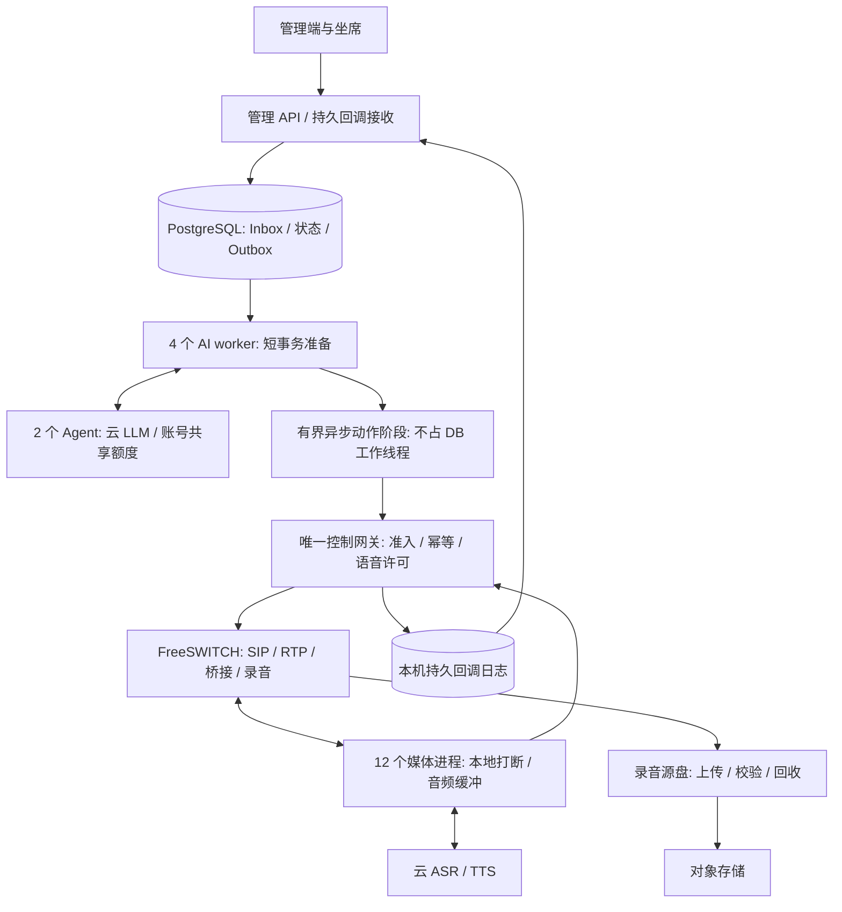

# 单机 500 并发：架构评审与实施方案

评审日期：2026-09-16。源码基准：`e88d9fb0f3fcda0b77270943b1590bbc90100b67`。目标口径沿用已确认要求：呼出、振铃、AI 通话、等待人工、转接中和人工通话合计最多 500 个客户呼叫；ASR/TTS/LLM 使用云服务，32 专用 vCPU / 64 GiB 为首轮候选。

**评审意见：现有架构可以作为实现目标的基础，应有条件通过技术路线，暂不通过容量验收。** 已有证据没有证明存在必须改成多机或更换语言的结构性障碍；但也不足以保证候选硬件达到目标。关键工作是降低 AI 工作池排队、补齐上游语音配额和录音源盘保护、优化持续回调延迟，并在目标机完成真实媒体与长稳验证。

本次仅新增评审文档与证据摘要，未修改业务源码、运行配置或数据库，未 commit/push，未部署、未真实拨号。以下“现状”来自当前源码和本次复核的历史记录，“建议”均为待实施方案。

**一、现有方案哪些可以保留**

现有单机部署已具备：1 个 FreeSWITCH、1 个控制网关、12 个媒体进程各 50 槽位、6 个 API、6 个 Inbox 消费者、4 个异步 AI worker 各 160 槽位、2 个共享模型额度的 Agent、1 个后台任务/调度角色，以及 PostgreSQL、Redis、录音适配器。

以下能力已在源码中实现，不应重复列为待开发：500 总在途上限、批量回调最多 16 条/聚合等待最多 5ms、持久接收后 ACK、同通话 FIFO、Inbox/业务/Outbox 原子提交、媒体归属及 epoch 栅栏、本地 VAD 打断、HTTP 连接复用、LLM 账号共享额度。600 媒体槽和 640 AI 槽是资源配置，不是已通过的容量。

建议继续使用下列结构。图中“异步动作阶段”“语音许可”“源录音回收”为本次建议补齐的部分。

音频沿 FreeSWITCH 与所属媒体进程传输；高频音频帧、中间识别结果不进入业务数据库。停止播放仍走媒体本地快路径，持久回调负责随后对账。Redis 保留租约/唤醒用途，业务事实继续保存在数据库及持久账本中。

**二、已有证据及其限制**

| 历史场景 | 结果 | 本次评审结论 |
|---|---|---|
| 500 合成会话，名义 50 终句/秒，10 轮 | 5,000 正式回复；模拟回复 P99 3.997s | 通过该轮 4.2s 模拟控制门槛 |
| 500 合成会话，名义 80 终句/秒，5 轮 | 2,500 正式回复；模拟回复 P99 6.162s；Inbox 最大完成 0.366s | 主要延迟证据集中在 AI 路径，模拟回复不通过 |
| 600 回调事件/秒，120s | 网关最大投递 2.070s；Inbox 最大完成 3.517s | 超过各自 1s 门槛；120s 不构成长稳 |
| 1,200 回调事件/秒，30s | 网关最大投递 30.416s | 突发积压严重，最终清空不能算通过 |
| 12 个媒体进程、500 控制 session | 会话分配和恢复验证通过 | 没有发送 500 路音频，不能视为真实媒体容量 |

两份最终 50/80 档记录中各 28 个文件的 SHA-256 均与当前文件相符。较早持续/突发 mixed 记录各有 1 个差异，均为负载脚本，应用文件相符；它们是历史失败证据，不是今天完整重测。哈希覆盖范围也不等于完整镜像、全部依赖和目标环境相同。[本次证据摘要](evidence/20260916-single-host-500-review.json)

50/80 档的全程平均分别为 48.385/70.313 终句/秒，包含启动爬坡与最后回复等待，不能直接当稳态吞吐。脚本每通等待上一轮回复，慢时会延后后续请求，且 conversation 场景未采实际调度滞后。因此不能声称已证明持续 50/80 RPS。

mixed 场景由终句及媒体事件组成，固定 3s 的模拟模型返回空 TTS，主要验证持久接收和旧轮次淘汰；它不证明有效回复吞吐。最终对话夹具也未运行 PBX、12 个媒体进程或通用任务 worker。4.2s 是“3s 模型＋0.2s 模拟播放确认＋1s 控制预算”，不是客户听到首音的延迟。

**三、必须落实的技术改造**

| 优先级 | 发现与证据 | 改造与完成判据 |
|---|---|---|
| P1 | 80 档 `_prepare_ai_turn` 排队 P99 1.10–1.54s；动作池 `_finish_ai_turn` 排队 P99 1.47–1.60s | 拆分短事务和异步网络等待，减少状态轮询；同等负载下分别报告 DB/动作排队与执行时间，不能只看总成功数 |
| P1 | `_fail_ai_turn` 在仅 2 线程的 DB 池里执行远端回退播放/挂断 | 把故障网络动作移出 DB 池，为续租与挂断保留执行能力；批量模型失败＋播放超时仍能续租、收尾和对账 |
| P1 | 持续回调期间发生 checkpoint 和锁等待；批处理的 50ms 预算不覆盖前置取锁及最终提交 | 分段测量并缩短事务；按目标 PG 配置重测，维持 1s 原有门槛 |
| P1 | 每媒体 session 直接创建 ASR/TTS；现有额度账本只覆盖 LLM | 补按账号/地域/产品的共享语音许可，含重连重叠和未知释放状态；没有批准额度不得准入 |
| P1 | 源 WAV 持续写 PBX 目录；适配器临时 spool 水位不覆盖源录音盘 | 补上传校验后的源文件回收、磁盘水位停拨；故障保留缓存容量可计算且不丢录音 |
| P1 验收缺口 | 500 控制会话与小规模音频分开验证；缺目标 Linux 全量拓扑及长稳 | 独立发压机运行完整 SIP/RTP/云服务/录音/人工桥接；按第五部分门槛验收 |

1. **把 AI 回答执行拆成三个阶段。**

短事务准备：核验租户、call、attempt、turn、speech generation 和执行租约，生成不可变动作快照及稳定业务命令 ID，需要可靠重试的命令写入 Outbox。释放 ORM/session 后进入独立有界异步网络阶段，复用 AsyncClient；回包后以短事务条件回写。不要跨线程传 ORM 实例。

现有代码在播放前已提交事务，准确问题是整段协程仍占动作线程，而非“所有播放都持有 DB 事务”。故障提示音、等待提示音、转人工、挂断也需统一拆分。DB 工作池只执行 DB 工作；任务续租、取消和收尾不能被外部超时堵住。

每秒逐个查询未完成模型请求，会进一步挤占 DB 池。先按 worker 批量查询待处理 call/attempt/turn，事件通知用于提前取消；外发前和落库时仍保留权威状态复核。首先保持现有 DB 连接预算，依据每事务 SQL、锁和提交时间优化后再决定是否调整线程数。

新增持久动作必须完成端到端幂等：业务命令 ID 与每次 HTTP 签名 nonce 分开；网关及媒体端按同一命令确认结果。现有局部去重可复用，但不能假定跨进程重启、ACK 丢失都已覆盖。对未知结果先查询/对账，不盲目重播。新动作阶段与旧路径按通话固定归属，切换前排空在途命令，避免双发。

2. **在目标环境处理 Inbox/数据库抖动。**

保持持久 receipt、FIFO、批末原子提交和固定取锁顺序。逐事件观测“生成→网关持久化→接收提交→取锁→业务 SQL→最终提交”，同时采 `pg_stat_statements`、等待事件、`pg_stat_wal`、checkpoint、磁盘 fsync 和 cgroup throttling。现有 50ms 业务循环预算不能冒充事务总耗时。

先使用模板中 PostgreSQL 8GiB 容器、2GB shared_buffers、4GB max_wal_size、120 max_connections、应用连接上限 64 的基线；历史测试的数据库默认参数不能代表此配置。发现单次事务过长就减少锁定/更新的事件数；发现相同状态反复查询就合并；确有 WAL 触发频繁 checkpoint 才调整其预算，持续同步提交与 fsync。

PostgreSQL 官方说明 checkpoint 的 I/O 会影响延迟，增大 WAL 窗口同时增加磁盘与恢复时间需求；这支持按测量调参，不能据此认定历史失败只有一个根因。[PostgreSQL 16 WAL 配置](https://www.postgresql.org/docs/16/wal-configuration.html)

3. **让上游额度参与拨号准入。**

复用唯一网关 owner，在持久账本中增加 `provider/account/region/product` 预算。AI 呼叫在 originate 前取得逻辑 ASR 预留，振铃期间也预留，避免全部接通时额度不足。实际连接授权绑定 call/attempt/worker_epoch/connection_id。

ASR 自动重连需要额外重叠许可；旧连接状态不明时保留占用，确认关闭或达到供应商验证的失效条件后释放，不能只靠本地 lease TTL。TTS 按真实合成请求获取共享并发/短时请求预算，完成或取消确认后释放；未知超时继续对账。只在连接、请求起止做协调，音频帧不写账本。新增许可写入开销也必须纳入网关压测。

500 全 AI 至少需要 500 个实际 ASR stream；建议向供应商申请额外重连余量，例如预算 600，但实际批准值必须记录。TTS 持续并发按“请求率×平均合成连接占用时长”计算，500 同步开口另验；分句流式会增加请求数，需重算。现有阿里实时 ASR 默认商用额度为 200，同服务不同 AppKey 共享额度。当前 TTS 代码使用 OpenAI-compatible 服务，不能套用阿里 TTS 默认值。[阿里云并发说明](https://help.aliyun.com/zh/isi/product-overview/faq-about-concurrency-and-monitoring/)

新增准入取业务剩余额度、健康媒体槽、ASR 预留、PBX 呼叫腿、线路 CPS、模型预算、队列年龄及磁盘安全状态的共同允许范围。出现持续积压先停止/降低新拨号，优先已接通客户；等待队列要有 deadline。保护性停拨必须单独报告，不能用降到 300 路的成功结果宣布 500 路通过。

4. **把客户首音作为独立目标。**

当前 LLM 等待完整回答后才返回文本。若选用模型本身需约 3s，单靠消除本机排队无法实现 1.5s 客户首音。先测选定模型首 token、完整响应、TTS 首包和 RTP 首音；若不达体验目标，则扩展 Agent 为可取消的流式输出，按完整短句交给流式 TTS，保留本地打断。

流式片段绑定 attempt/turn/generation，限制文本及音频积压，打断时同时停止旧模型、TTS 和本地播放。业务动作按最终校验结果执行，不能从未完成文本提前触发。提示音和固定开场音可以本地预置，但提示音不计正式有效回复。流式改造会影响 Agent、后端协议、媒体播放及配额，应作为独立工作包验收。

5. **完成录音源盘闭环。**

源文件完成→上传→校验大小/内容摘要→确认对象可读→按保留策略删除源文件→记录删除确认。未完成录音和未确认上传的文件不得删除。源盘及适配器 spool 各自监控，清理操作由具有受限权限的录音角色执行，下载签名不等于删除授权。根据最坏可容忍上传中断时长设置容量和停拨水位，日志、WAL 与录音争用磁盘时应分别限额或使用独立设备。

**四、容量计算与硬件选择**

“500 并发”还需要约定每路说话频率。本方案建议以 500 全 AI、每路 4s 一个最终输入即 125 终句/秒作为偏保守的容量设计/压力档，80/100 档作为中间门槛；这是本次建议，不代表已验证的业务平均说话频率。业务若选择较低频率，应明确写入容量合同，不可在测试失败后悄悄降低。

| 每路轮间隔 | 500 路终句/秒 | LLM RPM | 假设模型平均 3s，按 70% 平均占用预算所需模型槽位 |
|---|---:|---:|---:|
| 10s | 50 | 3,000 | 215 |
| 6.25s | 80 | 4,800 | 343 |
| 5s | 100 | 6,000 | 429 |
| 4s | 125 | 7,500 | 536 |

计算为 `ceil(终句率×平均模型耗时/0.7)`，仅作初始工程估算，还须测尾延迟和同步突发。当前 640 是整个 AI 任务的槽位：125 轮/秒、70% 占用时，完整任务平均驻留预算仅 `640×0.7/125=3.584s`，包括准备、模型、动作和回写。不能用仅模型 3s 算完后宣称余量充足。

LLM 账号 `TPM=60×终句率×每轮输入输出 token`。例如 125 轮/秒、每轮平均 1,200 tokens 对应 900 万 TPM；这是情景假设，需用实际话术、知识、历史上下文和所选 tokenizer 校准，并分别符合供应商输入/输出限额。500 同步终句还需要短时 RPS/并发额度或可接受的排队预算；7500 RPM 本身不保证突发首音。

拨号速率与并发分别计算：`总在途≈CPS×平均占用秒数`。若每次呼叫平均建立/振铃 20s、接通率 30%、接通后平均 120s，则平均占用约 56s，维持 500 需约 8.93 CPS。若占用缩短至 13s，则需要约 38.46 CPS，现有候选 15 CPS 无法维持该场景的 500；要按真实分布核验获准线路容量。人工桥接另计 PBX legs，模板 1500 sessions / 100 sessions-per-second 只是配置预算。

| 资源 | 首轮建议与限制 |
|---|---|
| CPU / 内存 | 沿用 32 专用 vCPU / 64 GiB 候选，记录 CPU 型号、物理核/vCPU、实际可用内存与 CPU steal；云模型方案不预设本机 GPU |
| 进程资源 | 当前限额合计 31.5 CPU / 52.75 GiB，非实测消耗；API 每进程 0.25 CPU、Inbox 0.5、AI worker 0.75。先查各 cgroup 是否节流，再重配预算 |
| 主机余量 | 建议正常档 CPU ≤75%、可用内存 ≥8GiB，无持续换页或 OOM；CPU quota 合计不能证明操作系统与突发余量 |
| 数据盘 | 优先低延迟 NVMe，按录音缓冲、数据库/WAL、临时副本、日志和安全余量定大小；不能用顺序带宽代替 fsync 延迟验证 |
| 网络 | 建议以可验证的 1Gbps 双向网络为候选，同时核验实际云出口和跨地域时延，网卡标称速率不等于公网保障 |
| 备份 / 故障域 | 数据和账本异机备份并恢复演练；单机故障会中断通话，若业务要求整机故障不间断，需要独立高可用架构 |

Docker CPU quota 是使用上限，容器可能在主机仍有闲置资源时被自身配额限制。调整时同时测媒体实时性与后台限速，不直接取消全部保护。[Docker 资源限制](https://docs.docker.com/engine/containers/resource_constraints/)

录音举例：8kHz、16bit、双声道 PCM，每路 32kB/s，500 全接通约 16MB/s、57.6GB/h、8h 460.8GB；16kHz 翻倍。上传故障需缓存 2h 时，仅源音频就需 115.2GB 或 230.4GB，另加复制与余量。本方案不默认购买多盘大容量服务器。

网络举例：G.711 每 20ms 一包，160 字节音频加 IPv4/UDP/RTP 40 字节，约每路每方向 80kbps，500 路为每方向 40Mbps；16kHz/PCM16 单声道 ASR 上行另约 128Mbps，TTS 下行按实际编码/发声比例另算，录音上传再占上行。以上均是明确假设下的计算，未含链路封装、TLS、重传、TURN、人工桥接及突发余量，需实测并按方向合计。

**五、实施顺序与验收门槛**

| 工作包 | 必交结果 | 进入下一阶段的条件 |
|---|---|---|
| A：可信基线 | 修正负载器、分阶段计时、逐秒计划/实际/完成、完整镜像清单；目标 Linux 部署基线 | 发压无漏计，报告爬坡/稳态/排空，原始失败记录可复现 |
| B：控制路径 | 三阶段动作、故障隔离、批量存活检查、Inbox 事务观测及优化 | 50/80/100/125 档有效回复与持续回调均达标；迟到/重复/取消正确 |
| C：资源保障与首音 | ASR/TTS 共享许可、录音回收及水位、必要的流式首音改造 | 额度不足/云故障可控；声音与录音真实可验；无过期音频、重复副作用 |
| D：完整验收 | 全量服务联合运行、500 媒体、8/24h、故障与恢复报告 | 全部门槛通过后才确认该硬件/线路/模型组合的 500 容量 |

建议的新验收目标与既有门槛分开记录：

| 验收维度 | 负载及门槛 |
|---|---|
| 准入正确性 | 所有入口合计 ≤500，第 501 路安全拒绝；并行申请、重启、未知拨号结果均不超发 |
| 有效对话基线 | 500 会话，50/80/100/125 终句/秒各至少 30min；固定 3s 模型＋0.2s 确认时，延用 P99 ≤4.2s；每个应答全量对账 |
| 持续回调 | 600 events/s 至少 30min；延用网关逐事件最大投递年龄 ≤1s、Inbox 最大完成延迟 ≤1s，零丢失/重复业务副作用/同通话越序 |
| 突发 | 1200 events/s 持续 30s，重复多轮；500 同步终句、挂断另测。若该档纳入承诺容量，应延用延迟门槛；超设计档拒绝/恢复须单列，不能冒充通过 |
| 发压可信 | 自然对话闭环之外增加绝对时间排程；到期上一轮未完成即记违约，不悄悄顺延，不靠新终句淘汰旧轮次凑吞吐；记录每10s窗口 |
| 真实媒体 | 20→50→100→200→350→500，每档至少 30min；混合在途及 500 全 AI 两类都测，包含 ASR/TTS/LLM、录音、人工桥接和本地打断 |
| 首音体验（建议） | 客户停止说话至客户侧正式回复首音 P95 ≤1.5s、P99 ≤2.5s；另报 ASR终句至首音，不用提示音替代 |
| 打断体验（建议） | 客户开始说话至客户侧 AI 停音 P95 ≤300ms、P99 ≤500ms；无单向音、串音，记录丢包和抖动 |
| 业务可靠性（建议） | 系统原因无回复/掉话率 <0.5%，与客户主动挂机、拒接、运营商失败分开；正常场景零未解释丢事件和重复副作用 |
| 长稳 / 故障 | 500 档 8h及混合24h；云429/超时、断网、媒体/AI/回调进程退出、上传停滞/磁盘水位；无持续积压、资源增长或重复拨号，报告实际影响和恢复时间 |
| 管理端并存 | 500 负载下完成登录、客户搜索/导入、策略保存回显、任务启停、话单/录音、转人工、退出；建议读P95 ≤500ms、关键写P95 ≤1s |

125 档还必须同时达到计划发压量及每通 4s 的轮次截止要求；4.2s 仅用于保持历史模拟基线可比，不能豁免排程违约，单独满足 P99 ≤4.2s 不代表该档通过。

上述端到端分位数必须来自同一条 trace；不能相加独立阶段 P99 当端到端 P99。已有短测 runner 限制秒数/轮数，不能直接执行 8/24h，工作包 A 必须补专用长稳运行器、日志轮转、断点对账和仅清理自身资源的退出路径。发压器部署在另一主机，避免争用受测机资源。

拟改动涉及入口/状态：批量回调（正常/重复/乱序/持久化失败）、AI任务（领取/续租/取消/失败）、播放（接受/确认丢失/迟到/打断）、语音许可（申请/重连/释放未知）、录音（写入/上传/校验/清理/低磁盘）、调度（准入/停拨/恢复）、登录与后台操作。实施后须逐项填写、保存、回显、返回与异常验证。项目不存在门店/房型/购物车/商城支付页面，通用电商链不适用；实际业务链为登录→客户→话术/知识/策略→任务→外呼/对话→人工接管→话单/录音→预约/跟进→退出。

**六、本次交付状态与上线条件**

| 状态 | 本次结果 |
|---|---|
| 源代码已修改 | 否；仅新增评审文档和 JSON 证据摘要 |
| 静态检查 | Compose 渲染/容量预检共 9 项测试通过；文档与证据差异检查通过。不是全仓库静态回归 |
| 开发环境功能测试 | 未重新执行完整业务回归；历史证据已复核，不冒充本次功能验收 |
| 测试环境已发布 | 本次未发布 |
| 真机测试通过 | 未验证 |
| 生产环境已发布 | 本次未发布 |
| Git / CI | 本地 HEAD 已核对；未提交、推送或重查远端 CI |

本次已验证：当前拓扑/相关源码、历史数值与覆盖边界、两份最终对话记录的源码哈希、9 项配置及容量公式测试。测试命令：`.venv-backend/bin/python -m pytest -q -p no:cacheprovider scripts/test_single_host_profile.py scripts/test_capacity_preflight.py`，结果 `9 passed in 1.73s`。

未验证：目标 Linux 全量部署、真实获批语音/模型配额、500 路 SIP/RTP/音频、人工桥接容量、上述新增改造、客户首音、8/24h和生产恢复。已知问题及源码风险见第三部分。环境限制：本次为 macOS 工作区只读评审与轻量配置测试，没有目标机或真实线路压测。

正式上线前置条件：完成 A—D；固定镜像和迁移/回退；获得并实测线路/CPS/模型/语音额度；完整业务入口与双租户权限回归；签名密钥及内部端口配置验收；录音与账本恢复演练；明确单机故障可接受的中断和恢复时间。若 32/64 在消除软件排队后仍由 CPU/内存/磁盘饱和限制，再基于曲线增加资源；硬件扩容不替代云额度、并发正确性和首音验证。

**主要源码与证据索引**

- 工作池与异常路径：`backend/app/services/async_ai.py:40,105,128`；`backend/app/services/dispatcher.py:385,453,488,533`。
- Inbox 取锁与批处理：`backend/app/services/callback_inbox.py:105,233,257`；原子事务 `backend/app/db.py:249`。
- 完整 LLM 响应：`agent/app/llm.py:141`；Agent 接口 `agent/app/main.py:61`。
- 语音服务及重连：`voice_gateway/app/pipecat_pipeline.py:423,613`；`voice_gateway/app/aliyun_nls_stt.py:128`。
- 录音源：`voice_gateway/app/freeswitch.py:779`；`voice_gateway/app/recording_source.py:19`；`docker-compose.compact.yml:179,241`。
- 部署与预算：`docker-compose.single-host-500.yml:40,419,559,819,834`；`scripts/check-single-host-500.py:82`。
- 发压口径：`scripts/load-single-host-dialogue.py:185,226,270`；`scripts/fixtures/single500_model_fixture.py:11`。
- [历史完整修复/验证报告](20260913-single-host-500-fixes.md)、[50 档](evidence/20260913-single-host-500-fixes/single500-0913-final-50rps-results.json)、[80 档](evidence/20260913-single-host-500-fixes/single500-0913-final-80rps-results.json)、[持续回调](evidence/20260913-single-host-500-fixes/fix0913-batch05-long-results.json)、[突发回调](evidence/20260913-single-host-500-fixes/fix0913-burst01-results.json)。
