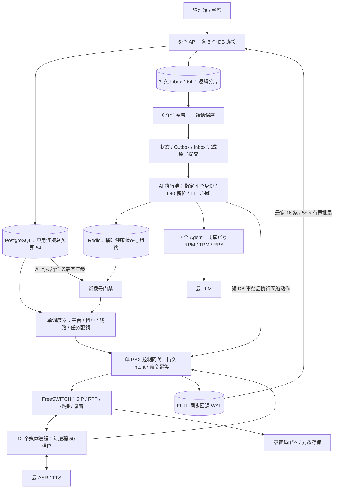

# 单机 500 并发：架构设计与实施前评估

日期：2026-10-03。基线：`9fcb9f27490b2b8db9b8b3d060b085623fbd6b82`，与本次读取的 GitHub main 一致。改造在独立 worktree 中进行；最终验收通过前不更新 GitHub 或原本地工作树。

## 目标与验收口径

沿用已有约定：32 专用 vCPU / 64 GiB Linux 为待验收候选；500 指呼出、振铃、AI、转人工及人工通话合计的客户呼叫，最坏负载为 500 路全部接通 AI。PBX 呼叫腿、媒体连接、模型请求、回调事件和 HTTP 请求分别计量。云端 ASR/TTS/LLM 须有实际批准的账号额度。

当前执行机 cgroup CPU 配额为 4 核、内存上限 16 GiB，无真实线路和云语音凭据。可以完成代码正确性和合成控制负载验证；真实容量资格需要目标机及独立发压机。

## 架构

单机多进程，保持单一 PBX 控制者和通话归属。音频帧不经过 PostgreSQL 或 Redis；模型、TTS 和其他网络等待不占用数据库事务。正常满载保留 CPU 约 25% 和主机内存至少 8 GiB，具体使用率须实测。模板现有 CPU 限额总数 31.5、内存 52.75 GiB、DB 64、媒体 600、AI 640 是预算，不是实测吞吐。

## 本次需要实现的架构变化

1. **AI 执行池参与实际拨号准入。** 当前 Agent 健康不能证明 AI worker 正常。使用固定 worker 身份及声明槽位的 Redis 心跳，不用 SCAN 汇总任意进程。心跳携带进程代次并有 TTL；同身份只允许一个发布者。初始化与任务领取成功后才报告 ready；领取失败撤回 ready；优雅停止先撤回再排空。旧代次不能覆盖或删除新代次。缺 worker、Redis 不可用、损坏心跳及槽位不匹配时暂停新拨号。
2. **按 AI 队列压力暂停新拨号。** 在真实 `_claim_dispatch_slot` 路径检查，排除未来延期任务、完成任务和无效死信。已到期待执行的 AI 任务超过 1 秒等待时暂停新准入，包括被同通话前序任务阻塞的 FIFO 后继，属于保守保护，并非只统计此刻可领取的队首；过期 processing 租约也必须视为恢复积压。已有通话、回调接收、租约更新和业务页面继续工作。检查使用现有任务索引，不扩大 DB 连接池。
3. **验收防止发压不足误报通过。** 单独记录负载有效性：计划数量、实际数量、实际发送时长/速率、计划时刻与实际时刻的 P99 差值。正确性、控制 SLO 和负载有效性必须同时通过；真实媒体与长稳资格保持单独状态。每次报告保留原始记录和源码摘要。

门禁是拨号专用保护，不移除接收回调的 API。健康信息只作准入条件，不作释放 PBX/媒体/云语音未知名额的依据。故障探测仍有 TTL 和轮询窗口，不承诺故障发生瞬间零新呼叫。

## 实施前自评

| 维度 | 判断 | 依据与限制 |
|---|---|---|
| 单机可实施性 | 通过，可进入代码改造 | 复用 Redis、现有队列索引及独立 AI 进程，无新增数据库、服务或连接预算 |
| 呼叫容量正确性 | 保留现有设计，须回归 | 平台事务锁、网关持久 intent、第 501 路拒绝、未知结果不释放已有测试 |
| 故障时新准入 | 必须修复后复验 | 独立审查确认 AI worker 全停仍可能拨号，为 P1 |
| 持久与顺序 | 保留现有设计，须回归 | FULL WAL、Inbox 分区锁、同通话 FIFO 和 Outbox 原子提交 |
| 压测可信度 | 必须修复后复验 | 独立审查确认 mixed 场景缺少实际发压有效性门槛，为 P1 |
| 真实 500 路资格 | 未通过 | 本机规格不足、未连接线路/云语音、没有 500 路音频或长稳证据 |

**评估结论：候选架构通过实施可行性评估，可以在隔离副本改造；容量评估尚未通过。** 实施完成后先由独立审查子代理 review，修复阻断项，再执行下述测试。

## 审查及测试门槛

- 代码审查：不留 P0/P1；确认发布与原代码同步仍受最终容量验收约束。
- 回归：SQLite 与 PostgreSQL/Redis 后端、批量回调/FIFO、任务租约、网关第 501 路拒绝、AI 进程退出/恢复/代次隔离、原有 Agent 与录音测试；静态模板预算。
- 控制负载：500 合成会话，600 有效回调事件/秒持续和 1200/秒短突发；500 同步终句/挂断；不得丢失/重复副作用。网关投递及 Inbox 完成各 ≤ 1s；每项须实际发压有效。正常对话至少 125 轮/秒，模拟 P99 回复 ≤ 4.2s（3s 模型 + 0.2s 播放 + 1s 控制预算）。
- 真实目标机：20→50→100→200→350→500，每档至少 30 分钟；500 路 8 小时及 24 小时混合运行；真实双向音频、动态模型、打断、转人工、双声道录音及对账。客户终句至首音 P95 ≤ 1.5s、P99 ≤ 2.5s，打断至停止播音 P95 ≤ 250ms；系统异常断话率 ≤ 0.1%。记录 CPU/内存/磁盘/网络、cgroup throttling、队列年龄和供应商限流。
- 全部门槛通过后，再更新 GitHub 和原本地代码。失败报告仍保留，不用最佳短测覆盖失败或缺失的验收项。
